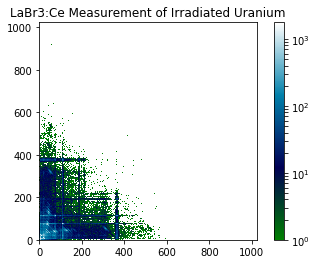
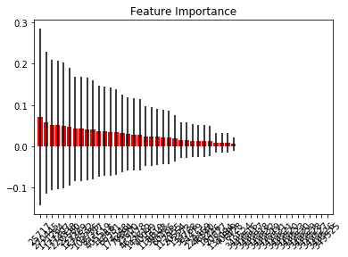
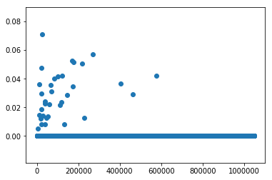
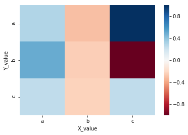
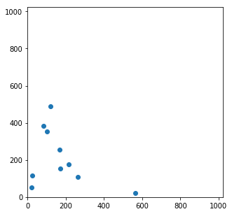
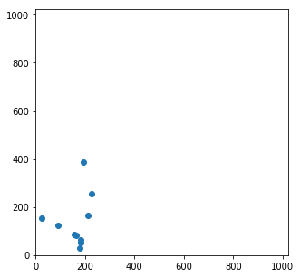

This notebook reads gamma-gamma coincidence data into machine learning classification algorithms to develop predictive models of uranium enrichment and visualize important features, trends, etc.


```python
import sklearn as sk
import pandas as pd
import numpy as np
import matplotlib as mp
import matplotlib.pyplot as plt
import math as math
import seaborn as sns
```


```python
cd /users/adam/Box Sync/HDF5_data/csvs
```

    /Users/adam/Box Sync/HDF5_data/csvs


```python
nat01 = pd.read_csv('natu_03_25.csv', header=None).as_matrix()
nat02 = pd.read_csv('natu_03_28.csv', header=None).as_matrix()
nat03 = pd.read_csv('natu_03_30.csv', header=None).as_matrix()
nat04 = pd.read_csv('natu_04_01.csv', header=None).as_matrix()
nat05 = pd.read_csv('natu_04_04.csv', header=None).as_matrix()
nat06 = pd.read_csv('natu_04_06.csv', header=None).as_matrix()
nat07 = pd.read_csv('natu_04_08.csv', header=None).as_matrix()
nat08 = pd.read_csv('natu_04_11.csv', header=None).as_matrix()
nat09 = pd.read_csv('natu_04_13.csv', header=None).as_matrix()
nat10 = pd.read_csv('natu_04_15.csv', header=None).as_matrix()
nat11 = pd.read_csv('natu_04_18.csv', header=None).as_matrix()
nat12 = pd.read_csv('natu_04_20.csv', header=None).as_matrix()
nat13 = pd.read_csv('natu_04_22.csv', header=None).as_matrix()
rct01 = pd.read_csv('rctu_03_25.csv', header=None).as_matrix()
rct02 = pd.read_csv('rctu_03_28.csv', header=None).as_matrix()
rct03 = pd.read_csv('rctu_03_30.csv', header=None).as_matrix()
rct04 = pd.read_csv('rctu_04_01.csv', header=None).as_matrix()
rct05 = pd.read_csv('rctu_04_04.csv', header=None).as_matrix()
rct06 = pd.read_csv('rctu_04_06.csv', header=None).as_matrix()
rct07 = pd.read_csv('rctu_04_08.csv', header=None).as_matrix()
rct08 = pd.read_csv('rctu_04_11.csv', header=None).as_matrix()
rct09 = pd.read_csv('rctu_04_13.csv', header=None).as_matrix()
rct10 = pd.read_csv('rctu_04_15.csv', header=None).as_matrix()
rct11 = pd.read_csv('rctu_04_18.csv', header=None).as_matrix()
rct12 = pd.read_csv('rctu_04_20.csv', header=None).as_matrix()
rct13 = pd.read_csv('rctu_04_22.csv', header=None).as_matrix()
wpn01 = pd.read_csv('wpnu_03_25.csv', header=None).as_matrix()
wpn02 = pd.read_csv('wpnu_03_28.csv', header=None).as_matrix()
wpn03 = pd.read_csv('wpnu_03_30.csv', header=None).as_matrix()
wpn04 = pd.read_csv('wpnu_04_01.csv', header=None).as_matrix()
wpn05 = pd.read_csv('wpnu_04_04.csv', header=None).as_matrix()
wpn06 = pd.read_csv('wpnu_04_06.csv', header=None).as_matrix()
wpn07 = pd.read_csv('wpnu_04_08.csv', header=None).as_matrix()
wpn08 = pd.read_csv('wpnu_04_11.csv', header=None).as_matrix()
wpn09 = pd.read_csv('wpnu_04_13.csv', header=None).as_matrix()
wpn10 = pd.read_csv('wpnu_04_18.csv', header=None).as_matrix()
wpn11 = pd.read_csv('wpnu_04_20.csv', header=None).as_matrix()
wpn12 = pd.read_csv('wpnu_04_22.csv', header=None).as_matrix()

```


```python
alldata = [nat01,nat02,nat03,nat04,nat05,nat06,nat07,nat08,nat09,nat10,nat11,nat12,nat13,rct01,rct02,rct03,rct04,rct05,rct06,rct07,rct08,rct09,rct10,rct11,rct12,rct13,wpn01,wpn02,wpn03,wpn04,wpn05,wpn06,wpn07,wpn08,wpn09,wpn10,wpn11,wpn12]
```


```python
from sklearn import preprocessing
```


```python
X = np.empty([38,1048576])
for i in range(0,37):
    X[i,:] = np.reshape(alldata[i],newshape=1048576, order='C')
```


```python
from __future__ import division
```


```python
X.shape
```


    (38, 1048576)


```python
y = np.empty([38,1],dtype=np.dtype('a16'))
for i in range(0,38):
    if i<13:
        y[i,0] = 'Nat U'
    elif 12<i<26:
        y[i,0] = 'LEU'
    else:
        y[i,0] = 'HEU'
y = np.ravel(y)
```

Here we scale all of our data to have unit variance and zero average. sklearn has many built-in functions that make essential steps like this easy.


```python
X = preprocessing.scale(X)
```

Here we can visualize a single coincidence spectrum.


```python
def heatmap(data):
    fig = plt.figure()
    ax = fig.add_subplot(1,1,1)
    ax.set_aspect('equal')
    plt.imshow(data, norm=mp.colors.LogNorm(), interpolation='nearest', cmap=plt.cm.ocean, origin='lower')
    plt.colorbar()
    plt.title("LaBr3:Ce Measurement of Irradiated Uranium")
    plt.show()
```


```python
heatmap(rct12)
```





Another already available sklearn package randomly splits data into training and testing sets.


```python
from sklearn import model_selection
```


```python
 X_train, X_test, y_train, y_test = sk.model_selection.train_test_split(
            X, y, test_size = 0.5)
```

Let's test a bunch of classification models on this dataset.


```python
from sklearn.neural_network import MLPClassifier
from sklearn import svm
from sklearn.ensemble import RandomForestClassifier
import scikitplot as skplt
```

I wrote a script which trains, tests, and scores several classification models including: MLPClassifier, svm.SVC, and RandomForestClassifier. It returns the percentage of correct predictions made by the model.


```python
def clf_model(X, y, model):
    if model == 'MLPClassifier':
        clf = MLPClassifier(solver='lbfgs', alpha=1e-5, hidden_layer_sizes=(5,2), random_state=1)
    elif model == 'svm.SVC':
        clf = svm.SVC(decision_function_shape='ovo')
    elif model == 'RandomForestClassifier':
        clf = RandomForestClassifier()
    elif model == 'svm.LinearSVC':
        clf = svm.LinearSVC()
    else:
        print("Please specify a valid model (Current supported models are MLPClassifier, svm.SVC, svm.LinearSVC, and RandomForestClassifier")
    X_train, X_test, y_train, y_test = sk.model_selection.train_test_split(
    X, y, test_size = 0.5)
    clf.fit(X_train, y_train)
    pred = clf.predict(X_test)
    score=0
    for i in range(0,len(pred)):
        if pred[i] == y_test[i]:
            score+=1
        else:
            pass
    score = 100 * score / len(pred)
    return score, clf
    
```


```python
scoreSVC, clfSVC = clf_model(X,y,'svm.SVC')
scoreSVC
```

    /Users/adam/anaconda2/lib/python2.7/site-packages/sklearn/svm/base.py:196: FutureWarning: The default value of gamma will change from 'auto' to 'scale' in version 0.22 to account better for unscaled features. Set gamma explicitly to 'auto' or 'scale' to avoid this warning.
      "avoid this warning.", FutureWarning)


    57.89473684210526


```python
clfSVC.get_params(deep=True)
```


    {'C': 1.0,
     'cache_size': 200,
     'class_weight': None,
     'coef0': 0.0,
     'decision_function_shape': 'ovo',
     'degree': 3,
     'gamma': 'auto_deprecated',
     'kernel': 'rbf',
     'max_iter': -1,
     'probability': False,
     'random_state': None,
     'shrinking': True,
     'tol': 0.001,
     'verbose': False}


```python
scoreLSVC, clfLSVC = clf_model(X, y, 'svm.LinearSVC')
scoreLSVC
```

    /Users/adam/anaconda2/lib/python2.7/site-packages/sklearn/svm/base.py:922: ConvergenceWarning: Liblinear failed to converge, increase the number of iterations.
      "the number of iterations.", ConvergenceWarning)


    68.42105263157895


```python
clfLSVC.get_params(deep=True)
```


    {'C': 1.0,
     'class_weight': None,
     'dual': True,
     'fit_intercept': True,
     'intercept_scaling': 1,
     'loss': 'squared_hinge',
     'max_iter': 1000,
     'multi_class': 'ovr',
     'penalty': 'l2',
     'random_state': None,
     'tol': 0.0001,
     'verbose': 0}


Obviously these models could be refined by changing model parameters/settings.


```python
scoreRF, clfRF = clf_model(X, y, 'RandomForestClassifier')
scoreRF
```

    /Users/adam/anaconda2/lib/python2.7/site-packages/sklearn/ensemble/forest.py:248: FutureWarning: The default value of n_estimators will change from 10 in version 0.20 to 100 in 0.22.
      "10 in version 0.20 to 100 in 0.22.", FutureWarning)


    42.10526315789474


```python
clfRF.get_params(deep=True)
```


    {'bootstrap': True,
     'class_weight': None,
     'criterion': 'gini',
     'max_depth': None,
     'max_features': 'auto',
     'max_leaf_nodes': None,
     'min_impurity_decrease': 0.0,
     'min_impurity_split': None,
     'min_samples_leaf': 1,
     'min_samples_split': 2,
     'min_weight_fraction_leaf': 0.0,
     'n_estimators': 10,
     'n_jobs': None,
     'oob_score': False,
     'random_state': None,
     'verbose': 0,
     'warm_start': False}


Because we transformed the shape of the original data matrices, it will be necessary to perform reverse transformations to return the coincidence channels that each of these important features correspond to. Then, it will be necessary to apply an energy calibration to return the initial photon energies corresponding to each bin.


```python
plotted_features = skplt.estimators.plot_feature_importances(clfRF, max_num_features=50, x_tick_rotation=45, text_fontsize='medium')
```





```python
importances = clfRF.feature_importances_
labels = np.arange(1,1048577)
plt.scatter(labels,importances)
```


    <matplotlib.collections.PathCollection at 0x1a563e3950>





```python
np.array(list(zip(labels, importances)))
```


    array([[1.000000e+00, 0.000000e+00],
           [2.000000e+00, 0.000000e+00],
           [3.000000e+00, 0.000000e+00],
           ...,
           [1.048574e+06, 0.000000e+00],
           [1.048575e+06, 0.000000e+00],
           [1.048576e+06, 0.000000e+00]])


```python
labels
```


    array([      1,       2,       3, ..., 1048574, 1048575, 1048576])


I need to validate my features_finder(e) function to ensure that it is creating the correct coordinates for each data point. This function essentially undoes the np.reshape(order='C') function that is called near the beginning of this notebook. The easiest way to validate features_fuinder(e) would be to use it to create a heatmap of one row of the X[i] matrix and ensure that it looks like the standard coincidence heatmaps, with the preprocessing.scale renormalization applied.


```python
labels = np.arange(1,1048577)
features = features_finder(labels)
features
```


    array([[0.000e+00, 1.000e+00],
           [0.000e+00, 2.000e+00],
           [0.000e+00, 3.000e+00],
           ...,
           [1.023e+03, 1.022e+03],
           [1.023e+03, 1.023e+03],
           [1.024e+03, 0.000e+00]])


```python
newheatmap = np.dstack((features[:,0],features[:,1],X[0,:]))
newheatmap
```


    array([[[ 0.00000000e+00,  1.00000000e+00, -1.05145560e+00],
            [ 0.00000000e+00,  2.00000000e+00, -1.13696731e+00],
            [ 0.00000000e+00,  3.00000000e+00, -9.27556564e-01],
            ...,
            [ 1.02300000e+03,  1.02200000e+03,  0.00000000e+00],
            [ 1.02300000e+03,  1.02300000e+03,  0.00000000e+00],
            [ 1.02400000e+03,  0.00000000e+00,  0.00000000e+00]]])


```python
newheatmap.size
```


    3145728


```python
(features[:,1])
```


    array([1.000e+00, 2.000e+00, 3.000e+00, ..., 1.022e+03, 1.023e+03,
           0.000e+00])


```python
(features[:,0])
```


    array([   0.,    0.,    0., ..., 1023., 1023., 1024.])


```python
(X[0,:])
```


    array([-1.0514556 , -1.13696731, -0.92755656, ...,  0.        ,
            0.        ,  0.        ])


```python
a = np.array([features[:,0]])
b = np.array([features[:,1]])
c = np.array([X[0,:]])
df = pd.DataFrame(np.array([a,b,c]).T)
df.columns = ['X_coor','Y_coor','Color_value']
df
```


    ---------------------------------------------------------------------------

    ValueError                                Traceback (most recent call last)

    <ipython-input-118-e5a5ff9fdd62> in <module>()
          2 b = np.array([features[:,1]])
          3 c = np.array([X[0,:]])
    ----> 4 df = pd.DataFrame(np.array([a,b,c]).T)
          5 df.columns = ['X_coor','Y_coor','Color_value']
          6 df


    /Users/adam/anaconda2/lib/python2.7/site-packages/pandas/core/frame.pyc in __init__(self, data, index, columns, dtype, copy)
        359             else:
        360                 mgr = self._init_ndarray(data, index, columns, dtype=dtype,
    --> 361                                          copy=copy)
        362         elif isinstance(data, (list, types.GeneratorType)):
        363             if isinstance(data, types.GeneratorType):


    /Users/adam/anaconda2/lib/python2.7/site-packages/pandas/core/frame.pyc in _init_ndarray(self, values, index, columns, dtype, copy)
        511         # by definition an array here
        512         # the dtypes will be coerced to a single dtype
    --> 513         values = _prep_ndarray(values, copy=copy)
        514 
        515         if dtype is not None:


    /Users/adam/anaconda2/lib/python2.7/site-packages/pandas/core/frame.pyc in _prep_ndarray(values, copy)
       6255         values = values.reshape((values.shape[0], 1))
       6256     elif values.ndim != 2:
    -> 6257         raise ValueError('Must pass 2-d input')
       6258 
       6259     return values


    ValueError: Must pass 2-d input


```python
x = np.array(['a','b','c','a','b','c','a','b','c'])
y = np.array(['a','a','a','b','b','b','c','c','c'])
z = np.array([0.3,-0.3,1,0.5,-0.25,-1,0.25,-0.23,0.25])
df = pd.DataFrame.from_dict(np.array([x,y,z]).T)
df.columns = ['X_value','Y_value','Z_value']
df['Z_value'] = pd.to_numeric(df['Z_value'])
df
```


<div>
<style scoped>
    .dataframe tbody tr th:only-of-type {
        vertical-align: middle;
    }

    .dataframe tbody tr th {
        vertical-align: top;
    }

    .dataframe thead th {
        text-align: right;
    }
</style>
<table border="1" class="dataframe">
  <thead>
    <tr style="text-align: right;">
      <th></th>
      <th>X_value</th>
      <th>Y_value</th>
      <th>Z_value</th>
    </tr>
  </thead>
  <tbody>
    <tr>
      <th>0</th>
      <td>a</td>
      <td>a</td>
      <td>0.30</td>
    </tr>
    <tr>
      <th>1</th>
      <td>b</td>
      <td>a</td>
      <td>-0.30</td>
    </tr>
    <tr>
      <th>2</th>
      <td>c</td>
      <td>a</td>
      <td>1.00</td>
    </tr>
    <tr>
      <th>3</th>
      <td>a</td>
      <td>b</td>
      <td>0.50</td>
    </tr>
    <tr>
      <th>4</th>
      <td>b</td>
      <td>b</td>
      <td>-0.25</td>
    </tr>
    <tr>
      <th>5</th>
      <td>c</td>
      <td>b</td>
      <td>-1.00</td>
    </tr>
    <tr>
      <th>6</th>
      <td>a</td>
      <td>c</td>
      <td>0.25</td>
    </tr>
    <tr>
      <th>7</th>
      <td>b</td>
      <td>c</td>
      <td>-0.23</td>
    </tr>
    <tr>
      <th>8</th>
      <td>c</td>
      <td>c</td>
      <td>0.25</td>
    </tr>
  </tbody>
</table>
</div>


```python
pivotted = df.pivot('Y_value','X_value','Z_value')
sns.heatmap(pivotted,cmap='RdBu')
```


    <matplotlib.axes._subplots.AxesSubplot at 0x1a2e29e4d0>





```python
df = pd.DataFrame.from_dict(np.array([newheatmap]).T)
```


    ---------------------------------------------------------------------------

    ValueError                                Traceback (most recent call last)

    <ipython-input-102-6d0744a1df63> in <module>()
    ----> 1 df = pd.DataFrame.from_dict(np.array([newheatmap]).T)
    

    /Users/adam/anaconda2/lib/python2.7/site-packages/pandas/core/frame.pyc in from_dict(cls, data, orient, dtype)
        898             raise ValueError('only recognize index or columns for orient')
        899 
    --> 900         return cls(data, index=index, columns=columns, dtype=dtype)
        901 
        902     def to_dict(self, orient='dict', into=dict):


    /Users/adam/anaconda2/lib/python2.7/site-packages/pandas/core/frame.pyc in __init__(self, data, index, columns, dtype, copy)
        359             else:
        360                 mgr = self._init_ndarray(data, index, columns, dtype=dtype,
    --> 361                                          copy=copy)
        362         elif isinstance(data, (list, types.GeneratorType)):
        363             if isinstance(data, types.GeneratorType):


    /Users/adam/anaconda2/lib/python2.7/site-packages/pandas/core/frame.pyc in _init_ndarray(self, values, index, columns, dtype, copy)
        511         # by definition an array here
        512         # the dtypes will be coerced to a single dtype
    --> 513         values = _prep_ndarray(values, copy=copy)
        514 
        515         if dtype is not None:


    /Users/adam/anaconda2/lib/python2.7/site-packages/pandas/core/frame.pyc in _prep_ndarray(values, copy)
       6255         values = values.reshape((values.shape[0], 1))
       6256     elif values.ndim != 2:
    -> 6257         raise ValueError('Must pass 2-d input')
       6258 
       6259     return values


    ValueError: Must pass 2-d input


```python
def features_finder(e):
    features = np.empty([len(e),2])
    for i in range (0,len(e)):
        features[i,0] = e[i] // 1024
        features[i,1] = e[i] % 1024
    return features
```


```python
def iter_features_finder(n_iter):
    labels = np.arange(1,1048577)
    importances = np.zeros(1048576)
    results = np.array(list(zip(labels, importances)))
    features = features_finder(labels)
    for i in range(n_iter):
        clfRF = clf_model(X, y, 'RandomForestClassifier')
        importances = clfRF.feature_importances_
        results[:,1] = results[:,1] + importances
```


```python
f = np.array([25717, 270445, 171264, 177307, 220338, 22580, 123369, 576532, 102755, 85377])
```


```python
features2 = features_finder(f)
features2
```


    array([[ 25., 117.],
           [264., 109.],
           [167., 256.],
           [173., 155.],
           [215., 178.],
           [ 22.,  52.],
           [120., 489.],
           [563.,  20.],
           [100., 355.],
           [ 83., 385.]])


```python
plt.figure(figsize=(5,5))
plt.scatter(x=features2[:,0],y=features2[:,1])
plt.xlim(0,1024)
plt.ylim(0,1024)
```


    (0, 1024)





```python
# e = np.array([185396, 233729, 93308, 185409, 26776, 168019, 217254, 200067, 183326, 160853, 85073, 98322, 64688, 134487, 419020, 296270, 33991, 209160, 88116, 241688])
e = np.array([185396, 233729, 93308, 185409, 26776, 168019, 217254, 200067, 183326, 160853])
features = features_finder(e)
features
```


    array([[181.,  52.],
           [228., 257.],
           [ 91., 124.],
           [181.,  65.],
           [ 26., 152.],
           [164.,  83.],
           [212., 166.],
           [195., 387.],
           [179.,  30.],
           [157.,  85.]])


```python
plt.figure(figsize=(5,5))
plt.scatter(x=features[:,0],y=features[:,1])
plt.xlim(0,1024)
plt.ylim(0,1024)
```


    (0, 1024)





Maybe size each dot according to its feature importance weight
