This notebook improves on the work in "__SCALE_4_2019"__ in the following ways:

1. Streamlines the data preparation process into a pipeline contained within a single function.

2. Streamlines and creates consistency in the evaluation of each model with dedicated functions that piece together the steps, and repeating the same analysis steps on each model.

# Setting up the notebook


```python
import numpy as np
import pandas as pd
import sklearn as sk
import matplotlib.pyplot as plt
import seaborn as sns
import warnings
warnings.simplefilter(action='ignore')  
sns.set_context("talk")
sns.set_style("dark")
pd.set_option('display.max_columns', 100)
```


```python
# Models I will use
from sklearn.linear_model import LinearRegression
from sklearn.linear_model import Ridge
from sklearn.tree import DecisionTreeRegressor
from sklearn.linear_model import Lasso
from sklearn.linear_model import SGDRegressor
from sklearn.svm import SVR
from sklearn.linear_model import ElasticNet
from sklearn.ensemble import RandomForestClassifier
from sklearn.svm import LinearSVC
from sklearn.neighbors import KNeighborsClassifier

# Various other tools in sklearn I will use
from sklearn.model_selection import KFold
from sklearn.model_selection import cross_val_score
from sklearn.model_selection import GridSearchCV
from sklearn.impute import SimpleImputer
from sklearn.model_selection import train_test_split
from sklearn.preprocessing import StandardScaler
from sklearn.metrics import mean_squared_error
from sklearn.metrics import accuracy_score
```

# Importing Pre-Built Functions

## Centrifuge

This function is used for creating more synthetic data for regression problems. It takes the data from two different isotopes and blends it at a user-specified number of intermediate values.


```python
def centrifuge(w, mode, iso1, iso2):
    # w refers to the numer of linear subdivisions of enrichment to create.
    # mode refers to either classification 'clf' or regression 'reg'.
    # 'iso1' and 'iso2' should be decay data for two isotopes of the same actinide.
    # Enrichment refers to the atom percent of iso2
    X = iso1 # Sample 0% enriched in iso2
    if mode=='clf':
        y = np.zeros([180], dtype=str)
    elif mode=='reg':
        y = np.zeros([180], dtype=float)
    else:
        print('Please specify classification (clf) or regression (reg).')
    for i in range(1,w+1):
        enrichment = (float(i)/float(w))
        enriched = enrichment * iso2 + (1 - enrichment) * iso1
        X = np.append(X, enriched, axis=0)
        if mode=='clf':
            category = str(enrichment)
        elif mode=='reg':
            category = float(enrichment)
        else:
            print('Please specify classification (clf) or regression (reg).')
        for j in range(0, 180):
            y = np.append(y, category)
    return X, y
        
```

## Classification Comparison
This function builds a number of classification models, and scores them using 10 fold cross-validation and acuracy as the scoring metric. The algorithms which have been hyperparameter-tuned via grid search are manually pasted into this function.


```python
def clf_comp(seed, X, y):
    seed = seed

    models = []
    
    models.append(('Random Forest', RandomForestClassifier(
            bootstrap=True, class_weight=None, criterion='gini',
            max_depth=None, max_features='auto', max_leaf_nodes=None,
            min_impurity_decrease=0.0, min_impurity_split=None,
            min_samples_leaf=1, min_samples_split=2,
            min_weight_fraction_leaf=0.0, n_estimators=40, n_jobs=None,
            oob_score=False, random_state=42, verbose=0, warm_start=False)))
    
    models.append(('Support Vector', LinearSVC(
            C=100.0, class_weight=None, dual=False, fit_intercept=True,
            intercept_scaling=1, loss='squared_hinge', max_iter=1000,
            multi_class='ovr', penalty='l1', random_state=42, tol=0.001,
            verbose=0)))
    
    models.append(('K Neighbors', KNeighborsClassifier(
            algorithm='auto', leaf_size=10, metric='minkowski',
            metric_params=None, n_jobs=None, n_neighbors=1, p=2,
            weights='uniform')))

    results = []
    names = []
    scoring = 'accuracy'

    from sklearn.model_selection import KFold
    from sklearn.model_selection import cross_val_score
    
    print("Model: Mean (Standard Deviation)")

    for name, model in models:
        kfold = KFold(n_splits=10, random_state=seed)
        cv_results = cross_val_score(
            model, X, y, cv=kfold, scoring=scoring)
        results.append(cv_results)
        names.append(name)
        msg = "%s: %f (%f)" % (name, cv_results.mean(), cv_results.std())
        print(msg)

    fig = plt.figure(figsize=(12,8))
    fig.suptitle("Classification Algorithm Performance Comparison")
    ax = fig.add_subplot(111)
    sns.boxplot(data=results, linewidth=1, color='orange')
    # sns.violinplot(data=results, cut=0)
    ax.set_xticklabels(names)
    plt.ylabel("Prediction Accuracy")
    plt.xlabel("Classification Algorithm")
    plt.xticks(rotation=30)
    plt.show()
```

## Regression Comparison

The regression version of the above classification comparison function.


```python
def reg_comp(seed, X, y):
    """This is the help documentation for regression comparison"""
    seed = seed

    models = []
    # models.append(('lin_reg', LinearRegression()))
    models.append(('Ridge', Ridge(
        alpha=1, copy_X=True, fit_intercept=True, max_iter=None,
        normalize=False, random_state=42, solver='sparse_cg', tol=0.001)))
    
    models.append(('Decision Tree', DecisionTreeRegressor()))
    
    models.append(('Lasso', Lasso(
        alpha=0.001, copy_X=True, fit_intercept=True, max_iter=1000,
        normalize=False, positive=False, precompute=False, random_state=42,
        selection='cyclic', tol=0.0001, warm_start=False)))
    
    models.append(('Support Vector', SVR(kernel='linear')))
    
    models.append(('Elastic Net', ElasticNet(
        alpha=1e-07, copy_X=True, fit_intercept=True, l1_ratio=0,
        max_iter=1000, normalize=False, positive=False, precompute=False,
        random_state=None, selection='cyclic', tol=0.0001, warm_start=False)))

    results = []
    names = []
    scoring = 'neg_mean_squared_error'
    
    print("Model: Mean (Standard Deviation)")

    for name, model in models:
        kfold = KFold(n_splits=10, random_state=seed)
        cv_results = cross_val_score(
            model, X, y, cv=kfold, scoring=scoring)
        results.append(cv_results)
        names.append(name)
        msg = "%s: %f (%f)" % (name, cv_results.mean(), cv_results.std())
        print(msg)

    fig = plt.figure(figsize=(12,8))
    fig.suptitle("Regression Algorithm Performance Comparison")
    ax = fig.add_subplot(111)
    sns.boxplot(data=results, linewidth=1, color='orange')
    # sns.violinplot(data=results, cut=0, width=1, inner='point', orient='v', scale='area')
    ax.set_xticklabels(names)
    plt.ylabel("- RMSE")
    plt.xlabel("Regression Algorithm")
    plt.xticks(rotation=30)
    plt.show()
```

## Full Pipeline

This function is the full data preparation pipeline. Running this function once handles everything from importing the csv fules, formatting the dataframe with proper indeces and columnn headers, imputing any missing values, performing training and testing splits, scaling the data, centrifuging the regression data, and returning all X and y's for training and test, classification and regression.


```python
def full_pipeline(w, test_size, seed):
    u235, u238, pu239, pu240 = pd.read_csv(
        'SCALE/u235.csv', skipinitialspace=True).T, pd.read_csv(
        'SCALE/u238.csv', skipinitialspace=True).T, pd.read_csv(
        'SCALE/pu239.csv', skipinitialspace=True).T, pd.read_csv(
        'SCALE/pu240.csv', skipinitialspace=True).T
    
    u235.columns, u238.columns, pu239.columns, pu240.columns = u235.iloc[0], u238.iloc[0], pu239.iloc[0], pu240.iloc[0]
    
    u235 = u235.drop(index=['boundaries'])
    u238 = u238.drop(index=['boundaries'])
    pu239 = pu239.drop(index=['boundaries'])
    pu240 = pu240.drop(index=['boundaries'])
    
    test = pd.concat([u235], keys=['U235'], names=['Actinide'])
    test2 = pd.concat([u238], keys=['U238'], names=['Actinide'])
    test3 = pd.concat([pu239], keys=['Pu239'], names=['Actinide'])
    test4 = pd.concat([pu240], keys=['Pu240'], names=['Actinide'])
    df_all = pd.concat([test, test2, test3, test4])
    
    index = df_all.index
    columns = df_all.columns
    values = df_all.values
    targets = index.get_level_values('Actinide')
    targets_array = np.array(targets)
    
    imputer = SimpleImputer(fill_value=0)
    imputer.fit(values)
    values_imp = imputer.transform(values)
    
    X_train_clf, X_test_clf, y_train_clf, y_test_clf = train_test_split(
        values_imp, targets, test_size=test_size, random_state=seed)
    
    scaler = StandardScaler()
    scaler.fit(X_train_clf)
    X_train_clf = scaler.transform(X_train_clf)
    X_test_clf = scaler.transform(X_test_clf)
    
    u_values_imp = values_imp[0:360,:]
    u235_values = u_values_imp[0:180,:]
    u238_values = u_values_imp[180:360,:]

    pu_values_imp = values_imp[361:720,:]
    pu239_values = pu_values_imp[0:180,:]
    pu240_values = pu_values_imp[180:360,:]
    
    X, y = centrifuge(w, mode='reg', iso1 = u238_values, iso2 = u235_values)
    X_train_reg, X_test_reg, y_train_reg, y_test_reg = train_test_split(
        X, y, test_size=test_size, random_state=seed)
    
    scaler = StandardScaler()
    scaler.fit(X_train_reg)
    X_train_reg = scaler.transform(X_train_reg)
    X_test_reg = scaler.transform(X_test_reg)
    return X_train_reg, X_test_reg, y_train_reg, y_test_reg, X_train_clf, X_test_clf, y_train_clf, y_test_clf
```

## Model Gridsearch Cross-Validation
This function combines the grid and cross-validation procedures into a single wrapper function. Furthermore, it provides a dataframe of all of the grid search results, and it saves the best estimator and provides its statistics in more detail. It uses RMSE as the scoring metric.


```python
def model_gsearch_cval(model, X, y, param_grid, cv):
    grid_search = GridSearchCV(model, param_grid, cv=cv)
    grid_search.fit(X, y)
    gs_results = pd.DataFrame(grid_search.cv_results_).sort_values(
        by=['rank_test_score'])
    grid_search.best_estimator_
    scores = cross_val_score(
                grid_search.best_estimator_, X, y, cv=cv,
                scoring="neg_mean_squared_error")
    rmse_scores = np.sqrt(-scores)
    Message = print("Cross-validation statistics for best model:",'Scores:', rmse_scores, 'Mean:', rmse_scores.mean(), 'Standard Deviation:', rmse_scores.std())
    return gs_results, grid_search.best_estimator_, Message
```

## Classification Gridsearch Cross-Validation
This function is the same as the regression version above, except made for classification models. It uses accuracy as the scoring metric.


```python
def clf_model_gsearch_cval(model, X, y, param_grid, cv):
    grid_search = GridSearchCV(model, param_grid, cv=cv)
    grid_search.fit(X, y)
    gs_results = pd.DataFrame(grid_search.cv_results_).sort_values(
        by=['rank_test_score'])
    grid_search.best_estimator_
    scores = cross_val_score(
                grid_search.best_estimator_, X, y, cv=cv, 
                scoring="accuracy")
    Message = print("Cross-validation statistics for best model:",'Scores:', scores, 'Mean:', scores.mean(), 'Standard Deviation:', scores.std())
    return gs_results, grid_search.best_estimator_, Message
```

## Functions I still have to build
### Learning Curve
We need a function for generating learning curves for each model. This will allow us to see how much training data is necessary, whether or not each model is over or under fit, and how well the models generalize to new data.


```python
def reg_plot_learning_curves(model, X, y):
    X_train, X_val, y_train, y_val = train_test_split(X, y, test_size=0.2)
    train_errors, val_errors = [], []
    for m in range(1, len(X_train)):
        model.fit(X_train[:m], y_train[:m])
        y_train_predict = model.predict(X_train[:m])
        y_val_predict = model.predict(X_val)
        train_errors.append(mean_squared_error(y_train_predict, y_train[:m]))
        val_errors.append(mean_squared_error(y_val_predict, y_val))
    fig = plt.figure(figsize=(12,8))
    plt.plot(np.sqrt(train_errors), "r-", linewidth=2, label="Training set")
    plt.plot(np.sqrt(val_errors), "b-", linewidth=2, label="Validation set")
    plt.legend(loc="upper right", fontsize=14)
    plt.xlabel("Training set size", fontsize=14)
    plt.ylabel("RMSE", fontsize=14)
```

And the classification version


```python
def clf_plot_learning_curves(model, X, y):
    X_train, X_val, y_train, y_val = train_test_split(X, y, test_size=0.2)
    train_errors, val_errors = [], []
    for m in range(10, len(X_train)):
        model.fit(X_train[:m], y_train[:m])
        y_train_predict = model.predict(X_train[:m])
        y_val_predict = model.predict(X_val)
        train_errors.append(accuracy_score(y_train_predict, y_train[:m]))
        val_errors.append(accuracy_score(y_val_predict, y_val))
    fig = plt.figure(figsize=(12,8))
    plt.plot(train_errors, "r-", linewidth=2, label="Training set")
    plt.plot(val_errors, "b-", linewidth=2, label="Validation set")
    plt.legend(loc="upper right", fontsize=14)
    plt.xlabel("Training set size (+10)", fontsize=14)
    plt.ylabel("Accuracy", fontsize=14)
```

### Gaussian Noise
This function adds gaussion noise to our observation data, which serves the following purposes:
1. More accurately resemble real-world data which is also subject to statistical noise,
2. Increase the amount of data available for model construction. It is easy to bootstrap each instance with multiple iterations of gaussian noise creation, which is a cheap and easy way to quickly multiply the total amount of data available to us.


```python
def gauss_noise(X, sigma, mu):
    noise = sigma * np.random.randn(X.shape[0], X.shape[1]) + mu
    X_noise = X * ( 1 + noise)
    return X_noise
```

# Testing the Imported Functions

The functions all passed tests to verify that they operate properly. We will now use this analysis pipeline to streamline what has been done in the previous Jupyter Notebook.


```python
X_train_reg, X_test_reg, y_train_reg, y_test_reg, X_train_clf, X_test_clf, y_train_clf, y_test_clf = full_pipeline(w=3, test_size=0.2, seed=42)
```


```python
X_train_reg_noise = gauss_noise(X_train_reg, 0.05, 0)
X_train_clf_noise = gauss_noise(X_train_clf, 0.05, 0)
X_test_reg_noise = gauss_noise(X_test_reg, 0.05, 0)
X_test_clf_noise = gauss_noise(X_test_clf, 0.05, 0)
```

# Experiments with Noise-Free Data

# Regression Models

## Ridge Regression


```python
param_grid=[{
    'alpha': [1e-9, 1e-8, 1e-7, 1e-6, 5e-5, 1e-5, 5e-4, 1e-4, 1e-3, 1e-2, 1e-1, 1], 
    'solver': ['auto', 'svd', 'cholesky']
}]

results_ridge, best_ridge, Message= model_gsearch_cval(
    model=Ridge(random_state=42), X=X_train_reg, y=y_train_reg, param_grid=param_grid, cv=5)
```

    Cross-validation statistics for best model: Scores: [0.00528499 0.00466248 0.00415411 0.01095095 0.00423692] Mean: 0.005857892377361654 Standard Deviation: 0.0025778608921939845


```python
results_ridge.head()
```


<div>
<style scoped>
    .dataframe tbody tr th:only-of-type {
        vertical-align: middle;
    }

    .dataframe tbody tr th {
        vertical-align: top;
    }

    .dataframe thead th {
        text-align: right;
    }
</style>
<table border="1" class="dataframe">
  <thead>
    <tr style="text-align: right;">
      <th></th>
      <th>mean_fit_time</th>
      <th>std_fit_time</th>
      <th>mean_score_time</th>
      <th>std_score_time</th>
      <th>param_alpha</th>
      <th>param_solver</th>
      <th>params</th>
      <th>split0_test_score</th>
      <th>split1_test_score</th>
      <th>split2_test_score</th>
      <th>split3_test_score</th>
      <th>split4_test_score</th>
      <th>mean_test_score</th>
      <th>std_test_score</th>
      <th>rank_test_score</th>
      <th>split0_train_score</th>
      <th>split1_train_score</th>
      <th>split2_train_score</th>
      <th>split3_train_score</th>
      <th>split4_train_score</th>
      <th>mean_train_score</th>
      <th>std_train_score</th>
    </tr>
  </thead>
  <tbody>
    <tr>
      <th>13</th>
      <td>0.002376</td>
      <td>0.000081</td>
      <td>0.000289</td>
      <td>0.000011</td>
      <td>5e-05</td>
      <td>svd</td>
      <td>{'alpha': 5e-05, 'solver': 'svd'}</td>
      <td>0.999809</td>
      <td>0.999831</td>
      <td>0.999882</td>
      <td>0.999054</td>
      <td>0.999863</td>
      <td>0.999688</td>
      <td>0.000318</td>
      <td>1</td>
      <td>0.999890</td>
      <td>0.999883</td>
      <td>0.999878</td>
      <td>0.999889</td>
      <td>0.999885</td>
      <td>0.999885</td>
      <td>0.000004</td>
    </tr>
    <tr>
      <th>14</th>
      <td>0.000886</td>
      <td>0.000102</td>
      <td>0.000272</td>
      <td>0.000031</td>
      <td>5e-05</td>
      <td>cholesky</td>
      <td>{'alpha': 5e-05, 'solver': 'cholesky'}</td>
      <td>0.999809</td>
      <td>0.999831</td>
      <td>0.999882</td>
      <td>0.999054</td>
      <td>0.999863</td>
      <td>0.999688</td>
      <td>0.000318</td>
      <td>2</td>
      <td>0.999890</td>
      <td>0.999883</td>
      <td>0.999878</td>
      <td>0.999889</td>
      <td>0.999885</td>
      <td>0.999885</td>
      <td>0.000004</td>
    </tr>
    <tr>
      <th>12</th>
      <td>0.000853</td>
      <td>0.000082</td>
      <td>0.000274</td>
      <td>0.000049</td>
      <td>5e-05</td>
      <td>auto</td>
      <td>{'alpha': 5e-05, 'solver': 'auto'}</td>
      <td>0.999809</td>
      <td>0.999831</td>
      <td>0.999882</td>
      <td>0.999054</td>
      <td>0.999863</td>
      <td>0.999688</td>
      <td>0.000318</td>
      <td>2</td>
      <td>0.999890</td>
      <td>0.999883</td>
      <td>0.999878</td>
      <td>0.999889</td>
      <td>0.999885</td>
      <td>0.999885</td>
      <td>0.000004</td>
    </tr>
    <tr>
      <th>22</th>
      <td>0.002374</td>
      <td>0.000050</td>
      <td>0.000288</td>
      <td>0.000007</td>
      <td>0.0001</td>
      <td>svd</td>
      <td>{'alpha': 0.0001, 'solver': 'svd'}</td>
      <td>0.999759</td>
      <td>0.999696</td>
      <td>0.999785</td>
      <td>0.998868</td>
      <td>0.999768</td>
      <td>0.999575</td>
      <td>0.000355</td>
      <td>4</td>
      <td>0.999796</td>
      <td>0.999795</td>
      <td>0.999786</td>
      <td>0.999799</td>
      <td>0.999796</td>
      <td>0.999794</td>
      <td>0.000004</td>
    </tr>
    <tr>
      <th>23</th>
      <td>0.000801</td>
      <td>0.000056</td>
      <td>0.000246</td>
      <td>0.000004</td>
      <td>0.0001</td>
      <td>cholesky</td>
      <td>{'alpha': 0.0001, 'solver': 'cholesky'}</td>
      <td>0.999759</td>
      <td>0.999696</td>
      <td>0.999785</td>
      <td>0.998868</td>
      <td>0.999768</td>
      <td>0.999575</td>
      <td>0.000355</td>
      <td>5</td>
      <td>0.999796</td>
      <td>0.999795</td>
      <td>0.999786</td>
      <td>0.999799</td>
      <td>0.999796</td>
      <td>0.999794</td>
      <td>0.000004</td>
    </tr>
  </tbody>
</table>
</div>


```python
sns.set_context("poster")
fig = plt.figure(figsize=(12,8))
sns.swarmplot(data=results_ridge, x="param_alpha", y="mean_test_score", hue="param_solver", linewidth=1)
plt.xticks(rotation=30)
plt.legend(loc='lower right')
plt.title("Ridge Regression with varying regularization")
plt.xlabel("Alpha")
plt.ylabel("Mean cross validation score")
```


    Text(0, 0.5, 'Mean cross validation score')


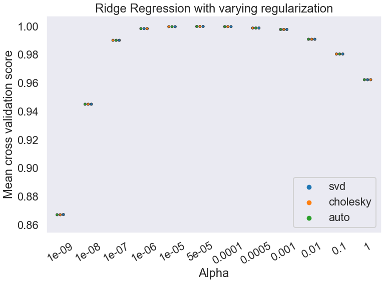


```python
fig = plt.figure(figsize=(12,8))
sns.scatterplot(data=best_ridge.coef_)
plt.title("Feature Coefficient Weights in Ridge Model")
plt.xlabel("Feature Index")
plt.ylabel("Coefficient Weight")
```


    Text(0, 0.5, 'Coefficient Weight')


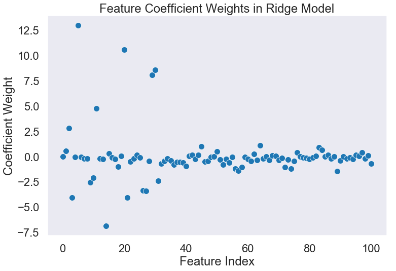


```python
reg_plot_learning_curves(
    model=best_ridge, X=X_train_reg, y=y_train_reg)
plt.yscale('log')
```


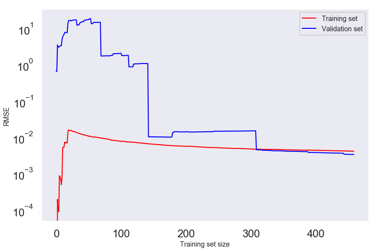


## Decision Tree Regressor


```python
param_grid= [{
    'criterion': ['mae'], 'splitter': ['best'], 
    'max_depth': [101, 1, 2, 3, 5, 10, 50],  
    'min_samples_split': [0.1, 2], 'min_samples_leaf': [0.1, 1, 2], 
    'min_weight_fraction_leaf': [0], 'max_features': [101, 2, 4, 10, 50], 
    'random_state': [42]
}]

results_tree_reg, best_tree_reg, Message = model_gsearch_cval(
    model=DecisionTreeRegressor(), X=X_train_reg, y=y_train_reg, 
    param_grid=param_grid, cv=5)
```

    Cross-validation statistics for best model: Scores: [0.03460228 0.04914732 0.0439587  0.03806935 0.        ] Mean: 0.03315552991968411 Standard Deviation: 0.01730880490191542


```python
best_tree_reg
```


    DecisionTreeRegressor(criterion='mae', max_depth=101, max_features=101,
               max_leaf_nodes=None, min_impurity_decrease=0.0,
               min_impurity_split=None, min_samples_leaf=2,
               min_samples_split=2, min_weight_fraction_leaf=0, presort=False,
               random_state=42, splitter='best')


```python
results_tree_reg.head()
```


<div>
<style scoped>
    .dataframe tbody tr th:only-of-type {
        vertical-align: middle;
    }

    .dataframe tbody tr th {
        vertical-align: top;
    }

    .dataframe thead th {
        text-align: right;
    }
</style>
<table border="1" class="dataframe">
  <thead>
    <tr style="text-align: right;">
      <th></th>
      <th>mean_fit_time</th>
      <th>std_fit_time</th>
      <th>mean_score_time</th>
      <th>std_score_time</th>
      <th>param_criterion</th>
      <th>param_max_depth</th>
      <th>param_max_features</th>
      <th>param_min_samples_leaf</th>
      <th>param_min_samples_split</th>
      <th>param_min_weight_fraction_leaf</th>
      <th>param_random_state</th>
      <th>param_splitter</th>
      <th>params</th>
      <th>split0_test_score</th>
      <th>split1_test_score</th>
      <th>split2_test_score</th>
      <th>split3_test_score</th>
      <th>split4_test_score</th>
      <th>mean_test_score</th>
      <th>std_test_score</th>
      <th>rank_test_score</th>
      <th>split0_train_score</th>
      <th>split1_train_score</th>
      <th>split2_train_score</th>
      <th>split3_train_score</th>
      <th>split4_train_score</th>
      <th>mean_train_score</th>
      <th>std_train_score</th>
    </tr>
  </thead>
  <tbody>
    <tr>
      <th>5</th>
      <td>0.089635</td>
      <td>0.015855</td>
      <td>0.000433</td>
      <td>0.000064</td>
      <td>mae</td>
      <td>101</td>
      <td>101</td>
      <td>2</td>
      <td>2</td>
      <td>0</td>
      <td>42</td>
      <td>best</td>
      <td>{'criterion': 'mae', 'max_depth': 101, 'max_fe...</td>
      <td>0.991823</td>
      <td>0.981192</td>
      <td>0.986839</td>
      <td>0.988566</td>
      <td>1.0</td>
      <td>0.989688</td>
      <td>0.006199</td>
      <td>1</td>
      <td>0.997358</td>
      <td>0.99487</td>
      <td>0.998243</td>
      <td>0.993927</td>
      <td>0.994856</td>
      <td>0.995851</td>
      <td>0.001652</td>
    </tr>
    <tr>
      <th>185</th>
      <td>0.090162</td>
      <td>0.015687</td>
      <td>0.000326</td>
      <td>0.000021</td>
      <td>mae</td>
      <td>50</td>
      <td>101</td>
      <td>2</td>
      <td>2</td>
      <td>0</td>
      <td>42</td>
      <td>best</td>
      <td>{'criterion': 'mae', 'max_depth': 50, 'max_fea...</td>
      <td>0.991823</td>
      <td>0.981192</td>
      <td>0.986839</td>
      <td>0.988566</td>
      <td>1.0</td>
      <td>0.989688</td>
      <td>0.006199</td>
      <td>1</td>
      <td>0.997358</td>
      <td>0.99487</td>
      <td>0.998243</td>
      <td>0.993927</td>
      <td>0.994856</td>
      <td>0.995851</td>
      <td>0.001652</td>
    </tr>
    <tr>
      <th>155</th>
      <td>0.082453</td>
      <td>0.009986</td>
      <td>0.000359</td>
      <td>0.000022</td>
      <td>mae</td>
      <td>10</td>
      <td>101</td>
      <td>2</td>
      <td>2</td>
      <td>0</td>
      <td>42</td>
      <td>best</td>
      <td>{'criterion': 'mae', 'max_depth': 10, 'max_fea...</td>
      <td>0.991823</td>
      <td>0.973669</td>
      <td>0.986839</td>
      <td>0.988566</td>
      <td>1.0</td>
      <td>0.988186</td>
      <td>0.008544</td>
      <td>3</td>
      <td>0.997358</td>
      <td>0.99145</td>
      <td>0.998243</td>
      <td>0.993060</td>
      <td>0.994856</td>
      <td>0.994993</td>
      <td>0.002548</td>
    </tr>
    <tr>
      <th>123</th>
      <td>0.074868</td>
      <td>0.003161</td>
      <td>0.000387</td>
      <td>0.000005</td>
      <td>mae</td>
      <td>5</td>
      <td>101</td>
      <td>1</td>
      <td>2</td>
      <td>0</td>
      <td>42</td>
      <td>best</td>
      <td>{'criterion': 'mae', 'max_depth': 5, 'max_feat...</td>
      <td>0.986916</td>
      <td>0.977430</td>
      <td>0.980259</td>
      <td>0.992377</td>
      <td>1.0</td>
      <td>0.987396</td>
      <td>0.008168</td>
      <td>4</td>
      <td>0.996478</td>
      <td>0.98974</td>
      <td>1.000000</td>
      <td>0.993060</td>
      <td>0.996571</td>
      <td>0.995170</td>
      <td>0.003491</td>
    </tr>
    <tr>
      <th>125</th>
      <td>0.083835</td>
      <td>0.005154</td>
      <td>0.000485</td>
      <td>0.000034</td>
      <td>mae</td>
      <td>5</td>
      <td>101</td>
      <td>2</td>
      <td>2</td>
      <td>0</td>
      <td>42</td>
      <td>best</td>
      <td>{'criterion': 'mae', 'max_depth': 5, 'max_feat...</td>
      <td>0.986916</td>
      <td>0.969907</td>
      <td>0.986839</td>
      <td>0.990471</td>
      <td>1.0</td>
      <td>0.986827</td>
      <td>0.009719</td>
      <td>5</td>
      <td>0.995597</td>
      <td>0.98974</td>
      <td>0.998243</td>
      <td>0.992192</td>
      <td>0.994856</td>
      <td>0.994126</td>
      <td>0.002920</td>
    </tr>
  </tbody>
</table>
</div>


```python
fig = plt.figure(figsize=(12,8))

sns.boxplot(
    data=results_tree_reg, x="param_max_depth", y="mean_test_score", hue="param_max_features")
plt.title("Varying Decision Tree Hyperparameters")
plt.xlabel("Maximum Depth")
plt.ylabel("Mean test score")
```


    Text(0, 0.5, 'Mean test score')


```python
test = cross_val_score(best_tree_reg, X_test_reg, y_test_reg, scoring="neg_mean_squared_error", cv=5)
rmse_test = np.sqrt(-test)
print("Scores:", rmse_test)
print("Mean:", rmse_test.mean())
print("Standard Deviation:", rmse_test.std())
```

    Scores: [0.06189845 0.04376881 0.08753762 0.15161961 0.04454354]
    Mean: 0.0778736055906516
    Standard Deviation: 0.0401524648773531


```python
reg_plot_learning_curves(
    model=best_tree_reg, X=X_train_reg, y=y_train_reg)
plt.yscale('linear')
```


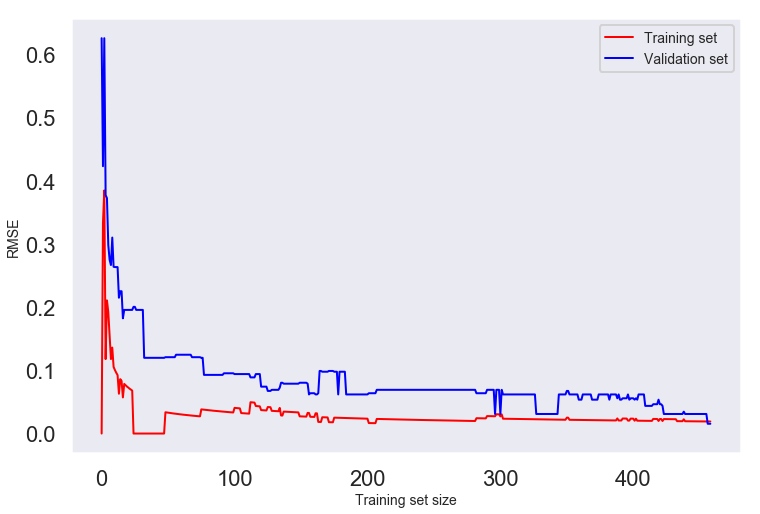


## Lasso


```python
param_grid = [{
    'alpha': [1e-3, 1e-2], 'random_state': [42]
}]

results_lasso, best_lasso, Message = model_gsearch_cval(
    model=Lasso(),X=X_train_reg, y=y_train_reg, 
    param_grid=param_grid, cv=5)
```

    Cross-validation statistics for best model: Scores: [0.06879424 0.08060629 0.08791208 0.0722936  0.06947704] Mean: 0.07581664912643021 Standard Deviation: 0.007364196113476549


```python
results_lasso.head()
```


<div>
<style scoped>
    .dataframe tbody tr th:only-of-type {
        vertical-align: middle;
    }

    .dataframe tbody tr th {
        vertical-align: top;
    }

    .dataframe thead th {
        text-align: right;
    }
</style>
<table border="1" class="dataframe">
  <thead>
    <tr style="text-align: right;">
      <th></th>
      <th>mean_fit_time</th>
      <th>std_fit_time</th>
      <th>mean_score_time</th>
      <th>std_score_time</th>
      <th>param_alpha</th>
      <th>param_random_state</th>
      <th>params</th>
      <th>split0_test_score</th>
      <th>split1_test_score</th>
      <th>split2_test_score</th>
      <th>split3_test_score</th>
      <th>split4_test_score</th>
      <th>mean_test_score</th>
      <th>std_test_score</th>
      <th>rank_test_score</th>
      <th>split0_train_score</th>
      <th>split1_train_score</th>
      <th>split2_train_score</th>
      <th>split3_train_score</th>
      <th>split4_train_score</th>
      <th>mean_train_score</th>
      <th>std_train_score</th>
    </tr>
  </thead>
  <tbody>
    <tr>
      <th>0</th>
      <td>0.014549</td>
      <td>0.002610</td>
      <td>0.000430</td>
      <td>0.000155</td>
      <td>0.001</td>
      <td>42</td>
      <td>{'alpha': 0.001, 'random_state': 42}</td>
      <td>0.967678</td>
      <td>0.949408</td>
      <td>0.947363</td>
      <td>0.958765</td>
      <td>0.963156</td>
      <td>0.957292</td>
      <td>0.007818</td>
      <td>1</td>
      <td>0.958304</td>
      <td>0.962232</td>
      <td>0.959169</td>
      <td>0.962751</td>
      <td>0.958519</td>
      <td>0.960195</td>
      <td>0.001904</td>
    </tr>
    <tr>
      <th>1</th>
      <td>0.009926</td>
      <td>0.000482</td>
      <td>0.000255</td>
      <td>0.000005</td>
      <td>0.01</td>
      <td>42</td>
      <td>{'alpha': 0.01, 'random_state': 42}</td>
      <td>0.871774</td>
      <td>0.882860</td>
      <td>0.872049</td>
      <td>0.874476</td>
      <td>0.886457</td>
      <td>0.877513</td>
      <td>0.006009</td>
      <td>2</td>
      <td>0.880023</td>
      <td>0.890088</td>
      <td>0.884111</td>
      <td>0.882003</td>
      <td>0.884499</td>
      <td>0.884145</td>
      <td>0.003377</td>
    </tr>
  </tbody>
</table>
</div>


```python
best_lasso
```


    Lasso(alpha=0.001, copy_X=True, fit_intercept=True, max_iter=1000,
       normalize=False, positive=False, precompute=False, random_state=42,
       selection='cyclic', tol=0.0001, warm_start=False)


```python
test = cross_val_score(best_lasso, X_test_reg, y_test_reg, scoring="neg_mean_squared_error", cv=5)
rmse_test = np.sqrt(-test)
print("Scores:", rmse_test)
print("Mean:", rmse_test.mean())
print("Standard Deviation:", rmse_test.std())
```

    Scores: [0.06079401 0.08208939 0.08048793 0.5959277  0.06310351]
    Mean: 0.17648050799809348
    Standard Deviation: 0.2099037474938683


```python
reg_plot_learning_curves(
    model=best_lasso, X=X_train_reg, y=y_train_reg)
plt.yscale('linear')
plt.ylim(0,0.3)
```


    (0, 0.3)


## Elastic Net


```python
param_grid = [{
    'alpha': [1e-7, 1e-6, 1e-5, 1e-4, 1e-3, 1e-2, 1e-1], 'l1_ratio': [0, 0.4, 0.6, 1]
}]

results_elastic, best_elastic, Message = model_gsearch_cval(
    model=ElasticNet(), X=X_train_reg, y=y_train_reg, 
    param_grid=param_grid, cv=5)
```

    Cross-validation statistics for best model: Scores: [0.05447368 0.06110617 0.06243749 0.05989883 0.06068161] Mean: 0.05971955333562697 Standard Deviation: 0.0027490650119604363


```python
best_elastic
```


    ElasticNet(alpha=1e-07, copy_X=True, fit_intercept=True, l1_ratio=0,
          max_iter=1000, normalize=False, positive=False, precompute=False,
          random_state=None, selection='cyclic', tol=0.0001, warm_start=False)


```python
results_elastic.head()
```


<div>
<style scoped>
    .dataframe tbody tr th:only-of-type {
        vertical-align: middle;
    }

    .dataframe tbody tr th {
        vertical-align: top;
    }

    .dataframe thead th {
        text-align: right;
    }
</style>
<table border="1" class="dataframe">
  <thead>
    <tr style="text-align: right;">
      <th></th>
      <th>mean_fit_time</th>
      <th>std_fit_time</th>
      <th>mean_score_time</th>
      <th>std_score_time</th>
      <th>param_alpha</th>
      <th>param_l1_ratio</th>
      <th>params</th>
      <th>split0_test_score</th>
      <th>split1_test_score</th>
      <th>split2_test_score</th>
      <th>split3_test_score</th>
      <th>split4_test_score</th>
      <th>mean_test_score</th>
      <th>std_test_score</th>
      <th>rank_test_score</th>
      <th>split0_train_score</th>
      <th>split1_train_score</th>
      <th>split2_train_score</th>
      <th>split3_train_score</th>
      <th>split4_train_score</th>
      <th>mean_train_score</th>
      <th>std_train_score</th>
    </tr>
  </thead>
  <tbody>
    <tr>
      <th>0</th>
      <td>0.024798</td>
      <td>0.004625</td>
      <td>0.000360</td>
      <td>0.000055</td>
      <td>1e-07</td>
      <td>0</td>
      <td>{'alpha': 1e-07, 'l1_ratio': 0}</td>
      <td>0.979734</td>
      <td>0.970925</td>
      <td>0.973449</td>
      <td>0.971693</td>
      <td>0.971894</td>
      <td>0.973550</td>
      <td>0.003212</td>
      <td>1</td>
      <td>0.975121</td>
      <td>0.977156</td>
      <td>0.974882</td>
      <td>0.977579</td>
      <td>0.974220</td>
      <td>0.975792</td>
      <td>0.001327</td>
    </tr>
    <tr>
      <th>1</th>
      <td>0.019761</td>
      <td>0.001167</td>
      <td>0.000314</td>
      <td>0.000063</td>
      <td>1e-07</td>
      <td>0.4</td>
      <td>{'alpha': 1e-07, 'l1_ratio': 0.4}</td>
      <td>0.979734</td>
      <td>0.970925</td>
      <td>0.973448</td>
      <td>0.971693</td>
      <td>0.971894</td>
      <td>0.973549</td>
      <td>0.003212</td>
      <td>2</td>
      <td>0.975121</td>
      <td>0.977155</td>
      <td>0.974882</td>
      <td>0.977579</td>
      <td>0.974220</td>
      <td>0.975791</td>
      <td>0.001327</td>
    </tr>
    <tr>
      <th>2</th>
      <td>0.019523</td>
      <td>0.000210</td>
      <td>0.000260</td>
      <td>0.000014</td>
      <td>1e-07</td>
      <td>0.6</td>
      <td>{'alpha': 1e-07, 'l1_ratio': 0.6}</td>
      <td>0.979734</td>
      <td>0.970924</td>
      <td>0.973448</td>
      <td>0.971693</td>
      <td>0.971894</td>
      <td>0.973549</td>
      <td>0.003212</td>
      <td>3</td>
      <td>0.975120</td>
      <td>0.977155</td>
      <td>0.974882</td>
      <td>0.977579</td>
      <td>0.974220</td>
      <td>0.975791</td>
      <td>0.001327</td>
    </tr>
    <tr>
      <th>3</th>
      <td>0.019442</td>
      <td>0.001033</td>
      <td>0.000279</td>
      <td>0.000044</td>
      <td>1e-07</td>
      <td>1</td>
      <td>{'alpha': 1e-07, 'l1_ratio': 1}</td>
      <td>0.979734</td>
      <td>0.970924</td>
      <td>0.973448</td>
      <td>0.971693</td>
      <td>0.971894</td>
      <td>0.973549</td>
      <td>0.003212</td>
      <td>4</td>
      <td>0.975120</td>
      <td>0.977155</td>
      <td>0.974881</td>
      <td>0.977579</td>
      <td>0.974219</td>
      <td>0.975791</td>
      <td>0.001327</td>
    </tr>
    <tr>
      <th>4</th>
      <td>0.020557</td>
      <td>0.001871</td>
      <td>0.000305</td>
      <td>0.000043</td>
      <td>1e-06</td>
      <td>0</td>
      <td>{'alpha': 1e-06, 'l1_ratio': 0}</td>
      <td>0.979733</td>
      <td>0.970917</td>
      <td>0.973444</td>
      <td>0.971693</td>
      <td>0.971893</td>
      <td>0.973547</td>
      <td>0.003213</td>
      <td>5</td>
      <td>0.975116</td>
      <td>0.977152</td>
      <td>0.974879</td>
      <td>0.977575</td>
      <td>0.974217</td>
      <td>0.975788</td>
      <td>0.001327</td>
    </tr>
  </tbody>
</table>
</div>


```python
fig = plt.figure(figsize=(12,8))

sns.swarmplot(
    data=results_elastic, x="param_alpha", y="mean_test_score", hue="param_l1_ratio")
plt.title("Varying Elastic Net Hyperparameters")
plt.xlabel("Alpha")
plt.ylabel("Mean test score")
```


    Text(0, 0.5, 'Mean test score')


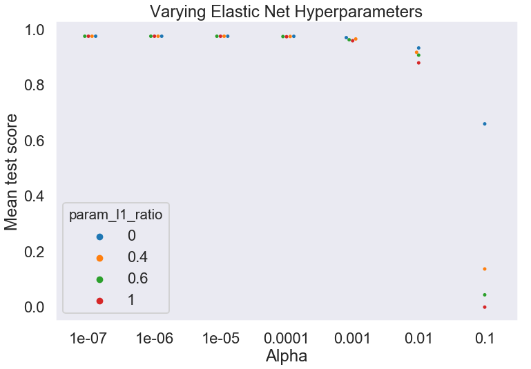


```python
reg_plot_learning_curves(
    model=best_elastic, X=X_train_reg, y=y_train_reg)
plt.yscale('log')
```


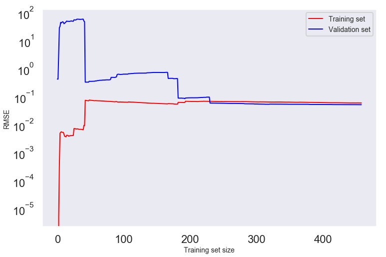


# Comparison of all Regression Models


```python
reg_comp(seed=42, X=X_train_reg, y=y_train_reg)
```

    Model: Mean (Standard Deviation)
    Ridge: -0.004915 (0.001164)
    Decision Tree: -0.002302 (0.002815)
    Lasso: -0.005766 (0.001483)
    Support Vector: -0.006685 (0.000798)
    Elastic Net: -0.003493 (0.000666)


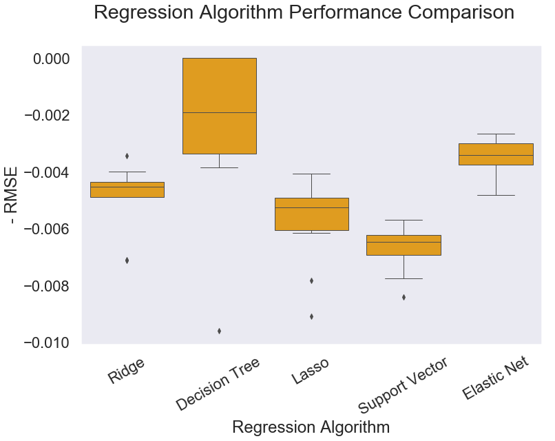


# Classification Models

## Random Forest Classifier


```python
param_grid = [{
    'n_estimators': [1, 5, 10, 20, 25, 30, 35, 40, 50], 
    'random_state': [42]
}]
results_rfc, best_rfc, Message = clf_model_gsearch_cval(
    model=RandomForestClassifier(), X=X_train_clf, y=y_train_clf, param_grid=param_grid, cv=5)
```

    Cross-validation statistics for best model: Scores: [0.99137931 0.97413793 0.98275862 1.         0.99115044] Mean: 0.9878852609093685 Standard Deviation: 0.008773918326473498


```python
results_rfc.head()
```


<div>
<style scoped>
    .dataframe tbody tr th:only-of-type {
        vertical-align: middle;
    }

    .dataframe tbody tr th {
        vertical-align: top;
    }

    .dataframe thead th {
        text-align: right;
    }
</style>
<table border="1" class="dataframe">
  <thead>
    <tr style="text-align: right;">
      <th></th>
      <th>mean_fit_time</th>
      <th>std_fit_time</th>
      <th>mean_score_time</th>
      <th>std_score_time</th>
      <th>param_n_estimators</th>
      <th>param_random_state</th>
      <th>params</th>
      <th>split0_test_score</th>
      <th>split1_test_score</th>
      <th>split2_test_score</th>
      <th>split3_test_score</th>
      <th>split4_test_score</th>
      <th>mean_test_score</th>
      <th>std_test_score</th>
      <th>rank_test_score</th>
      <th>split0_train_score</th>
      <th>split1_train_score</th>
      <th>split2_train_score</th>
      <th>split3_train_score</th>
      <th>split4_train_score</th>
      <th>mean_train_score</th>
      <th>std_train_score</th>
    </tr>
  </thead>
  <tbody>
    <tr>
      <th>7</th>
      <td>0.033854</td>
      <td>0.000308</td>
      <td>0.002321</td>
      <td>0.000038</td>
      <td>40</td>
      <td>42</td>
      <td>{'n_estimators': 40, 'random_state': 42}</td>
      <td>0.991379</td>
      <td>0.974138</td>
      <td>0.982759</td>
      <td>1.000000</td>
      <td>0.99115</td>
      <td>0.987847</td>
      <td>0.008787</td>
      <td>1</td>
      <td>1.0</td>
      <td>1.0</td>
      <td>1.0</td>
      <td>1.0</td>
      <td>1.00000</td>
      <td>1.000000</td>
      <td>0.000000</td>
    </tr>
    <tr>
      <th>3</th>
      <td>0.017691</td>
      <td>0.000844</td>
      <td>0.001357</td>
      <td>0.000043</td>
      <td>20</td>
      <td>42</td>
      <td>{'n_estimators': 20, 'random_state': 42}</td>
      <td>0.991379</td>
      <td>0.974138</td>
      <td>0.991379</td>
      <td>0.982609</td>
      <td>0.99115</td>
      <td>0.986111</td>
      <td>0.006891</td>
      <td>2</td>
      <td>1.0</td>
      <td>1.0</td>
      <td>1.0</td>
      <td>1.0</td>
      <td>0.99784</td>
      <td>0.999568</td>
      <td>0.000864</td>
    </tr>
    <tr>
      <th>5</th>
      <td>0.025529</td>
      <td>0.000369</td>
      <td>0.001859</td>
      <td>0.000050</td>
      <td>30</td>
      <td>42</td>
      <td>{'n_estimators': 30, 'random_state': 42}</td>
      <td>0.991379</td>
      <td>0.982759</td>
      <td>0.982759</td>
      <td>0.982609</td>
      <td>0.99115</td>
      <td>0.986111</td>
      <td>0.004189</td>
      <td>2</td>
      <td>1.0</td>
      <td>1.0</td>
      <td>1.0</td>
      <td>1.0</td>
      <td>1.00000</td>
      <td>1.000000</td>
      <td>0.000000</td>
    </tr>
    <tr>
      <th>6</th>
      <td>0.029854</td>
      <td>0.000363</td>
      <td>0.002082</td>
      <td>0.000028</td>
      <td>35</td>
      <td>42</td>
      <td>{'n_estimators': 35, 'random_state': 42}</td>
      <td>0.991379</td>
      <td>0.974138</td>
      <td>0.982759</td>
      <td>0.991304</td>
      <td>0.99115</td>
      <td>0.986111</td>
      <td>0.006862</td>
      <td>2</td>
      <td>1.0</td>
      <td>1.0</td>
      <td>1.0</td>
      <td>1.0</td>
      <td>1.00000</td>
      <td>1.000000</td>
      <td>0.000000</td>
    </tr>
    <tr>
      <th>8</th>
      <td>0.042699</td>
      <td>0.001248</td>
      <td>0.002816</td>
      <td>0.000063</td>
      <td>50</td>
      <td>42</td>
      <td>{'n_estimators': 50, 'random_state': 42}</td>
      <td>0.991379</td>
      <td>0.974138</td>
      <td>0.982759</td>
      <td>0.991304</td>
      <td>0.99115</td>
      <td>0.986111</td>
      <td>0.006862</td>
      <td>2</td>
      <td>1.0</td>
      <td>1.0</td>
      <td>1.0</td>
      <td>1.0</td>
      <td>1.00000</td>
      <td>1.000000</td>
      <td>0.000000</td>
    </tr>
  </tbody>
</table>
</div>


```python
best_rfc
```


    RandomForestClassifier(bootstrap=True, class_weight=None, criterion='gini',
                max_depth=None, max_features='auto', max_leaf_nodes=None,
                min_impurity_decrease=0.0, min_impurity_split=None,
                min_samples_leaf=1, min_samples_split=2,
                min_weight_fraction_leaf=0.0, n_estimators=40, n_jobs=None,
                oob_score=False, random_state=42, verbose=0, warm_start=False)


```python
clf_plot_learning_curves(
    model=best_rfc, X=X_train_clf, y=y_train_clf)
plt.yscale('linear')
plt.legend(loc='lower right')
```


    <matplotlib.legend.Legend at 0x1a2785a198>


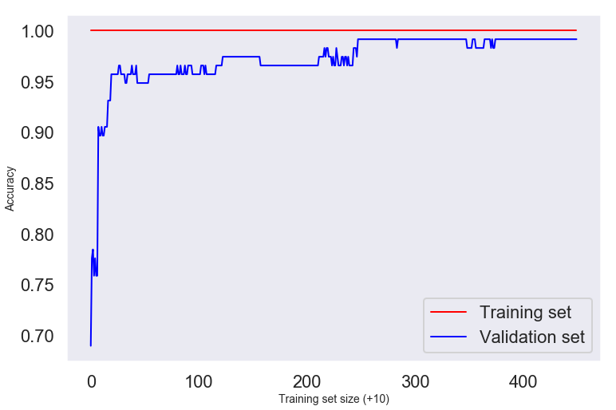


## Support Vector Classifier


```python
param_grid = [{
    'C': [5, 6, 1e1, 1e2, 1e3], 'random_state': [42], 'dual': [False], 
    'tol': [1e-5, 1e-3, 1e-1], 'penalty': ['l1']},
    {'C': [5, 6, 1e1, 1e2, 1e3], 'loss': ['hinge'], 'random_state': [42], 
     'tol': [1e-5, 1e-3, 1e-1], 'penalty': ['l2']}
]

results_svc, best_svc, Message = clf_model_gsearch_cval(
    model=LinearSVC(), X=X_train_clf, y=y_train_clf, 
    param_grid=param_grid, cv=5)
```

    Cross-validation statistics for best model: Scores: [1.         0.99137931 1.         1.         1.        ] Mean: 0.9982758620689655 Standard Deviation: 0.0034482758620689503


```python
results_svc.head()
```


<div>
<style scoped>
    .dataframe tbody tr th:only-of-type {
        vertical-align: middle;
    }

    .dataframe tbody tr th {
        vertical-align: top;
    }

    .dataframe thead th {
        text-align: right;
    }
</style>
<table border="1" class="dataframe">
  <thead>
    <tr style="text-align: right;">
      <th></th>
      <th>mean_fit_time</th>
      <th>std_fit_time</th>
      <th>mean_score_time</th>
      <th>std_score_time</th>
      <th>param_C</th>
      <th>param_dual</th>
      <th>param_penalty</th>
      <th>param_random_state</th>
      <th>param_tol</th>
      <th>param_loss</th>
      <th>params</th>
      <th>split0_test_score</th>
      <th>split1_test_score</th>
      <th>split2_test_score</th>
      <th>split3_test_score</th>
      <th>split4_test_score</th>
      <th>mean_test_score</th>
      <th>std_test_score</th>
      <th>rank_test_score</th>
      <th>split0_train_score</th>
      <th>split1_train_score</th>
      <th>split2_train_score</th>
      <th>split3_train_score</th>
      <th>split4_train_score</th>
      <th>mean_train_score</th>
      <th>std_train_score</th>
    </tr>
  </thead>
  <tbody>
    <tr>
      <th>13</th>
      <td>0.247924</td>
      <td>0.028537</td>
      <td>0.000399</td>
      <td>0.000007</td>
      <td>1000</td>
      <td>False</td>
      <td>l1</td>
      <td>42</td>
      <td>0.001</td>
      <td>NaN</td>
      <td>{'C': 1000.0, 'dual': False, 'penalty': 'l1', ...</td>
      <td>1.0</td>
      <td>0.991379</td>
      <td>1.0</td>
      <td>1.0</td>
      <td>1.0</td>
      <td>0.998264</td>
      <td>0.003457</td>
      <td>1</td>
      <td>1.0</td>
      <td>1.0</td>
      <td>1.0</td>
      <td>1.0</td>
      <td>1.0</td>
      <td>1.0</td>
      <td>0.0</td>
    </tr>
    <tr>
      <th>3</th>
      <td>0.170582</td>
      <td>0.030265</td>
      <td>0.000389</td>
      <td>0.000011</td>
      <td>6</td>
      <td>False</td>
      <td>l1</td>
      <td>42</td>
      <td>1e-05</td>
      <td>NaN</td>
      <td>{'C': 6, 'dual': False, 'penalty': 'l1', 'rand...</td>
      <td>1.0</td>
      <td>0.991379</td>
      <td>1.0</td>
      <td>1.0</td>
      <td>1.0</td>
      <td>0.998264</td>
      <td>0.003457</td>
      <td>1</td>
      <td>1.0</td>
      <td>1.0</td>
      <td>1.0</td>
      <td>1.0</td>
      <td>1.0</td>
      <td>1.0</td>
      <td>0.0</td>
    </tr>
    <tr>
      <th>4</th>
      <td>0.192358</td>
      <td>0.041714</td>
      <td>0.000434</td>
      <td>0.000060</td>
      <td>6</td>
      <td>False</td>
      <td>l1</td>
      <td>42</td>
      <td>0.001</td>
      <td>NaN</td>
      <td>{'C': 6, 'dual': False, 'penalty': 'l1', 'rand...</td>
      <td>1.0</td>
      <td>0.991379</td>
      <td>1.0</td>
      <td>1.0</td>
      <td>1.0</td>
      <td>0.998264</td>
      <td>0.003457</td>
      <td>1</td>
      <td>1.0</td>
      <td>1.0</td>
      <td>1.0</td>
      <td>1.0</td>
      <td>1.0</td>
      <td>1.0</td>
      <td>0.0</td>
    </tr>
    <tr>
      <th>12</th>
      <td>0.476669</td>
      <td>0.061062</td>
      <td>0.000405</td>
      <td>0.000025</td>
      <td>1000</td>
      <td>False</td>
      <td>l1</td>
      <td>42</td>
      <td>1e-05</td>
      <td>NaN</td>
      <td>{'C': 1000.0, 'dual': False, 'penalty': 'l1', ...</td>
      <td>1.0</td>
      <td>0.991379</td>
      <td>1.0</td>
      <td>1.0</td>
      <td>1.0</td>
      <td>0.998264</td>
      <td>0.003457</td>
      <td>1</td>
      <td>1.0</td>
      <td>1.0</td>
      <td>1.0</td>
      <td>1.0</td>
      <td>1.0</td>
      <td>1.0</td>
      <td>0.0</td>
    </tr>
    <tr>
      <th>6</th>
      <td>0.192701</td>
      <td>0.019670</td>
      <td>0.000399</td>
      <td>0.000014</td>
      <td>10</td>
      <td>False</td>
      <td>l1</td>
      <td>42</td>
      <td>1e-05</td>
      <td>NaN</td>
      <td>{'C': 10.0, 'dual': False, 'penalty': 'l1', 'r...</td>
      <td>1.0</td>
      <td>0.991379</td>
      <td>1.0</td>
      <td>1.0</td>
      <td>1.0</td>
      <td>0.998264</td>
      <td>0.003457</td>
      <td>1</td>
      <td>1.0</td>
      <td>1.0</td>
      <td>1.0</td>
      <td>1.0</td>
      <td>1.0</td>
      <td>1.0</td>
      <td>0.0</td>
    </tr>
  </tbody>
</table>
</div>


```python
best_svc
```


    LinearSVC(C=6, class_weight=None, dual=False, fit_intercept=True,
         intercept_scaling=1, loss='squared_hinge', max_iter=1000,
         multi_class='ovr', penalty='l1', random_state=42, tol=1e-05,
         verbose=0)


```python
fig = plt.figure(figsize=(12,8))

sns.swarmplot(
    data=results_svc, x="param_C", y="mean_test_score", hue="param_penalty")
plt.title("Varying Linear SVC Hyperparameters")
plt.xlabel("C")
plt.ylabel("Mean test score")
```


    Text(0, 0.5, 'Mean test score')


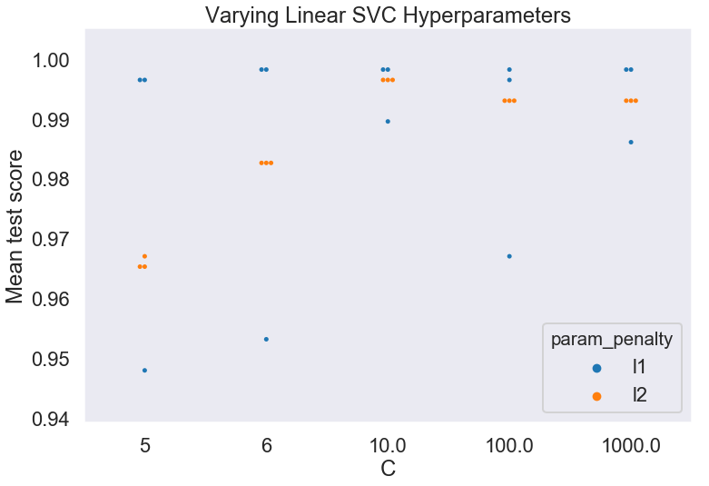


```python
clf_plot_learning_curves(
    model=best_svc, X=X_train_clf, y=y_train_clf)
plt.yscale('linear')
plt.legend(loc='lower right')
```


    <matplotlib.legend.Legend at 0x1a26e57e48>


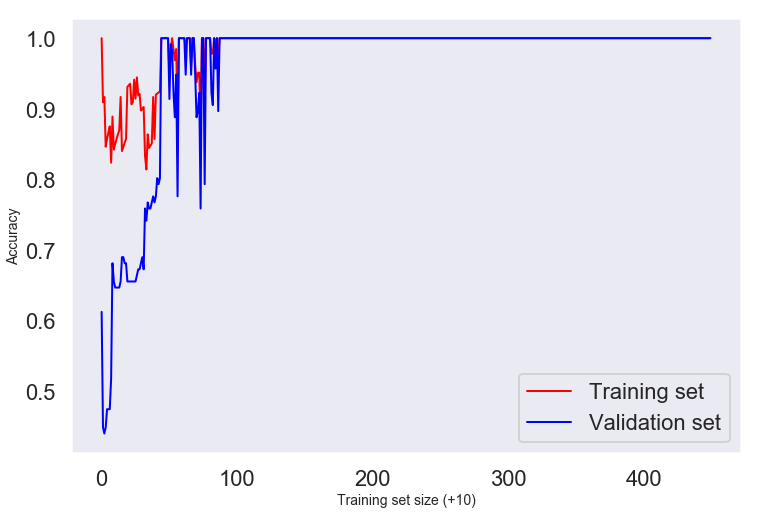


## K Neighbors Classifier


```python
param_grid = [{
    'n_neighbors': [1, 3, 5, 7, 9], 'weights': ['uniform', 'distance'], 'leaf_size': [10, 20, 30, 40, 50]
}]

results_knc, best_knc, Message = clf_model_gsearch_cval(
    model=KNeighborsClassifier(), X=X_train_clf, y=y_train_clf, 
    param_grid=param_grid, cv=3)
```

    Cross-validation statistics for best model: Scores: [0.98445596 0.98963731 0.99473684] Mean: 0.9896100354513226 Standard Deviation: 0.004197197431861843


```python
results_knc.head()
```


<div>
<style scoped>
    .dataframe tbody tr th:only-of-type {
        vertical-align: middle;
    }

    .dataframe tbody tr th {
        vertical-align: top;
    }

    .dataframe thead th {
        text-align: right;
    }
</style>
<table border="1" class="dataframe">
  <thead>
    <tr style="text-align: right;">
      <th></th>
      <th>mean_fit_time</th>
      <th>std_fit_time</th>
      <th>mean_score_time</th>
      <th>std_score_time</th>
      <th>param_leaf_size</th>
      <th>param_n_neighbors</th>
      <th>param_weights</th>
      <th>params</th>
      <th>split0_test_score</th>
      <th>split1_test_score</th>
      <th>split2_test_score</th>
      <th>mean_test_score</th>
      <th>std_test_score</th>
      <th>rank_test_score</th>
      <th>split0_train_score</th>
      <th>split1_train_score</th>
      <th>split2_train_score</th>
      <th>mean_train_score</th>
      <th>std_train_score</th>
    </tr>
  </thead>
  <tbody>
    <tr>
      <th>0</th>
      <td>0.001257</td>
      <td>0.000308</td>
      <td>0.010803</td>
      <td>0.002223</td>
      <td>10</td>
      <td>1</td>
      <td>uniform</td>
      <td>{'leaf_size': 10, 'n_neighbors': 1, 'weights':...</td>
      <td>0.984456</td>
      <td>0.989637</td>
      <td>0.994737</td>
      <td>0.989583</td>
      <td>0.004192</td>
      <td>1</td>
      <td>1.0</td>
      <td>1.0</td>
      <td>1.0</td>
      <td>1.0</td>
      <td>0.0</td>
    </tr>
    <tr>
      <th>21</th>
      <td>0.000785</td>
      <td>0.000020</td>
      <td>0.004799</td>
      <td>0.001104</td>
      <td>30</td>
      <td>1</td>
      <td>distance</td>
      <td>{'leaf_size': 30, 'n_neighbors': 1, 'weights':...</td>
      <td>0.984456</td>
      <td>0.989637</td>
      <td>0.994737</td>
      <td>0.989583</td>
      <td>0.004192</td>
      <td>1</td>
      <td>1.0</td>
      <td>1.0</td>
      <td>1.0</td>
      <td>1.0</td>
      <td>0.0</td>
    </tr>
    <tr>
      <th>20</th>
      <td>0.000804</td>
      <td>0.000007</td>
      <td>0.008059</td>
      <td>0.001064</td>
      <td>30</td>
      <td>1</td>
      <td>uniform</td>
      <td>{'leaf_size': 30, 'n_neighbors': 1, 'weights':...</td>
      <td>0.984456</td>
      <td>0.989637</td>
      <td>0.994737</td>
      <td>0.989583</td>
      <td>0.004192</td>
      <td>1</td>
      <td>1.0</td>
      <td>1.0</td>
      <td>1.0</td>
      <td>1.0</td>
      <td>0.0</td>
    </tr>
    <tr>
      <th>40</th>
      <td>0.000754</td>
      <td>0.000028</td>
      <td>0.008441</td>
      <td>0.001097</td>
      <td>50</td>
      <td>1</td>
      <td>uniform</td>
      <td>{'leaf_size': 50, 'n_neighbors': 1, 'weights':...</td>
      <td>0.984456</td>
      <td>0.989637</td>
      <td>0.994737</td>
      <td>0.989583</td>
      <td>0.004192</td>
      <td>1</td>
      <td>1.0</td>
      <td>1.0</td>
      <td>1.0</td>
      <td>1.0</td>
      <td>0.0</td>
    </tr>
    <tr>
      <th>31</th>
      <td>0.000769</td>
      <td>0.000014</td>
      <td>0.004870</td>
      <td>0.001063</td>
      <td>40</td>
      <td>1</td>
      <td>distance</td>
      <td>{'leaf_size': 40, 'n_neighbors': 1, 'weights':...</td>
      <td>0.984456</td>
      <td>0.989637</td>
      <td>0.994737</td>
      <td>0.989583</td>
      <td>0.004192</td>
      <td>1</td>
      <td>1.0</td>
      <td>1.0</td>
      <td>1.0</td>
      <td>1.0</td>
      <td>0.0</td>
    </tr>
  </tbody>
</table>
</div>


```python
best_knc
```


    KNeighborsClassifier(algorithm='auto', leaf_size=10, metric='minkowski',
               metric_params=None, n_jobs=None, n_neighbors=1, p=2,
               weights='uniform')


```python
fig = plt.figure(figsize=(12,8))

sns.swarmplot(
    data=results_knc, x="param_n_neighbors", y="mean_test_score", hue="param_weights")
plt.title("Varying K Neighbors Hyperparameters")
plt.xlabel("# of neighbors")
plt.ylabel("Mean test score")
```


    Text(0, 0.5, 'Mean test score')


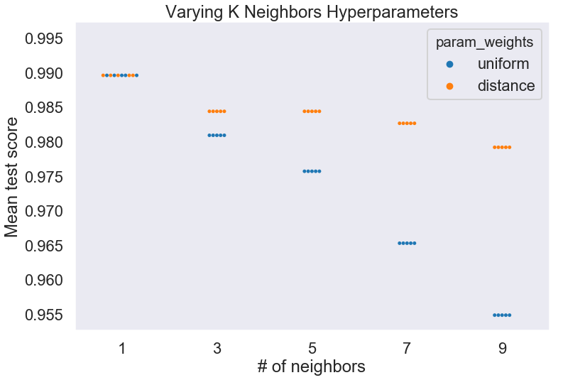


```python
clf_plot_learning_curves(
    model=best_knc, X=X_train_clf, y=y_train_clf)
plt.yscale('linear')
plt.legend(loc='lower right')
```


    <matplotlib.legend.Legend at 0x1a27d8d438>


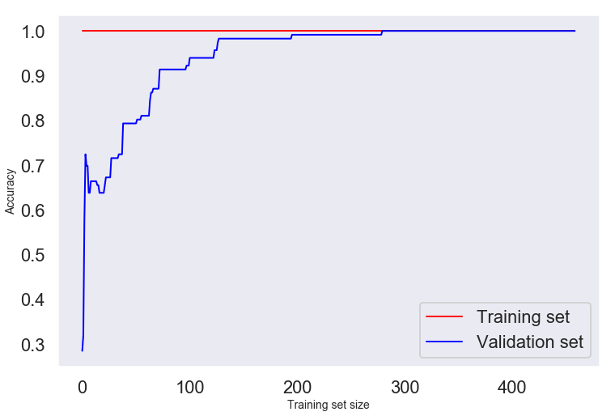


# Comparison of all Classification Models


```python
clf_comp(seed=42, X=X_train_clf, y=y_train_clf)
```

    Model: Mean (Standard Deviation)
    Random Forest: 0.987871 (0.013490)
    Support Vector: 0.996552 (0.010345)
    K Neighbors: 0.991349 (0.011589)


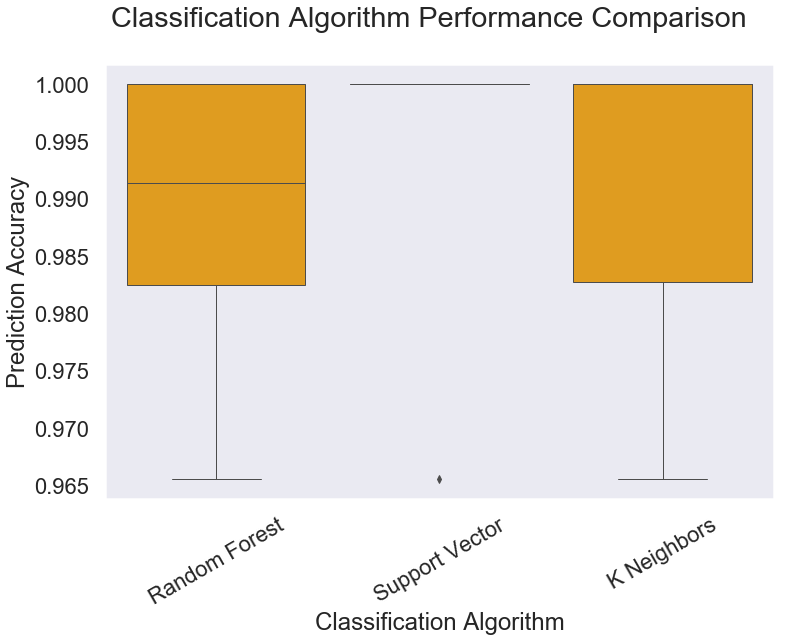


## This concludes the experiments with noise-free data. We can now repeat this analysis with the same models, but with noisy data, and see how the performance of the models changes.

# Experiments with Noisy Data


```python
reg_comp(seed=42, X=X_train_reg_noise, y=y_train_reg)
```

    Model: Mean (Standard Deviation)
    Ridge: -0.025553 (0.039050)
    Decision Tree: -0.005979 (0.003889)
    Lasso: -0.016374 (0.015960)
    Support Vector: -0.043167 (0.076863)
    Elastic Net: -0.045449 (0.070956)


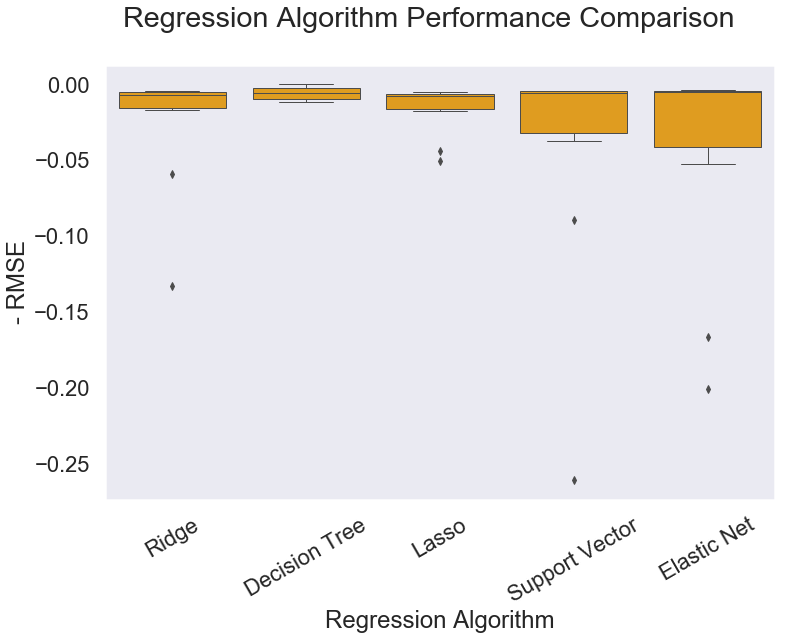


```python
clf_comp(seed=42, X=X_train_clf_noise, y=y_train_clf)
```

    Model: Mean (Standard Deviation)
    Random Forest: 0.977495 (0.023312)
    Support Vector: 0.994797 (0.011073)
    K Neighbors: 0.989625 (0.011455)


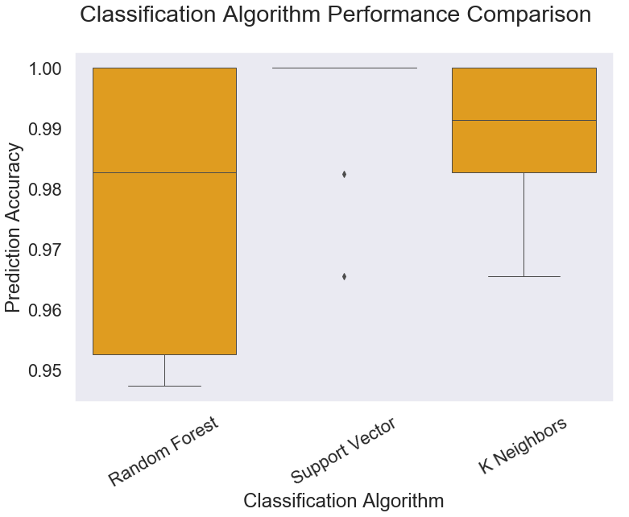


## Grid searches with noisy data
Let's check to see if the optimal model as determined by a grid search changes when trained on noisey data

## Support Vector Classifier


```python
param_grid = [{
    'C': [3, 4, 5, 6, 1e1], 'random_state': [42], 'dual': [False], 
    'tol': [1e-9, 1e-8, 1e-7, 1e-6, 1e-5, 1e-4], 'penalty': ['l1'],
    'max_iter': [1e4]},
    {'C': [3, 4, 5, 6, 1e1], 'loss': ['hinge'], 'random_state': [42], 
     'tol': [1e-9, 1e-8, 1e-7, 1e-6, 1e-5, 1e-4], 'penalty': ['l2'],
    'max_iter': [1e4]}
]

results_svc_noise, best_svc_noise, Message = clf_model_gsearch_cval(
    model=LinearSVC(), X=X_train_clf_noise, y=y_train_clf, 
    param_grid=param_grid, cv=5)
```

    Cross-validation statistics for best model: Scores: [1.         0.99137931 1.         1.         1.        ] Mean: 0.9982758620689655 Standard Deviation: 0.0034482758620689503


```python
best_svc_noise
```


    LinearSVC(C=3, class_weight=None, dual=False, fit_intercept=True,
         intercept_scaling=1, loss='squared_hinge', max_iter=10000.0,
         multi_class='ovr', penalty='l1', random_state=42, tol=1e-09,
         verbose=0)


```python
best_svc
```


    LinearSVC(C=6, class_weight=None, dual=False, fit_intercept=True,
         intercept_scaling=1, loss='squared_hinge', max_iter=1000,
         multi_class='ovr', penalty='l1', random_state=42, tol=1e-05,
         verbose=0)


```python

```
