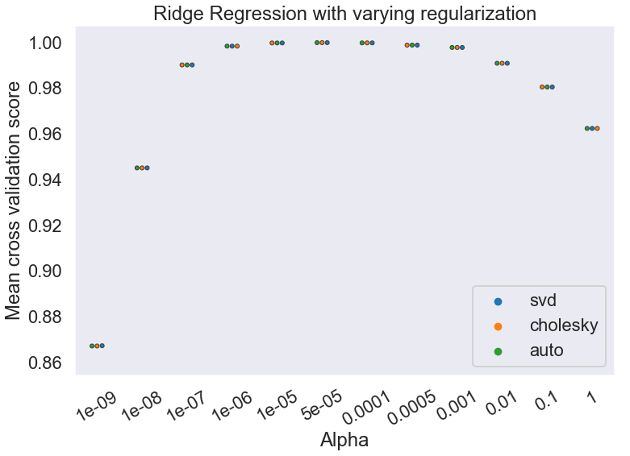
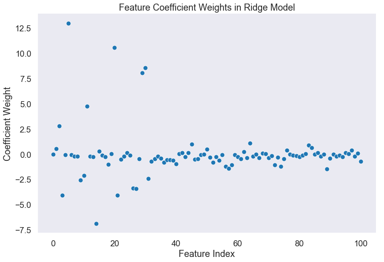
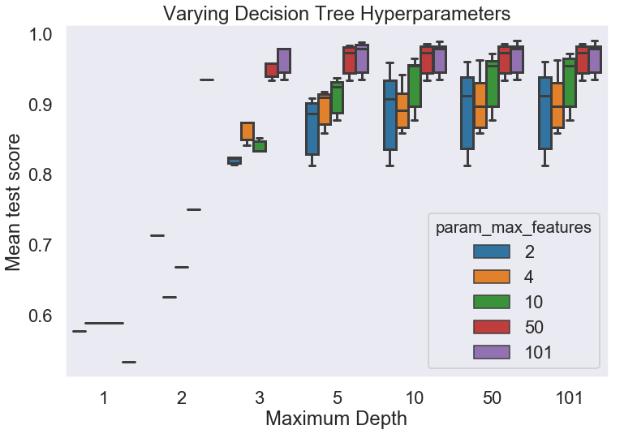
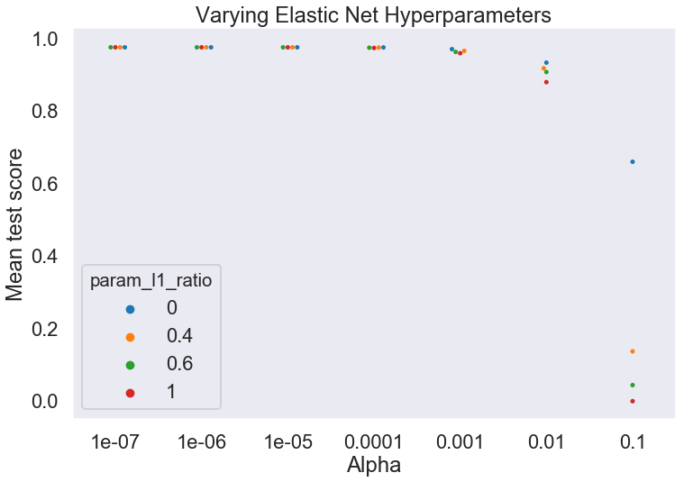
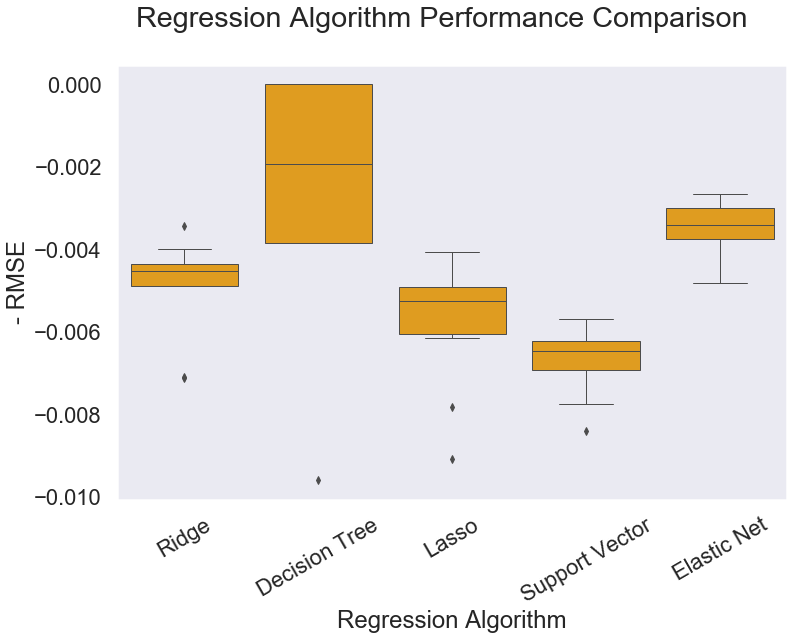
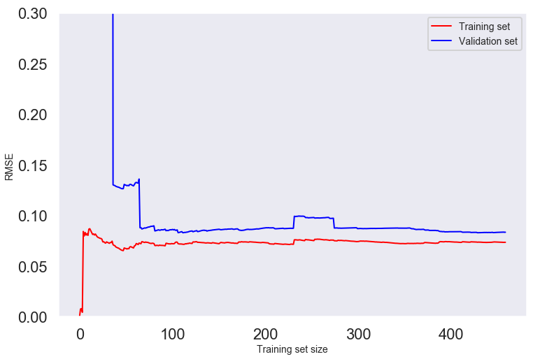
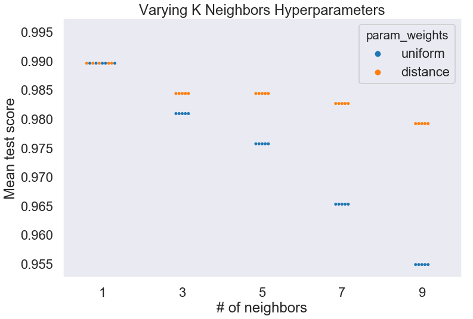
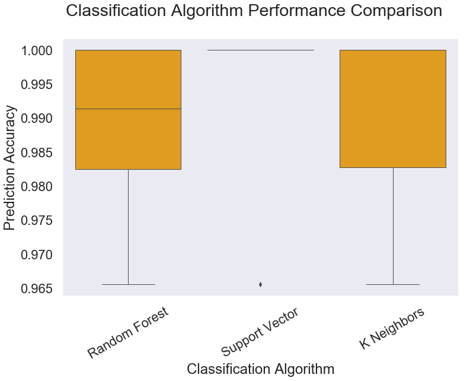

This notebook improves on the work in "__SCALE_4_2019"__ in the following ways:

1. Streamlines the data preparation process into a pipeline contained within a single function.

2. Streamlines and creates consistency in the evaluation of each model with dedicated functions that piece together the steps, and repeating the same analysis steps on each model.

# Setting up the notebook


```python
import numpy as np
import pandas as pd
import sklearn as sk
import matplotlib.pyplot as plt
import seaborn as sns
import warnings
warnings.simplefilter(action='ignore')  
sns.set_context("talk")
sns.set_style("dark")
pd.set_option('display.max_columns', 100)
```


```python
from sklearn.linear_model import LinearRegression
from sklearn.linear_model import Ridge
from sklearn.tree import DecisionTreeRegressor
from sklearn.linear_model import Lasso
from sklearn.linear_model import SGDRegressor
from sklearn.svm import SVR
from sklearn.linear_model import ElasticNet
from sklearn.ensemble import RandomForestClassifier
from sklearn.svm import LinearSVC
from sklearn.neighbors import KNeighborsClassifier

from sklearn.model_selection import KFold
from sklearn.model_selection import cross_val_score
from sklearn.model_selection import GridSearchCV
from sklearn.impute import SimpleImputer
from sklearn.model_selection import train_test_split
from sklearn.preprocessing import StandardScaler
```

# Importing Pre-Built Functions


```python
def centrifuge(w, mode, iso1, iso2):
    # w refers to the numer of linear subdivisions of enrichment to create.
    # mode refers to either classification 'clf' or regression 'reg'.
    # 'iso1' and 'iso2' should be decay data for two isotopes of the same actinide.
    # Enrichment refers to the atom percent of iso2
    X = iso1 # Sample 0% enriched in iso2
    if mode=='clf':
        y = np.zeros([180], dtype=str)
    elif mode=='reg':
        y = np.zeros([180], dtype=float)
    else:
        print('Please specify classification (clf) or regression (reg).')
    for i in range(1,w+1):
        enrichment = (float(i)/float(w))
        enriched = enrichment * iso2 + (1 - enrichment) * iso1
        X = np.append(X, enriched, axis=0)
        if mode=='clf':
            category = str(enrichment)
        elif mode=='reg':
            category = float(enrichment)
        else:
            print('Please specify classification (clf) or regression (reg).')
        for j in range(0, 180):
            y = np.append(y, category)
    return X, y
        
```


```python
def clf_comp(seed):
    seed = seed

    models = []
    
    models.append(('Random Forest', RandomForestClassifier(bootstrap=True, class_weight=None, criterion='gini',
            max_depth=None, max_features='auto', max_leaf_nodes=None,
            min_impurity_decrease=0.0, min_impurity_split=None,
            min_samples_leaf=1, min_samples_split=2,
            min_weight_fraction_leaf=0.0, n_estimators=40, n_jobs=None,
            oob_score=False, random_state=42, verbose=0, warm_start=False)))
    
    models.append(('Support Vector', LinearSVC(C=100.0, class_weight=None, dual=False, fit_intercept=True,
     intercept_scaling=1, loss='squared_hinge', max_iter=1000,
     multi_class='ovr', penalty='l1', random_state=42, tol=0.001,
     verbose=0)))
    
    models.append(('K Neighbors', KNeighborsClassifier(algorithm='auto', leaf_size=10, metric='minkowski',
           metric_params=None, n_jobs=None, n_neighbors=1, p=2,
           weights='uniform')))

    results = []
    names = []
    scoring = 'accuracy'

    from sklearn.model_selection import KFold
    from sklearn.model_selection import cross_val_score
    
    print("Model: Mean (Standard Deviation)")

    for name, model in models:
        kfold = KFold(n_splits=10, random_state=seed)
        cv_results = cross_val_score(model, X_train_clf, y_train_clf, cv=kfold, scoring=scoring)
        results.append(cv_results)
        names.append(name)
        msg = "%s: %f (%f)" % (name, cv_results.mean(), cv_results.std())
        print(msg)

    fig = plt.figure(figsize=(12,8))
    fig.suptitle("Classification Algorithm Performance Comparison")
    ax = fig.add_subplot(111)
    sns.boxplot(data=results, linewidth=1, color='orange')
    # sns.violinplot(data=results, cut=0)
    ax.set_xticklabels(names)
    plt.ylabel("Prediction Accuracy")
    plt.xlabel("Classification Algorithm")
    plt.xticks(rotation=30)
    plt.show()
```

A feature I would like to add to reg_comp and clf_comp is the ability to cross validate on training AND testing data, and create boxplots that have hue=train/test so we can see if models are overfit or not.


```python
def reg_comp(seed):
    """This is the help documentation for regression comparison"""
    seed = seed

    models = []
    # models.append(('lin_reg', LinearRegression()))
    models.append(('Ridge', Ridge(alpha=1, copy_X=True, fit_intercept=True, max_iter=None,
    normalize=False, random_state=42, solver='sparse_cg', tol=0.001)))
    
    models.append(('Decision Tree', DecisionTreeRegressor()))
    
    models.append(('Lasso', Lasso(alpha=0.001, copy_X=True, fit_intercept=True, max_iter=1000,
   normalize=False, positive=False, precompute=False, random_state=42,
   selection='cyclic', tol=0.0001, warm_start=False)))
    
    models.append(('Support Vector', SVR(kernel='linear')))
    
    models.append(('Elastic Net', ElasticNet(alpha=1e-07, copy_X=True, fit_intercept=True, l1_ratio=0,
      max_iter=1000, normalize=False, positive=False, precompute=False,
      random_state=None, selection='cyclic', tol=0.0001, warm_start=False)))

    results = []
    names = []
    scoring = 'neg_mean_squared_error'
    
    print("Model: Mean (Standard Deviation)")

    for name, model in models:
        kfold = KFold(n_splits=10, random_state=seed)
        cv_results = cross_val_score(model, X_train_reg, y_train_reg, cv=kfold, scoring=scoring)
        results.append(cv_results)
        names.append(name)
        msg = "%s: %f (%f)" % (name, cv_results.mean(), cv_results.std())
        print(msg)

    fig = plt.figure(figsize=(12,8))
    fig.suptitle("Regression Algorithm Performance Comparison")
    ax = fig.add_subplot(111)
    sns.boxplot(data=results, linewidth=1, color='orange')
    # sns.violinplot(data=results, cut=0, width=1, inner='point', orient='v', scale='area')
    ax.set_xticklabels(names)
    plt.ylabel("- RMSE")
    plt.xlabel("Regression Algorithm")
    plt.xticks(rotation=30)
    plt.show()
```


```python
def full_pipeline(w, test_size, seed):
    u235, u238, pu239, pu240 = pd.read_csv('SCALE/u235.csv', skipinitialspace=True).T, pd.read_csv('SCALE/u238.csv', skipinitialspace=True).T, pd.read_csv('SCALE/pu239.csv', skipinitialspace=True).T, pd.read_csv('SCALE/pu240.csv', skipinitialspace=True).T
    u235.columns, u238.columns, pu239.columns, pu240.columns = u235.iloc[0], u238.iloc[0], pu239.iloc[0], pu240.iloc[0]
    
    u235 = u235.drop(index=['boundaries'])
    u238 = u238.drop(index=['boundaries'])
    pu239 = pu239.drop(index=['boundaries'])
    pu240 = pu240.drop(index=['boundaries'])
    
    test = pd.concat([u235], keys=['U235'], names=['Actinide'])
    test2 = pd.concat([u238], keys=['U238'], names=['Actinide'])
    test3 = pd.concat([pu239], keys=['Pu239'], names=['Actinide'])
    test4 = pd.concat([pu240], keys=['Pu240'], names=['Actinide'])
    df_all = pd.concat([test, test2, test3, test4])
    
    index = df_all.index
    columns = df_all.columns
    values = df_all.values
    targets = index.get_level_values('Actinide')
    targets_array = np.array(targets)
    
    imputer = SimpleImputer(fill_value=0)
    imputer.fit(values)
    values_imp = imputer.transform(values)
    
    X_train_clf, X_test_clf, y_train_clf, y_test_clf = train_test_split(values_imp, targets, test_size=test_size, random_state=seed)
    
    scaler = StandardScaler()
    scaler.fit(X_train_clf)
    X_train_clf = scaler.transform(X_train_clf)
    X_test_clf = scaler.transform(X_test_clf)
    
    u_values_imp = values_imp[0:360,:]
    u235_values = u_values_imp[0:180,:]
    u238_values = u_values_imp[180:360,:]

    pu_values_imp = values_imp[361:720,:]
    pu239_values = pu_values_imp[0:180,:]
    pu240_values = pu_values_imp[180:360,:]
    
    X, y = centrifuge(w, mode='reg', iso1 = u238_values, iso2 = u235_values)
    X_train_reg, X_test_reg, y_train_reg, y_test_reg = train_test_split(X, y, test_size=test_size, random_state=seed)
    
    scaler = StandardScaler()
    scaler.fit(X_train_reg)
    X_train_reg = scaler.transform(X_train_reg)
    X_test_reg = scaler.transform(X_test_reg)
    return X_train_reg, X_test_reg, y_train_reg, y_test_reg, X_train_clf, X_test_clf, y_train_clf, y_test_clf
```


```python
y_train_clf
```


    Index(['Pu239', 'U235', 'U235', 'Pu240', 'U235', 'U235', 'Pu239', 'U238',
           'Pu239', 'U235',
           ...
           'Pu239', 'U235', 'Pu240', 'U235', 'Pu240', 'U235', 'U235', 'U238',
           'Pu239', 'U235'],
          dtype='object', name='Actinide', length=576)


```python
def model_gsearch_cval(model, X, y, param_grid, cv):
    grid_search = GridSearchCV(model, param_grid, cv=cv)
    grid_search.fit(X, y)
    gs_results = pd.DataFrame(grid_search.cv_results_).sort_values(by=['rank_test_score'])
    grid_search.best_estimator_
    scores = cross_val_score(grid_search.best_estimator_, X, y, cv=cv, scoring="neg_mean_squared_error")
    rmse_scores = np.sqrt(-scores)
    Message = print("Cross-validation statistics for best model:",'Scores:', rmse_scores, 'Mean:', rmse_scores.mean(), 'Standard Deviation:', rmse_scores.std())
    return gs_results, grid_search.best_estimator_, Message
```


```python
def clf_model_gsearch_cval(model, X, y, param_grid, cv):
    grid_search = GridSearchCV(model, param_grid, cv=cv)
    grid_search.fit(X, y)
    gs_results = pd.DataFrame(grid_search.cv_results_).sort_values(by=['rank_test_score'])
    grid_search.best_estimator_
    scores = cross_val_score(grid_search.best_estimator_, X, y, cv=cv, scoring="accuracy")
    Message = print("Cross-validation statistics for best model:",'Scores:', scores, 'Mean:', scores.mean(), 'Standard Deviation:', scores.std())
    return gs_results, grid_search.best_estimator_, Message
```

# Testing the Imported Functions

The functions all passed tests to verify that they operate properly. We will now use this analysis pipeline to streamline what has been done in the previous Jupyter Notebook.


```python
X_train_reg, X_test_reg, y_train_reg, y_test_reg, X_train_clf, X_test_clf, y_train_clf, y_test_clf = full_pipeline(w=3, test_size=0.2, seed=42)
```

# Regression Models

## Ridge Regression


```python
param_grid=[{
    'alpha': [1e-9, 1e-8, 1e-7, 1e-6, 5e-5, 1e-5, 5e-4, 1e-4, 1e-3, 1e-2, 1e-1, 1], 'solver': ['auto', 'svd', 'cholesky']
}]

results_ridge, best_ridge, Message= model_gsearch_cval(
    model=Ridge(random_state=42), X=X_train_reg, y=y_train_reg, param_grid=param_grid, cv=5)
```

    Cross-validation statistics for best model: Scores: [0.00528499 0.00466248 0.00415411 0.01095095 0.00423692] Mean: 0.005857892377361654 Standard Deviation: 0.0025778608921939845


```python
results_ridge
```


<div>
<style scoped>
    .dataframe tbody tr th:only-of-type {
        vertical-align: middle;
    }

    .dataframe tbody tr th {
        vertical-align: top;
    }

    .dataframe thead th {
        text-align: right;
    }
</style>
<table border="1" class="dataframe">
  <thead>
    <tr style="text-align: right;">
      <th></th>
      <th>mean_fit_time</th>
      <th>std_fit_time</th>
      <th>mean_score_time</th>
      <th>std_score_time</th>
      <th>param_alpha</th>
      <th>param_solver</th>
      <th>params</th>
      <th>split0_test_score</th>
      <th>split1_test_score</th>
      <th>split2_test_score</th>
      <th>split3_test_score</th>
      <th>split4_test_score</th>
      <th>mean_test_score</th>
      <th>std_test_score</th>
      <th>rank_test_score</th>
      <th>split0_train_score</th>
      <th>split1_train_score</th>
      <th>split2_train_score</th>
      <th>split3_train_score</th>
      <th>split4_train_score</th>
      <th>mean_train_score</th>
      <th>std_train_score</th>
    </tr>
  </thead>
  <tbody>
    <tr>
      <th>13</th>
      <td>0.002504</td>
      <td>0.000159</td>
      <td>0.000337</td>
      <td>6.888011e-05</td>
      <td>5e-05</td>
      <td>svd</td>
      <td>{'alpha': 5e-05, 'solver': 'svd'}</td>
      <td>0.999809</td>
      <td>0.999831</td>
      <td>0.999882</td>
      <td>0.999054</td>
      <td>0.999863</td>
      <td>0.999688</td>
      <td>0.000318</td>
      <td>1</td>
      <td>0.999890</td>
      <td>0.999883</td>
      <td>0.999878</td>
      <td>0.999889</td>
      <td>0.999885</td>
      <td>0.999885</td>
      <td>4.429415e-06</td>
    </tr>
    <tr>
      <th>14</th>
      <td>0.000770</td>
      <td>0.000027</td>
      <td>0.000252</td>
      <td>3.526661e-06</td>
      <td>5e-05</td>
      <td>cholesky</td>
      <td>{'alpha': 5e-05, 'solver': 'cholesky'}</td>
      <td>0.999809</td>
      <td>0.999831</td>
      <td>0.999882</td>
      <td>0.999054</td>
      <td>0.999863</td>
      <td>0.999688</td>
      <td>0.000318</td>
      <td>2</td>
      <td>0.999890</td>
      <td>0.999883</td>
      <td>0.999878</td>
      <td>0.999889</td>
      <td>0.999885</td>
      <td>0.999885</td>
      <td>4.429415e-06</td>
    </tr>
    <tr>
      <th>12</th>
      <td>0.000759</td>
      <td>0.000012</td>
      <td>0.000247</td>
      <td>1.181556e-06</td>
      <td>5e-05</td>
      <td>auto</td>
      <td>{'alpha': 5e-05, 'solver': 'auto'}</td>
      <td>0.999809</td>
      <td>0.999831</td>
      <td>0.999882</td>
      <td>0.999054</td>
      <td>0.999863</td>
      <td>0.999688</td>
      <td>0.000318</td>
      <td>2</td>
      <td>0.999890</td>
      <td>0.999883</td>
      <td>0.999878</td>
      <td>0.999889</td>
      <td>0.999885</td>
      <td>0.999885</td>
      <td>4.429415e-06</td>
    </tr>
    <tr>
      <th>22</th>
      <td>0.002416</td>
      <td>0.000046</td>
      <td>0.000305</td>
      <td>1.619745e-05</td>
      <td>0.0001</td>
      <td>svd</td>
      <td>{'alpha': 0.0001, 'solver': 'svd'}</td>
      <td>0.999759</td>
      <td>0.999696</td>
      <td>0.999785</td>
      <td>0.998868</td>
      <td>0.999768</td>
      <td>0.999575</td>
      <td>0.000355</td>
      <td>4</td>
      <td>0.999796</td>
      <td>0.999795</td>
      <td>0.999786</td>
      <td>0.999799</td>
      <td>0.999796</td>
      <td>0.999794</td>
      <td>4.482918e-06</td>
    </tr>
    <tr>
      <th>23</th>
      <td>0.000792</td>
      <td>0.000015</td>
      <td>0.000250</td>
      <td>1.148376e-06</td>
      <td>0.0001</td>
      <td>cholesky</td>
      <td>{'alpha': 0.0001, 'solver': 'cholesky'}</td>
      <td>0.999759</td>
      <td>0.999696</td>
      <td>0.999785</td>
      <td>0.998868</td>
      <td>0.999768</td>
      <td>0.999575</td>
      <td>0.000355</td>
      <td>5</td>
      <td>0.999796</td>
      <td>0.999795</td>
      <td>0.999786</td>
      <td>0.999799</td>
      <td>0.999796</td>
      <td>0.999794</td>
      <td>4.482918e-06</td>
    </tr>
    <tr>
      <th>21</th>
      <td>0.000786</td>
      <td>0.000025</td>
      <td>0.000251</td>
      <td>5.722841e-06</td>
      <td>0.0001</td>
      <td>auto</td>
      <td>{'alpha': 0.0001, 'solver': 'auto'}</td>
      <td>0.999759</td>
      <td>0.999696</td>
      <td>0.999785</td>
      <td>0.998868</td>
      <td>0.999768</td>
      <td>0.999575</td>
      <td>0.000355</td>
      <td>5</td>
      <td>0.999796</td>
      <td>0.999795</td>
      <td>0.999786</td>
      <td>0.999799</td>
      <td>0.999796</td>
      <td>0.999794</td>
      <td>4.482918e-06</td>
    </tr>
    <tr>
      <th>16</th>
      <td>0.002405</td>
      <td>0.000063</td>
      <td>0.000302</td>
      <td>1.191864e-05</td>
      <td>1e-05</td>
      <td>svd</td>
      <td>{'alpha': 1e-05, 'solver': 'svd'}</td>
      <td>0.999840</td>
      <td>0.999938</td>
      <td>0.999950</td>
      <td>0.998051</td>
      <td>0.999929</td>
      <td>0.999542</td>
      <td>0.000746</td>
      <td>7</td>
      <td>0.999953</td>
      <td>0.999950</td>
      <td>0.999948</td>
      <td>0.999955</td>
      <td>0.999953</td>
      <td>0.999952</td>
      <td>2.280490e-06</td>
    </tr>
    <tr>
      <th>15</th>
      <td>0.000801</td>
      <td>0.000022</td>
      <td>0.000252</td>
      <td>1.406468e-06</td>
      <td>1e-05</td>
      <td>auto</td>
      <td>{'alpha': 1e-05, 'solver': 'auto'}</td>
      <td>0.999840</td>
      <td>0.999938</td>
      <td>0.999950</td>
      <td>0.998051</td>
      <td>0.999929</td>
      <td>0.999542</td>
      <td>0.000746</td>
      <td>8</td>
      <td>0.999953</td>
      <td>0.999950</td>
      <td>0.999948</td>
      <td>0.999955</td>
      <td>0.999953</td>
      <td>0.999952</td>
      <td>2.280490e-06</td>
    </tr>
    <tr>
      <th>17</th>
      <td>0.000792</td>
      <td>0.000029</td>
      <td>0.000251</td>
      <td>6.118399e-06</td>
      <td>1e-05</td>
      <td>cholesky</td>
      <td>{'alpha': 1e-05, 'solver': 'cholesky'}</td>
      <td>0.999840</td>
      <td>0.999938</td>
      <td>0.999950</td>
      <td>0.998051</td>
      <td>0.999929</td>
      <td>0.999542</td>
      <td>0.000746</td>
      <td>8</td>
      <td>0.999953</td>
      <td>0.999950</td>
      <td>0.999948</td>
      <td>0.999955</td>
      <td>0.999953</td>
      <td>0.999952</td>
      <td>2.280490e-06</td>
    </tr>
    <tr>
      <th>19</th>
      <td>0.002465</td>
      <td>0.000031</td>
      <td>0.000319</td>
      <td>5.869941e-06</td>
      <td>0.0005</td>
      <td>svd</td>
      <td>{'alpha': 0.0005, 'solver': 'svd'}</td>
      <td>0.999071</td>
      <td>0.998475</td>
      <td>0.998847</td>
      <td>0.997784</td>
      <td>0.998850</td>
      <td>0.998606</td>
      <td>0.000453</td>
      <td>10</td>
      <td>0.998903</td>
      <td>0.998934</td>
      <td>0.998902</td>
      <td>0.998925</td>
      <td>0.998938</td>
      <td>0.998921</td>
      <td>1.521154e-05</td>
    </tr>
    <tr>
      <th>18</th>
      <td>0.000758</td>
      <td>0.000047</td>
      <td>0.000246</td>
      <td>1.210077e-06</td>
      <td>0.0005</td>
      <td>auto</td>
      <td>{'alpha': 0.0005, 'solver': 'auto'}</td>
      <td>0.999071</td>
      <td>0.998475</td>
      <td>0.998847</td>
      <td>0.997784</td>
      <td>0.998850</td>
      <td>0.998606</td>
      <td>0.000453</td>
      <td>11</td>
      <td>0.998903</td>
      <td>0.998934</td>
      <td>0.998902</td>
      <td>0.998925</td>
      <td>0.998938</td>
      <td>0.998921</td>
      <td>1.521154e-05</td>
    </tr>
    <tr>
      <th>20</th>
      <td>0.000914</td>
      <td>0.000158</td>
      <td>0.000315</td>
      <td>7.833948e-05</td>
      <td>0.0005</td>
      <td>cholesky</td>
      <td>{'alpha': 0.0005, 'solver': 'cholesky'}</td>
      <td>0.999071</td>
      <td>0.998475</td>
      <td>0.998847</td>
      <td>0.997784</td>
      <td>0.998850</td>
      <td>0.998606</td>
      <td>0.000453</td>
      <td>11</td>
      <td>0.998903</td>
      <td>0.998934</td>
      <td>0.998902</td>
      <td>0.998925</td>
      <td>0.998938</td>
      <td>0.998921</td>
      <td>1.521154e-05</td>
    </tr>
    <tr>
      <th>9</th>
      <td>0.000782</td>
      <td>0.000049</td>
      <td>0.000249</td>
      <td>3.010501e-06</td>
      <td>1e-06</td>
      <td>auto</td>
      <td>{'alpha': 1e-06, 'solver': 'auto'}</td>
      <td>0.999951</td>
      <td>0.999973</td>
      <td>0.999977</td>
      <td>0.990950</td>
      <td>0.999963</td>
      <td>0.998166</td>
      <td>0.003604</td>
      <td>13</td>
      <td>0.999980</td>
      <td>0.999981</td>
      <td>0.999979</td>
      <td>0.999982</td>
      <td>0.999981</td>
      <td>0.999981</td>
      <td>1.063681e-06</td>
    </tr>
    <tr>
      <th>11</th>
      <td>0.000793</td>
      <td>0.000047</td>
      <td>0.000249</td>
      <td>2.855454e-06</td>
      <td>1e-06</td>
      <td>cholesky</td>
      <td>{'alpha': 1e-06, 'solver': 'cholesky'}</td>
      <td>0.999951</td>
      <td>0.999973</td>
      <td>0.999977</td>
      <td>0.990950</td>
      <td>0.999963</td>
      <td>0.998166</td>
      <td>0.003604</td>
      <td>13</td>
      <td>0.999980</td>
      <td>0.999981</td>
      <td>0.999979</td>
      <td>0.999982</td>
      <td>0.999981</td>
      <td>0.999981</td>
      <td>1.063681e-06</td>
    </tr>
    <tr>
      <th>10</th>
      <td>0.002375</td>
      <td>0.000020</td>
      <td>0.000318</td>
      <td>4.257838e-05</td>
      <td>1e-06</td>
      <td>svd</td>
      <td>{'alpha': 1e-06, 'solver': 'svd'}</td>
      <td>0.999951</td>
      <td>0.999973</td>
      <td>0.999977</td>
      <td>0.990950</td>
      <td>0.999963</td>
      <td>0.998166</td>
      <td>0.003604</td>
      <td>15</td>
      <td>0.999980</td>
      <td>0.999981</td>
      <td>0.999979</td>
      <td>0.999982</td>
      <td>0.999981</td>
      <td>0.999981</td>
      <td>1.063681e-06</td>
    </tr>
    <tr>
      <th>25</th>
      <td>0.002436</td>
      <td>0.000048</td>
      <td>0.000307</td>
      <td>1.354201e-05</td>
      <td>0.001</td>
      <td>svd</td>
      <td>{'alpha': 0.001, 'solver': 'svd'}</td>
      <td>0.998231</td>
      <td>0.997085</td>
      <td>0.997796</td>
      <td>0.996888</td>
      <td>0.997844</td>
      <td>0.997570</td>
      <td>0.000503</td>
      <td>16</td>
      <td>0.997859</td>
      <td>0.997948</td>
      <td>0.997885</td>
      <td>0.997903</td>
      <td>0.997949</td>
      <td>0.997909</td>
      <td>3.526121e-05</td>
    </tr>
    <tr>
      <th>26</th>
      <td>0.000748</td>
      <td>0.000013</td>
      <td>0.000247</td>
      <td>1.991330e-06</td>
      <td>0.001</td>
      <td>cholesky</td>
      <td>{'alpha': 0.001, 'solver': 'cholesky'}</td>
      <td>0.998231</td>
      <td>0.997085</td>
      <td>0.997796</td>
      <td>0.996888</td>
      <td>0.997844</td>
      <td>0.997570</td>
      <td>0.000503</td>
      <td>17</td>
      <td>0.997859</td>
      <td>0.997948</td>
      <td>0.997885</td>
      <td>0.997903</td>
      <td>0.997949</td>
      <td>0.997909</td>
      <td>3.526121e-05</td>
    </tr>
    <tr>
      <th>24</th>
      <td>0.000743</td>
      <td>0.000013</td>
      <td>0.000248</td>
      <td>4.143273e-06</td>
      <td>0.001</td>
      <td>auto</td>
      <td>{'alpha': 0.001, 'solver': 'auto'}</td>
      <td>0.998231</td>
      <td>0.997085</td>
      <td>0.997796</td>
      <td>0.996888</td>
      <td>0.997844</td>
      <td>0.997570</td>
      <td>0.000503</td>
      <td>17</td>
      <td>0.997859</td>
      <td>0.997948</td>
      <td>0.997885</td>
      <td>0.997903</td>
      <td>0.997949</td>
      <td>0.997909</td>
      <td>3.526121e-05</td>
    </tr>
    <tr>
      <th>28</th>
      <td>0.002416</td>
      <td>0.000056</td>
      <td>0.000310</td>
      <td>1.277390e-05</td>
      <td>0.01</td>
      <td>svd</td>
      <td>{'alpha': 0.01, 'solver': 'svd'}</td>
      <td>0.992359</td>
      <td>0.988458</td>
      <td>0.990885</td>
      <td>0.989237</td>
      <td>0.992406</td>
      <td>0.990672</td>
      <td>0.001604</td>
      <td>19</td>
      <td>0.991107</td>
      <td>0.991687</td>
      <td>0.991288</td>
      <td>0.991355</td>
      <td>0.991258</td>
      <td>0.991339</td>
      <td>1.919168e-04</td>
    </tr>
    <tr>
      <th>29</th>
      <td>0.000737</td>
      <td>0.000033</td>
      <td>0.000244</td>
      <td>1.768802e-06</td>
      <td>0.01</td>
      <td>cholesky</td>
      <td>{'alpha': 0.01, 'solver': 'cholesky'}</td>
      <td>0.992359</td>
      <td>0.988458</td>
      <td>0.990885</td>
      <td>0.989237</td>
      <td>0.992406</td>
      <td>0.990672</td>
      <td>0.001604</td>
      <td>20</td>
      <td>0.991107</td>
      <td>0.991687</td>
      <td>0.991288</td>
      <td>0.991355</td>
      <td>0.991258</td>
      <td>0.991339</td>
      <td>1.919168e-04</td>
    </tr>
    <tr>
      <th>27</th>
      <td>0.000740</td>
      <td>0.000014</td>
      <td>0.000249</td>
      <td>8.326784e-06</td>
      <td>0.01</td>
      <td>auto</td>
      <td>{'alpha': 0.01, 'solver': 'auto'}</td>
      <td>0.992359</td>
      <td>0.988458</td>
      <td>0.990885</td>
      <td>0.989237</td>
      <td>0.992406</td>
      <td>0.990672</td>
      <td>0.001604</td>
      <td>20</td>
      <td>0.991107</td>
      <td>0.991687</td>
      <td>0.991288</td>
      <td>0.991355</td>
      <td>0.991258</td>
      <td>0.991339</td>
      <td>1.919168e-04</td>
    </tr>
    <tr>
      <th>7</th>
      <td>0.003026</td>
      <td>0.000686</td>
      <td>0.000360</td>
      <td>4.157096e-05</td>
      <td>1e-07</td>
      <td>svd</td>
      <td>{'alpha': 1e-07, 'solver': 'svd'}</td>
      <td>0.999983</td>
      <td>0.999978</td>
      <td>0.999967</td>
      <td>0.949705</td>
      <td>0.999969</td>
      <td>0.989938</td>
      <td>0.020095</td>
      <td>22</td>
      <td>0.999987</td>
      <td>0.999989</td>
      <td>0.999988</td>
      <td>0.999989</td>
      <td>0.999988</td>
      <td>0.999988</td>
      <td>7.779639e-07</td>
    </tr>
    <tr>
      <th>6</th>
      <td>0.000901</td>
      <td>0.000190</td>
      <td>0.000273</td>
      <td>3.533534e-05</td>
      <td>1e-07</td>
      <td>auto</td>
      <td>{'alpha': 1e-07, 'solver': 'auto'}</td>
      <td>0.999983</td>
      <td>0.999978</td>
      <td>0.999967</td>
      <td>0.949705</td>
      <td>0.999969</td>
      <td>0.989938</td>
      <td>0.020095</td>
      <td>23</td>
      <td>0.999987</td>
      <td>0.999989</td>
      <td>0.999988</td>
      <td>0.999989</td>
      <td>0.999988</td>
      <td>0.999988</td>
      <td>7.779665e-07</td>
    </tr>
    <tr>
      <th>8</th>
      <td>0.000798</td>
      <td>0.000050</td>
      <td>0.000251</td>
      <td>6.486738e-06</td>
      <td>1e-07</td>
      <td>cholesky</td>
      <td>{'alpha': 1e-07, 'solver': 'cholesky'}</td>
      <td>0.999983</td>
      <td>0.999978</td>
      <td>0.999967</td>
      <td>0.949705</td>
      <td>0.999969</td>
      <td>0.989938</td>
      <td>0.020095</td>
      <td>23</td>
      <td>0.999987</td>
      <td>0.999989</td>
      <td>0.999988</td>
      <td>0.999989</td>
      <td>0.999988</td>
      <td>0.999988</td>
      <td>7.779665e-07</td>
    </tr>
    <tr>
      <th>31</th>
      <td>0.002437</td>
      <td>0.000058</td>
      <td>0.000310</td>
      <td>1.037162e-05</td>
      <td>0.1</td>
      <td>svd</td>
      <td>{'alpha': 0.1, 'solver': 'svd'}</td>
      <td>0.984888</td>
      <td>0.976233</td>
      <td>0.980297</td>
      <td>0.977728</td>
      <td>0.982198</td>
      <td>0.980277</td>
      <td>0.003095</td>
      <td>25</td>
      <td>0.981026</td>
      <td>0.982382</td>
      <td>0.981641</td>
      <td>0.981886</td>
      <td>0.981224</td>
      <td>0.981632</td>
      <td>4.816724e-04</td>
    </tr>
    <tr>
      <th>30</th>
      <td>0.000755</td>
      <td>0.000008</td>
      <td>0.000246</td>
      <td>8.064048e-07</td>
      <td>0.1</td>
      <td>auto</td>
      <td>{'alpha': 0.1, 'solver': 'auto'}</td>
      <td>0.984888</td>
      <td>0.976233</td>
      <td>0.980297</td>
      <td>0.977728</td>
      <td>0.982198</td>
      <td>0.980277</td>
      <td>0.003095</td>
      <td>26</td>
      <td>0.981026</td>
      <td>0.982382</td>
      <td>0.981641</td>
      <td>0.981886</td>
      <td>0.981224</td>
      <td>0.981632</td>
      <td>4.816724e-04</td>
    </tr>
    <tr>
      <th>32</th>
      <td>0.000738</td>
      <td>0.000022</td>
      <td>0.000246</td>
      <td>2.691491e-06</td>
      <td>0.1</td>
      <td>cholesky</td>
      <td>{'alpha': 0.1, 'solver': 'cholesky'}</td>
      <td>0.984888</td>
      <td>0.976233</td>
      <td>0.980297</td>
      <td>0.977728</td>
      <td>0.982198</td>
      <td>0.980277</td>
      <td>0.003095</td>
      <td>26</td>
      <td>0.981026</td>
      <td>0.982382</td>
      <td>0.981641</td>
      <td>0.981886</td>
      <td>0.981224</td>
      <td>0.981632</td>
      <td>4.816724e-04</td>
    </tr>
    <tr>
      <th>33</th>
      <td>0.000748</td>
      <td>0.000043</td>
      <td>0.000246</td>
      <td>3.859142e-06</td>
      <td>1</td>
      <td>auto</td>
      <td>{'alpha': 1, 'solver': 'auto'}</td>
      <td>0.971867</td>
      <td>0.952985</td>
      <td>0.958656</td>
      <td>0.962558</td>
      <td>0.964674</td>
      <td>0.962165</td>
      <td>0.006287</td>
      <td>28</td>
      <td>0.962371</td>
      <td>0.965551</td>
      <td>0.964129</td>
      <td>0.964083</td>
      <td>0.963966</td>
      <td>0.964020</td>
      <td>1.008421e-03</td>
    </tr>
    <tr>
      <th>35</th>
      <td>0.000796</td>
      <td>0.000048</td>
      <td>0.000262</td>
      <td>2.599747e-05</td>
      <td>1</td>
      <td>cholesky</td>
      <td>{'alpha': 1, 'solver': 'cholesky'}</td>
      <td>0.971867</td>
      <td>0.952985</td>
      <td>0.958656</td>
      <td>0.962558</td>
      <td>0.964674</td>
      <td>0.962165</td>
      <td>0.006287</td>
      <td>28</td>
      <td>0.962371</td>
      <td>0.965551</td>
      <td>0.964129</td>
      <td>0.964083</td>
      <td>0.963966</td>
      <td>0.964020</td>
      <td>1.008421e-03</td>
    </tr>
    <tr>
      <th>34</th>
      <td>0.002438</td>
      <td>0.000019</td>
      <td>0.000311</td>
      <td>4.099136e-06</td>
      <td>1</td>
      <td>svd</td>
      <td>{'alpha': 1, 'solver': 'svd'}</td>
      <td>0.971867</td>
      <td>0.952985</td>
      <td>0.958656</td>
      <td>0.962558</td>
      <td>0.964674</td>
      <td>0.962165</td>
      <td>0.006287</td>
      <td>30</td>
      <td>0.962371</td>
      <td>0.965551</td>
      <td>0.964129</td>
      <td>0.964083</td>
      <td>0.963966</td>
      <td>0.964020</td>
      <td>1.008421e-03</td>
    </tr>
    <tr>
      <th>4</th>
      <td>0.003624</td>
      <td>0.000543</td>
      <td>0.000423</td>
      <td>9.073661e-05</td>
      <td>1e-08</td>
      <td>svd</td>
      <td>{'alpha': 1e-08, 'solver': 'svd'}</td>
      <td>0.999991</td>
      <td>0.999981</td>
      <td>0.999966</td>
      <td>0.724059</td>
      <td>0.999977</td>
      <td>0.944891</td>
      <td>0.110296</td>
      <td>31</td>
      <td>0.999992</td>
      <td>0.999994</td>
      <td>0.999993</td>
      <td>0.999993</td>
      <td>0.999993</td>
      <td>0.999993</td>
      <td>5.406186e-07</td>
    </tr>
    <tr>
      <th>5</th>
      <td>0.000978</td>
      <td>0.000116</td>
      <td>0.000396</td>
      <td>1.194289e-04</td>
      <td>1e-08</td>
      <td>cholesky</td>
      <td>{'alpha': 1e-08, 'solver': 'cholesky'}</td>
      <td>0.999991</td>
      <td>0.999981</td>
      <td>0.999966</td>
      <td>0.724033</td>
      <td>0.999977</td>
      <td>0.944885</td>
      <td>0.110306</td>
      <td>32</td>
      <td>0.999992</td>
      <td>0.999994</td>
      <td>0.999993</td>
      <td>0.999993</td>
      <td>0.999993</td>
      <td>0.999993</td>
      <td>5.405989e-07</td>
    </tr>
    <tr>
      <th>3</th>
      <td>0.001520</td>
      <td>0.000316</td>
      <td>0.000628</td>
      <td>1.578473e-04</td>
      <td>1e-08</td>
      <td>auto</td>
      <td>{'alpha': 1e-08, 'solver': 'auto'}</td>
      <td>0.999991</td>
      <td>0.999981</td>
      <td>0.999966</td>
      <td>0.724033</td>
      <td>0.999977</td>
      <td>0.944885</td>
      <td>0.110306</td>
      <td>32</td>
      <td>0.999992</td>
      <td>0.999994</td>
      <td>0.999993</td>
      <td>0.999993</td>
      <td>0.999993</td>
      <td>0.999993</td>
      <td>5.405989e-07</td>
    </tr>
    <tr>
      <th>1</th>
      <td>0.004690</td>
      <td>0.002956</td>
      <td>0.000410</td>
      <td>4.197045e-05</td>
      <td>1e-09</td>
      <td>svd</td>
      <td>{'alpha': 1e-09, 'solver': 'svd'}</td>
      <td>0.999994</td>
      <td>0.999976</td>
      <td>0.999985</td>
      <td>0.334395</td>
      <td>0.999991</td>
      <td>0.867099</td>
      <td>0.266063</td>
      <td>34</td>
      <td>0.999995</td>
      <td>0.999996</td>
      <td>0.999995</td>
      <td>0.999996</td>
      <td>0.999995</td>
      <td>0.999996</td>
      <td>3.500778e-07</td>
    </tr>
    <tr>
      <th>2</th>
      <td>0.000976</td>
      <td>0.000054</td>
      <td>0.000352</td>
      <td>1.016898e-04</td>
      <td>1e-09</td>
      <td>cholesky</td>
      <td>{'alpha': 1e-09, 'solver': 'cholesky'}</td>
      <td>0.999994</td>
      <td>0.999976</td>
      <td>0.999985</td>
      <td>0.333800</td>
      <td>0.999991</td>
      <td>0.866981</td>
      <td>0.266301</td>
      <td>35</td>
      <td>0.999995</td>
      <td>0.999996</td>
      <td>0.999995</td>
      <td>0.999996</td>
      <td>0.999995</td>
      <td>0.999996</td>
      <td>3.500453e-07</td>
    </tr>
    <tr>
      <th>0</th>
      <td>0.002317</td>
      <td>0.002340</td>
      <td>0.000376</td>
      <td>8.001359e-05</td>
      <td>1e-09</td>
      <td>auto</td>
      <td>{'alpha': 1e-09, 'solver': 'auto'}</td>
      <td>0.999994</td>
      <td>0.999976</td>
      <td>0.999985</td>
      <td>0.333800</td>
      <td>0.999991</td>
      <td>0.866981</td>
      <td>0.266301</td>
      <td>35</td>
      <td>0.999995</td>
      <td>0.999996</td>
      <td>0.999995</td>
      <td>0.999996</td>
      <td>0.999995</td>
      <td>0.999996</td>
      <td>3.500453e-07</td>
    </tr>
  </tbody>
</table>
</div>


```python
sns.set_context("poster")
fig = plt.figure(figsize=(12,8))
sns.swarmplot(data=results_ridge, x="param_alpha", y="mean_test_score", hue="param_solver", linewidth=1)
plt.xticks(rotation=30)
plt.legend(loc='lower right')
plt.title("Ridge Regression with varying regularization")
plt.xlabel("Alpha")
plt.ylabel("Mean cross validation score")
```


    Text(0, 0.5, 'Mean cross validation score')





```python
fig = plt.figure(figsize=(12,8))
sns.scatterplot(data=best_ridge.coef_)
plt.title("Feature Coefficient Weights in Ridge Model")
plt.xlabel("Feature Index")
plt.ylabel("Coefficient Weight")
```


    Text(0, 0.5, 'Coefficient Weight')





## Decision Tree Regressor


```python
param_grid= [{
    'criterion': ['mae'], 'splitter': ['best'], 'max_depth': [101, 1, 2, 3, 5, 10, 50],  'min_samples_split': [0.1, 2], 'min_samples_leaf': [0.1, 1, 2], 'min_weight_fraction_leaf': [0], 'max_features': [101, 2, 4, 10, 50], 'random_state': [42]
}]

results_tree_reg, best_tree_reg, Message = model_gsearch_cval(model=DecisionTreeRegressor(), X=X_train_reg, y=y_train_reg, param_grid=param_grid, cv=5)
```

    Cross-validation statistics for best model: Scores: [0.03460228 0.04914732 0.0439587  0.03806935 0.        ] Mean: 0.03315552991968411 Standard Deviation: 0.01730880490191542


```python
best_tree_reg
```


    DecisionTreeRegressor(criterion='mae', max_depth=101, max_features=101,
               max_leaf_nodes=None, min_impurity_decrease=0.0,
               min_impurity_split=None, min_samples_leaf=2,
               min_samples_split=2, min_weight_fraction_leaf=0, presort=False,
               random_state=42, splitter='best')


```python
results_tree_reg
```


<div>
<style scoped>
    .dataframe tbody tr th:only-of-type {
        vertical-align: middle;
    }

    .dataframe tbody tr th {
        vertical-align: top;
    }

    .dataframe thead th {
        text-align: right;
    }
</style>
<table border="1" class="dataframe">
  <thead>
    <tr style="text-align: right;">
      <th></th>
      <th>mean_fit_time</th>
      <th>std_fit_time</th>
      <th>mean_score_time</th>
      <th>std_score_time</th>
      <th>param_criterion</th>
      <th>param_max_depth</th>
      <th>param_max_features</th>
      <th>param_min_samples_leaf</th>
      <th>param_min_samples_split</th>
      <th>param_min_weight_fraction_leaf</th>
      <th>param_random_state</th>
      <th>param_splitter</th>
      <th>params</th>
      <th>split0_test_score</th>
      <th>split1_test_score</th>
      <th>split2_test_score</th>
      <th>split3_test_score</th>
      <th>split4_test_score</th>
      <th>mean_test_score</th>
      <th>std_test_score</th>
      <th>rank_test_score</th>
      <th>split0_train_score</th>
      <th>split1_train_score</th>
      <th>split2_train_score</th>
      <th>split3_train_score</th>
      <th>split4_train_score</th>
      <th>mean_train_score</th>
      <th>std_train_score</th>
    </tr>
  </thead>
  <tbody>
    <tr>
      <th>5</th>
      <td>0.093509</td>
      <td>0.019571</td>
      <td>0.000408</td>
      <td>0.000061</td>
      <td>mae</td>
      <td>101</td>
      <td>101</td>
      <td>2</td>
      <td>2</td>
      <td>0</td>
      <td>42</td>
      <td>best</td>
      <td>{'criterion': 'mae', 'max_depth': 101, 'max_fe...</td>
      <td>0.991823</td>
      <td>0.981192</td>
      <td>0.986839</td>
      <td>0.988566</td>
      <td>1.000000</td>
      <td>0.989688</td>
      <td>0.006199</td>
      <td>1</td>
      <td>0.997358</td>
      <td>0.994870</td>
      <td>0.998243</td>
      <td>0.993927</td>
      <td>0.994856</td>
      <td>0.995851</td>
      <td>0.001652</td>
    </tr>
    <tr>
      <th>185</th>
      <td>0.088121</td>
      <td>0.014853</td>
      <td>0.000327</td>
      <td>0.000022</td>
      <td>mae</td>
      <td>50</td>
      <td>101</td>
      <td>2</td>
      <td>2</td>
      <td>0</td>
      <td>42</td>
      <td>best</td>
      <td>{'criterion': 'mae', 'max_depth': 50, 'max_fea...</td>
      <td>0.991823</td>
      <td>0.981192</td>
      <td>0.986839</td>
      <td>0.988566</td>
      <td>1.000000</td>
      <td>0.989688</td>
      <td>0.006199</td>
      <td>1</td>
      <td>0.997358</td>
      <td>0.994870</td>
      <td>0.998243</td>
      <td>0.993927</td>
      <td>0.994856</td>
      <td>0.995851</td>
      <td>0.001652</td>
    </tr>
    <tr>
      <th>155</th>
      <td>0.095377</td>
      <td>0.013044</td>
      <td>0.000407</td>
      <td>0.000006</td>
      <td>mae</td>
      <td>10</td>
      <td>101</td>
      <td>2</td>
      <td>2</td>
      <td>0</td>
      <td>42</td>
      <td>best</td>
      <td>{'criterion': 'mae', 'max_depth': 10, 'max_fea...</td>
      <td>0.991823</td>
      <td>0.973669</td>
      <td>0.986839</td>
      <td>0.988566</td>
      <td>1.000000</td>
      <td>0.988186</td>
      <td>0.008544</td>
      <td>3</td>
      <td>0.997358</td>
      <td>0.991450</td>
      <td>0.998243</td>
      <td>0.993060</td>
      <td>0.994856</td>
      <td>0.994993</td>
      <td>0.002548</td>
    </tr>
    <tr>
      <th>123</th>
      <td>0.073356</td>
      <td>0.003142</td>
      <td>0.000347</td>
      <td>0.000066</td>
      <td>mae</td>
      <td>5</td>
      <td>101</td>
      <td>1</td>
      <td>2</td>
      <td>0</td>
      <td>42</td>
      <td>best</td>
      <td>{'criterion': 'mae', 'max_depth': 5, 'max_feat...</td>
      <td>0.986916</td>
      <td>0.977430</td>
      <td>0.980259</td>
      <td>0.992377</td>
      <td>1.000000</td>
      <td>0.987396</td>
      <td>0.008168</td>
      <td>4</td>
      <td>0.996478</td>
      <td>0.989740</td>
      <td>1.000000</td>
      <td>0.993060</td>
      <td>0.996571</td>
      <td>0.995170</td>
      <td>0.003491</td>
    </tr>
    <tr>
      <th>125</th>
      <td>0.075075</td>
      <td>0.005169</td>
      <td>0.000387</td>
      <td>0.000114</td>
      <td>mae</td>
      <td>5</td>
      <td>101</td>
      <td>2</td>
      <td>2</td>
      <td>0</td>
      <td>42</td>
      <td>best</td>
      <td>{'criterion': 'mae', 'max_depth': 5, 'max_feat...</td>
      <td>0.986916</td>
      <td>0.969907</td>
      <td>0.986839</td>
      <td>0.990471</td>
      <td>1.000000</td>
      <td>0.986827</td>
      <td>0.009719</td>
      <td>5</td>
      <td>0.995597</td>
      <td>0.989740</td>
      <td>0.998243</td>
      <td>0.992192</td>
      <td>0.994856</td>
      <td>0.994126</td>
      <td>0.002920</td>
    </tr>
    <tr>
      <th>209</th>
      <td>0.045359</td>
      <td>0.002171</td>
      <td>0.000354</td>
      <td>0.000083</td>
      <td>mae</td>
      <td>50</td>
      <td>50</td>
      <td>2</td>
      <td>2</td>
      <td>0</td>
      <td>42</td>
      <td>best</td>
      <td>{'criterion': 'mae', 'max_depth': 50, 'max_fea...</td>
      <td>0.985281</td>
      <td>0.977430</td>
      <td>0.973678</td>
      <td>0.990471</td>
      <td>1.000000</td>
      <td>0.985372</td>
      <td>0.009371</td>
      <td>6</td>
      <td>0.995597</td>
      <td>0.992305</td>
      <td>1.000000</td>
      <td>0.996530</td>
      <td>0.997428</td>
      <td>0.996372</td>
      <td>0.002508</td>
    </tr>
    <tr>
      <th>179</th>
      <td>0.043109</td>
      <td>0.003017</td>
      <td>0.000283</td>
      <td>0.000010</td>
      <td>mae</td>
      <td>10</td>
      <td>50</td>
      <td>2</td>
      <td>2</td>
      <td>0</td>
      <td>42</td>
      <td>best</td>
      <td>{'criterion': 'mae', 'max_depth': 10, 'max_fea...</td>
      <td>0.985281</td>
      <td>0.977430</td>
      <td>0.973678</td>
      <td>0.990471</td>
      <td>1.000000</td>
      <td>0.985372</td>
      <td>0.009371</td>
      <td>6</td>
      <td>0.995597</td>
      <td>0.992305</td>
      <td>1.000000</td>
      <td>0.996530</td>
      <td>0.997428</td>
      <td>0.996372</td>
      <td>0.002508</td>
    </tr>
    <tr>
      <th>29</th>
      <td>0.048187</td>
      <td>0.007066</td>
      <td>0.000462</td>
      <td>0.000056</td>
      <td>mae</td>
      <td>101</td>
      <td>50</td>
      <td>2</td>
      <td>2</td>
      <td>0</td>
      <td>42</td>
      <td>best</td>
      <td>{'criterion': 'mae', 'max_depth': 101, 'max_fe...</td>
      <td>0.985281</td>
      <td>0.977430</td>
      <td>0.973678</td>
      <td>0.990471</td>
      <td>1.000000</td>
      <td>0.985372</td>
      <td>0.009371</td>
      <td>6</td>
      <td>0.995597</td>
      <td>0.992305</td>
      <td>1.000000</td>
      <td>0.996530</td>
      <td>0.997428</td>
      <td>0.996372</td>
      <td>0.002508</td>
    </tr>
    <tr>
      <th>27</th>
      <td>0.047145</td>
      <td>0.005045</td>
      <td>0.000458</td>
      <td>0.000025</td>
      <td>mae</td>
      <td>101</td>
      <td>50</td>
      <td>1</td>
      <td>2</td>
      <td>0</td>
      <td>42</td>
      <td>best</td>
      <td>{'criterion': 'mae', 'max_depth': 101, 'max_fe...</td>
      <td>0.980374</td>
      <td>0.977430</td>
      <td>0.973678</td>
      <td>0.992377</td>
      <td>1.000000</td>
      <td>0.984764</td>
      <td>0.009853</td>
      <td>9</td>
      <td>1.000000</td>
      <td>1.000000</td>
      <td>1.000000</td>
      <td>1.000000</td>
      <td>1.000000</td>
      <td>1.000000</td>
      <td>0.000000</td>
    </tr>
    <tr>
      <th>177</th>
      <td>0.043433</td>
      <td>0.002858</td>
      <td>0.000296</td>
      <td>0.000027</td>
      <td>mae</td>
      <td>10</td>
      <td>50</td>
      <td>1</td>
      <td>2</td>
      <td>0</td>
      <td>42</td>
      <td>best</td>
      <td>{'criterion': 'mae', 'max_depth': 10, 'max_fea...</td>
      <td>0.980374</td>
      <td>0.977430</td>
      <td>0.973678</td>
      <td>0.992377</td>
      <td>1.000000</td>
      <td>0.984764</td>
      <td>0.009853</td>
      <td>9</td>
      <td>1.000000</td>
      <td>0.993160</td>
      <td>1.000000</td>
      <td>1.000000</td>
      <td>1.000000</td>
      <td>0.998632</td>
      <td>0.002736</td>
    </tr>
    <tr>
      <th>207</th>
      <td>0.044285</td>
      <td>0.004038</td>
      <td>0.000318</td>
      <td>0.000052</td>
      <td>mae</td>
      <td>50</td>
      <td>50</td>
      <td>1</td>
      <td>2</td>
      <td>0</td>
      <td>42</td>
      <td>best</td>
      <td>{'criterion': 'mae', 'max_depth': 50, 'max_fea...</td>
      <td>0.980374</td>
      <td>0.977430</td>
      <td>0.973678</td>
      <td>0.992377</td>
      <td>1.000000</td>
      <td>0.984764</td>
      <td>0.009853</td>
      <td>9</td>
      <td>1.000000</td>
      <td>1.000000</td>
      <td>1.000000</td>
      <td>1.000000</td>
      <td>1.000000</td>
      <td>1.000000</td>
      <td>0.000000</td>
    </tr>
    <tr>
      <th>149</th>
      <td>0.042166</td>
      <td>0.002250</td>
      <td>0.000284</td>
      <td>0.000007</td>
      <td>mae</td>
      <td>5</td>
      <td>50</td>
      <td>2</td>
      <td>2</td>
      <td>0</td>
      <td>42</td>
      <td>best</td>
      <td>{'criterion': 'mae', 'max_depth': 5, 'max_feat...</td>
      <td>0.980374</td>
      <td>0.977430</td>
      <td>0.973678</td>
      <td>0.984754</td>
      <td>1.000000</td>
      <td>0.983242</td>
      <td>0.009121</td>
      <td>12</td>
      <td>0.993836</td>
      <td>0.991450</td>
      <td>0.996485</td>
      <td>0.993060</td>
      <td>0.993142</td>
      <td>0.993595</td>
      <td>0.001643</td>
    </tr>
    <tr>
      <th>147</th>
      <td>0.042321</td>
      <td>0.002193</td>
      <td>0.000292</td>
      <td>0.000031</td>
      <td>mae</td>
      <td>5</td>
      <td>50</td>
      <td>1</td>
      <td>2</td>
      <td>0</td>
      <td>42</td>
      <td>best</td>
      <td>{'criterion': 'mae', 'max_depth': 5, 'max_feat...</td>
      <td>0.980374</td>
      <td>0.977430</td>
      <td>0.973678</td>
      <td>0.984754</td>
      <td>1.000000</td>
      <td>0.983242</td>
      <td>0.009121</td>
      <td>12</td>
      <td>0.994717</td>
      <td>0.993160</td>
      <td>0.996485</td>
      <td>0.994795</td>
      <td>0.993142</td>
      <td>0.994460</td>
      <td>0.001242</td>
    </tr>
    <tr>
      <th>153</th>
      <td>0.084402</td>
      <td>0.008532</td>
      <td>0.000483</td>
      <td>0.000049</td>
      <td>mae</td>
      <td>10</td>
      <td>101</td>
      <td>1</td>
      <td>2</td>
      <td>0</td>
      <td>42</td>
      <td>best</td>
      <td>{'criterion': 'mae', 'max_depth': 10, 'max_fea...</td>
      <td>0.986916</td>
      <td>0.977430</td>
      <td>0.980259</td>
      <td>0.969508</td>
      <td>1.000000</td>
      <td>0.982830</td>
      <td>0.010237</td>
      <td>14</td>
      <td>1.000000</td>
      <td>0.993160</td>
      <td>1.000000</td>
      <td>1.000000</td>
      <td>1.000000</td>
      <td>0.998632</td>
      <td>0.002736</td>
    </tr>
    <tr>
      <th>183</th>
      <td>0.081217</td>
      <td>0.018439</td>
      <td>0.000381</td>
      <td>0.000120</td>
      <td>mae</td>
      <td>50</td>
      <td>101</td>
      <td>1</td>
      <td>2</td>
      <td>0</td>
      <td>42</td>
      <td>best</td>
      <td>{'criterion': 'mae', 'max_depth': 50, 'max_fea...</td>
      <td>0.986916</td>
      <td>0.977430</td>
      <td>0.980259</td>
      <td>0.969508</td>
      <td>1.000000</td>
      <td>0.982830</td>
      <td>0.010237</td>
      <td>14</td>
      <td>1.000000</td>
      <td>0.993160</td>
      <td>1.000000</td>
      <td>1.000000</td>
      <td>1.000000</td>
      <td>0.998632</td>
      <td>0.002736</td>
    </tr>
    <tr>
      <th>3</th>
      <td>0.086680</td>
      <td>0.027883</td>
      <td>0.000510</td>
      <td>0.000239</td>
      <td>mae</td>
      <td>101</td>
      <td>101</td>
      <td>1</td>
      <td>2</td>
      <td>0</td>
      <td>42</td>
      <td>best</td>
      <td>{'criterion': 'mae', 'max_depth': 101, 'max_fe...</td>
      <td>0.986916</td>
      <td>0.977430</td>
      <td>0.980259</td>
      <td>0.969508</td>
      <td>1.000000</td>
      <td>0.982830</td>
      <td>0.010237</td>
      <td>14</td>
      <td>1.000000</td>
      <td>1.000000</td>
      <td>1.000000</td>
      <td>1.000000</td>
      <td>1.000000</td>
      <td>1.000000</td>
      <td>0.000000</td>
    </tr>
    <tr>
      <th>92</th>
      <td>0.068383</td>
      <td>0.000984</td>
      <td>0.000368</td>
      <td>0.000052</td>
      <td>mae</td>
      <td>3</td>
      <td>101</td>
      <td>1</td>
      <td>0.1</td>
      <td>0</td>
      <td>42</td>
      <td>best</td>
      <td>{'criterion': 'mae', 'max_depth': 3, 'max_feat...</td>
      <td>0.993458</td>
      <td>0.954861</td>
      <td>0.973678</td>
      <td>0.969508</td>
      <td>1.000000</td>
      <td>0.978327</td>
      <td>0.016422</td>
      <td>17</td>
      <td>0.987673</td>
      <td>0.974351</td>
      <td>0.992971</td>
      <td>0.970503</td>
      <td>0.986283</td>
      <td>0.982356</td>
      <td>0.008496</td>
    </tr>
    <tr>
      <th>93</th>
      <td>0.068846</td>
      <td>0.002260</td>
      <td>0.000345</td>
      <td>0.000048</td>
      <td>mae</td>
      <td>3</td>
      <td>101</td>
      <td>1</td>
      <td>2</td>
      <td>0</td>
      <td>42</td>
      <td>best</td>
      <td>{'criterion': 'mae', 'max_depth': 3, 'max_feat...</td>
      <td>0.993458</td>
      <td>0.954861</td>
      <td>0.973678</td>
      <td>0.969508</td>
      <td>1.000000</td>
      <td>0.978327</td>
      <td>0.016422</td>
      <td>17</td>
      <td>0.987673</td>
      <td>0.974351</td>
      <td>0.992971</td>
      <td>0.970503</td>
      <td>0.986283</td>
      <td>0.982356</td>
      <td>0.008496</td>
    </tr>
    <tr>
      <th>94</th>
      <td>0.075232</td>
      <td>0.004388</td>
      <td>0.000471</td>
      <td>0.000041</td>
      <td>mae</td>
      <td>3</td>
      <td>101</td>
      <td>2</td>
      <td>0.1</td>
      <td>0</td>
      <td>42</td>
      <td>best</td>
      <td>{'criterion': 'mae', 'max_depth': 3, 'max_feat...</td>
      <td>0.993458</td>
      <td>0.954861</td>
      <td>0.973678</td>
      <td>0.969508</td>
      <td>1.000000</td>
      <td>0.978327</td>
      <td>0.016422</td>
      <td>17</td>
      <td>0.987673</td>
      <td>0.972641</td>
      <td>0.992971</td>
      <td>0.970503</td>
      <td>0.986283</td>
      <td>0.982014</td>
      <td>0.008839</td>
    </tr>
    <tr>
      <th>95</th>
      <td>0.072616</td>
      <td>0.001581</td>
      <td>0.000463</td>
      <td>0.000064</td>
      <td>mae</td>
      <td>3</td>
      <td>101</td>
      <td>2</td>
      <td>2</td>
      <td>0</td>
      <td>42</td>
      <td>best</td>
      <td>{'criterion': 'mae', 'max_depth': 3, 'max_feat...</td>
      <td>0.993458</td>
      <td>0.954861</td>
      <td>0.973678</td>
      <td>0.969508</td>
      <td>1.000000</td>
      <td>0.978327</td>
      <td>0.016422</td>
      <td>17</td>
      <td>0.987673</td>
      <td>0.972641</td>
      <td>0.992971</td>
      <td>0.970503</td>
      <td>0.986283</td>
      <td>0.982014</td>
      <td>0.008839</td>
    </tr>
    <tr>
      <th>122</th>
      <td>0.072636</td>
      <td>0.002789</td>
      <td>0.000296</td>
      <td>0.000009</td>
      <td>mae</td>
      <td>5</td>
      <td>101</td>
      <td>1</td>
      <td>0.1</td>
      <td>0</td>
      <td>42</td>
      <td>best</td>
      <td>{'criterion': 'mae', 'max_depth': 5, 'max_feat...</td>
      <td>0.986916</td>
      <td>0.954861</td>
      <td>0.986839</td>
      <td>0.961885</td>
      <td>1.000000</td>
      <td>0.978116</td>
      <td>0.016940</td>
      <td>21</td>
      <td>0.994717</td>
      <td>0.977771</td>
      <td>0.994728</td>
      <td>0.979179</td>
      <td>0.991427</td>
      <td>0.987564</td>
      <td>0.007532</td>
    </tr>
    <tr>
      <th>184</th>
      <td>0.078267</td>
      <td>0.011025</td>
      <td>0.000348</td>
      <td>0.000049</td>
      <td>mae</td>
      <td>50</td>
      <td>101</td>
      <td>2</td>
      <td>0.1</td>
      <td>0</td>
      <td>42</td>
      <td>best</td>
      <td>{'criterion': 'mae', 'max_depth': 50, 'max_fea...</td>
      <td>0.986916</td>
      <td>0.954861</td>
      <td>0.986839</td>
      <td>0.961885</td>
      <td>1.000000</td>
      <td>0.978116</td>
      <td>0.016940</td>
      <td>21</td>
      <td>0.994717</td>
      <td>0.984611</td>
      <td>0.994728</td>
      <td>0.978311</td>
      <td>0.991427</td>
      <td>0.988759</td>
      <td>0.006397</td>
    </tr>
    <tr>
      <th>182</th>
      <td>0.080580</td>
      <td>0.015986</td>
      <td>0.000382</td>
      <td>0.000075</td>
      <td>mae</td>
      <td>50</td>
      <td>101</td>
      <td>1</td>
      <td>0.1</td>
      <td>0</td>
      <td>42</td>
      <td>best</td>
      <td>{'criterion': 'mae', 'max_depth': 50, 'max_fea...</td>
      <td>0.986916</td>
      <td>0.954861</td>
      <td>0.986839</td>
      <td>0.961885</td>
      <td>1.000000</td>
      <td>0.978116</td>
      <td>0.016940</td>
      <td>21</td>
      <td>0.994717</td>
      <td>0.977771</td>
      <td>0.994728</td>
      <td>0.979179</td>
      <td>0.991427</td>
      <td>0.987564</td>
      <td>0.007532</td>
    </tr>
    <tr>
      <th>2</th>
      <td>0.080134</td>
      <td>0.013089</td>
      <td>0.000373</td>
      <td>0.000042</td>
      <td>mae</td>
      <td>101</td>
      <td>101</td>
      <td>1</td>
      <td>0.1</td>
      <td>0</td>
      <td>42</td>
      <td>best</td>
      <td>{'criterion': 'mae', 'max_depth': 101, 'max_fe...</td>
      <td>0.986916</td>
      <td>0.954861</td>
      <td>0.986839</td>
      <td>0.961885</td>
      <td>1.000000</td>
      <td>0.978116</td>
      <td>0.016940</td>
      <td>21</td>
      <td>0.994717</td>
      <td>0.977771</td>
      <td>0.994728</td>
      <td>0.979179</td>
      <td>0.991427</td>
      <td>0.987564</td>
      <td>0.007532</td>
    </tr>
    <tr>
      <th>4</th>
      <td>0.079504</td>
      <td>0.011025</td>
      <td>0.000416</td>
      <td>0.000102</td>
      <td>mae</td>
      <td>101</td>
      <td>101</td>
      <td>2</td>
      <td>0.1</td>
      <td>0</td>
      <td>42</td>
      <td>best</td>
      <td>{'criterion': 'mae', 'max_depth': 101, 'max_fe...</td>
      <td>0.986916</td>
      <td>0.954861</td>
      <td>0.986839</td>
      <td>0.961885</td>
      <td>1.000000</td>
      <td>0.978116</td>
      <td>0.016940</td>
      <td>21</td>
      <td>0.994717</td>
      <td>0.984611</td>
      <td>0.994728</td>
      <td>0.978311</td>
      <td>0.991427</td>
      <td>0.988759</td>
      <td>0.006397</td>
    </tr>
    <tr>
      <th>154</th>
      <td>0.090987</td>
      <td>0.014262</td>
      <td>0.000507</td>
      <td>0.000084</td>
      <td>mae</td>
      <td>10</td>
      <td>101</td>
      <td>2</td>
      <td>0.1</td>
      <td>0</td>
      <td>42</td>
      <td>best</td>
      <td>{'criterion': 'mae', 'max_depth': 10, 'max_fea...</td>
      <td>0.986916</td>
      <td>0.954861</td>
      <td>0.986839</td>
      <td>0.961885</td>
      <td>1.000000</td>
      <td>0.978116</td>
      <td>0.016940</td>
      <td>21</td>
      <td>0.994717</td>
      <td>0.984611</td>
      <td>0.994728</td>
      <td>0.978311</td>
      <td>0.991427</td>
      <td>0.988759</td>
      <td>0.006397</td>
    </tr>
    <tr>
      <th>152</th>
      <td>0.081127</td>
      <td>0.008469</td>
      <td>0.000421</td>
      <td>0.000085</td>
      <td>mae</td>
      <td>10</td>
      <td>101</td>
      <td>1</td>
      <td>0.1</td>
      <td>0</td>
      <td>42</td>
      <td>best</td>
      <td>{'criterion': 'mae', 'max_depth': 10, 'max_fea...</td>
      <td>0.986916</td>
      <td>0.954861</td>
      <td>0.986839</td>
      <td>0.961885</td>
      <td>1.000000</td>
      <td>0.978116</td>
      <td>0.016940</td>
      <td>21</td>
      <td>0.994717</td>
      <td>0.977771</td>
      <td>0.994728</td>
      <td>0.979179</td>
      <td>0.991427</td>
      <td>0.987564</td>
      <td>0.007532</td>
    </tr>
    <tr>
      <th>124</th>
      <td>0.074602</td>
      <td>0.006279</td>
      <td>0.000370</td>
      <td>0.000062</td>
      <td>mae</td>
      <td>5</td>
      <td>101</td>
      <td>2</td>
      <td>0.1</td>
      <td>0</td>
      <td>42</td>
      <td>best</td>
      <td>{'criterion': 'mae', 'max_depth': 5, 'max_feat...</td>
      <td>0.986916</td>
      <td>0.954861</td>
      <td>0.986839</td>
      <td>0.961885</td>
      <td>1.000000</td>
      <td>0.978116</td>
      <td>0.016940</td>
      <td>21</td>
      <td>0.994717</td>
      <td>0.984611</td>
      <td>0.994728</td>
      <td>0.977444</td>
      <td>0.991427</td>
      <td>0.988585</td>
      <td>0.006683</td>
    </tr>
    <tr>
      <th>176</th>
      <td>0.042937</td>
      <td>0.002974</td>
      <td>0.000292</td>
      <td>0.000033</td>
      <td>mae</td>
      <td>10</td>
      <td>50</td>
      <td>1</td>
      <td>0.1</td>
      <td>0</td>
      <td>42</td>
      <td>best</td>
      <td>{'criterion': 'mae', 'max_depth': 10, 'max_fea...</td>
      <td>0.967291</td>
      <td>0.962384</td>
      <td>0.980259</td>
      <td>0.977131</td>
      <td>0.977876</td>
      <td>0.972978</td>
      <td>0.006909</td>
      <td>29</td>
      <td>0.984151</td>
      <td>0.984611</td>
      <td>0.980670</td>
      <td>0.986119</td>
      <td>0.981140</td>
      <td>0.983338</td>
      <td>0.002096</td>
    </tr>
    <tr>
      <th>178</th>
      <td>0.042836</td>
      <td>0.002965</td>
      <td>0.000288</td>
      <td>0.000013</td>
      <td>mae</td>
      <td>10</td>
      <td>50</td>
      <td>2</td>
      <td>0.1</td>
      <td>0</td>
      <td>42</td>
      <td>best</td>
      <td>{'criterion': 'mae', 'max_depth': 10, 'max_fea...</td>
      <td>0.967291</td>
      <td>0.962384</td>
      <td>0.980259</td>
      <td>0.977131</td>
      <td>0.977876</td>
      <td>0.972978</td>
      <td>0.006909</td>
      <td>29</td>
      <td>0.984151</td>
      <td>0.984611</td>
      <td>0.980670</td>
      <td>0.986119</td>
      <td>0.981140</td>
      <td>0.983338</td>
      <td>0.002096</td>
    </tr>
    <tr>
      <th>...</th>
      <td>...</td>
      <td>...</td>
      <td>...</td>
      <td>...</td>
      <td>...</td>
      <td>...</td>
      <td>...</td>
      <td>...</td>
      <td>...</td>
      <td>...</td>
      <td>...</td>
      <td>...</td>
      <td>...</td>
      <td>...</td>
      <td>...</td>
      <td>...</td>
      <td>...</td>
      <td>...</td>
      <td>...</td>
      <td>...</td>
      <td>...</td>
      <td>...</td>
      <td>...</td>
      <td>...</td>
      <td>...</td>
      <td>...</td>
      <td>...</td>
      <td>...</td>
    </tr>
    <tr>
      <th>45</th>
      <td>0.001673</td>
      <td>0.000019</td>
      <td>0.000243</td>
      <td>0.000007</td>
      <td>mae</td>
      <td>1</td>
      <td>4</td>
      <td>1</td>
      <td>2</td>
      <td>0</td>
      <td>42</td>
      <td>best</td>
      <td>{'criterion': 'mae', 'max_depth': 1, 'max_feat...</td>
      <td>0.646740</td>
      <td>0.533560</td>
      <td>0.657816</td>
      <td>0.466393</td>
      <td>0.638643</td>
      <td>0.588731</td>
      <td>0.075656</td>
      <td>181</td>
      <td>0.589680</td>
      <td>0.615263</td>
      <td>0.587034</td>
      <td>0.623485</td>
      <td>0.591929</td>
      <td>0.601478</td>
      <td>0.014922</td>
    </tr>
    <tr>
      <th>56</th>
      <td>0.021136</td>
      <td>0.002117</td>
      <td>0.000399</td>
      <td>0.000122</td>
      <td>mae</td>
      <td>1</td>
      <td>50</td>
      <td>1</td>
      <td>0.1</td>
      <td>0</td>
      <td>42</td>
      <td>best</td>
      <td>{'criterion': 'mae', 'max_depth': 1, 'max_feat...</td>
      <td>0.646740</td>
      <td>0.533560</td>
      <td>0.657816</td>
      <td>0.466393</td>
      <td>0.638643</td>
      <td>0.588731</td>
      <td>0.075656</td>
      <td>181</td>
      <td>0.589680</td>
      <td>0.615263</td>
      <td>0.587034</td>
      <td>0.623485</td>
      <td>0.591929</td>
      <td>0.601478</td>
      <td>0.014922</td>
    </tr>
    <tr>
      <th>55</th>
      <td>0.018400</td>
      <td>0.000835</td>
      <td>0.000434</td>
      <td>0.000103</td>
      <td>mae</td>
      <td>1</td>
      <td>50</td>
      <td>0.1</td>
      <td>2</td>
      <td>0</td>
      <td>42</td>
      <td>best</td>
      <td>{'criterion': 'mae', 'max_depth': 1, 'max_feat...</td>
      <td>0.646740</td>
      <td>0.533560</td>
      <td>0.657816</td>
      <td>0.466393</td>
      <td>0.638643</td>
      <td>0.588731</td>
      <td>0.075656</td>
      <td>181</td>
      <td>0.589680</td>
      <td>0.615263</td>
      <td>0.587034</td>
      <td>0.623485</td>
      <td>0.591929</td>
      <td>0.601478</td>
      <td>0.014922</td>
    </tr>
    <tr>
      <th>59</th>
      <td>0.018342</td>
      <td>0.000183</td>
      <td>0.000297</td>
      <td>0.000064</td>
      <td>mae</td>
      <td>1</td>
      <td>50</td>
      <td>2</td>
      <td>2</td>
      <td>0</td>
      <td>42</td>
      <td>best</td>
      <td>{'criterion': 'mae', 'max_depth': 1, 'max_feat...</td>
      <td>0.646740</td>
      <td>0.533560</td>
      <td>0.657816</td>
      <td>0.466393</td>
      <td>0.638643</td>
      <td>0.588731</td>
      <td>0.075656</td>
      <td>181</td>
      <td>0.589680</td>
      <td>0.615263</td>
      <td>0.587034</td>
      <td>0.623485</td>
      <td>0.591929</td>
      <td>0.601478</td>
      <td>0.014922</td>
    </tr>
    <tr>
      <th>54</th>
      <td>0.018232</td>
      <td>0.001500</td>
      <td>0.000336</td>
      <td>0.000113</td>
      <td>mae</td>
      <td>1</td>
      <td>50</td>
      <td>0.1</td>
      <td>0.1</td>
      <td>0</td>
      <td>42</td>
      <td>best</td>
      <td>{'criterion': 'mae', 'max_depth': 1, 'max_feat...</td>
      <td>0.646740</td>
      <td>0.533560</td>
      <td>0.657816</td>
      <td>0.466393</td>
      <td>0.638643</td>
      <td>0.588731</td>
      <td>0.075656</td>
      <td>181</td>
      <td>0.589680</td>
      <td>0.615263</td>
      <td>0.587034</td>
      <td>0.623485</td>
      <td>0.591929</td>
      <td>0.601478</td>
      <td>0.014922</td>
    </tr>
    <tr>
      <th>53</th>
      <td>0.003906</td>
      <td>0.000083</td>
      <td>0.000304</td>
      <td>0.000116</td>
      <td>mae</td>
      <td>1</td>
      <td>10</td>
      <td>2</td>
      <td>2</td>
      <td>0</td>
      <td>42</td>
      <td>best</td>
      <td>{'criterion': 'mae', 'max_depth': 1, 'max_feat...</td>
      <td>0.646740</td>
      <td>0.533560</td>
      <td>0.657816</td>
      <td>0.466393</td>
      <td>0.638643</td>
      <td>0.588731</td>
      <td>0.075656</td>
      <td>181</td>
      <td>0.589680</td>
      <td>0.615263</td>
      <td>0.587034</td>
      <td>0.623485</td>
      <td>0.591929</td>
      <td>0.601478</td>
      <td>0.014922</td>
    </tr>
    <tr>
      <th>52</th>
      <td>0.003854</td>
      <td>0.000022</td>
      <td>0.000244</td>
      <td>0.000008</td>
      <td>mae</td>
      <td>1</td>
      <td>10</td>
      <td>2</td>
      <td>0.1</td>
      <td>0</td>
      <td>42</td>
      <td>best</td>
      <td>{'criterion': 'mae', 'max_depth': 1, 'max_feat...</td>
      <td>0.646740</td>
      <td>0.533560</td>
      <td>0.657816</td>
      <td>0.466393</td>
      <td>0.638643</td>
      <td>0.588731</td>
      <td>0.075656</td>
      <td>181</td>
      <td>0.589680</td>
      <td>0.615263</td>
      <td>0.587034</td>
      <td>0.623485</td>
      <td>0.591929</td>
      <td>0.601478</td>
      <td>0.014922</td>
    </tr>
    <tr>
      <th>51</th>
      <td>0.003884</td>
      <td>0.000036</td>
      <td>0.000251</td>
      <td>0.000007</td>
      <td>mae</td>
      <td>1</td>
      <td>10</td>
      <td>1</td>
      <td>2</td>
      <td>0</td>
      <td>42</td>
      <td>best</td>
      <td>{'criterion': 'mae', 'max_depth': 1, 'max_feat...</td>
      <td>0.646740</td>
      <td>0.533560</td>
      <td>0.657816</td>
      <td>0.466393</td>
      <td>0.638643</td>
      <td>0.588731</td>
      <td>0.075656</td>
      <td>181</td>
      <td>0.589680</td>
      <td>0.615263</td>
      <td>0.587034</td>
      <td>0.623485</td>
      <td>0.591929</td>
      <td>0.601478</td>
      <td>0.014922</td>
    </tr>
    <tr>
      <th>50</th>
      <td>0.003891</td>
      <td>0.000057</td>
      <td>0.000257</td>
      <td>0.000014</td>
      <td>mae</td>
      <td>1</td>
      <td>10</td>
      <td>1</td>
      <td>0.1</td>
      <td>0</td>
      <td>42</td>
      <td>best</td>
      <td>{'criterion': 'mae', 'max_depth': 1, 'max_feat...</td>
      <td>0.646740</td>
      <td>0.533560</td>
      <td>0.657816</td>
      <td>0.466393</td>
      <td>0.638643</td>
      <td>0.588731</td>
      <td>0.075656</td>
      <td>181</td>
      <td>0.589680</td>
      <td>0.615263</td>
      <td>0.587034</td>
      <td>0.623485</td>
      <td>0.591929</td>
      <td>0.601478</td>
      <td>0.014922</td>
    </tr>
    <tr>
      <th>49</th>
      <td>0.003658</td>
      <td>0.000072</td>
      <td>0.000243</td>
      <td>0.000006</td>
      <td>mae</td>
      <td>1</td>
      <td>10</td>
      <td>0.1</td>
      <td>2</td>
      <td>0</td>
      <td>42</td>
      <td>best</td>
      <td>{'criterion': 'mae', 'max_depth': 1, 'max_feat...</td>
      <td>0.646740</td>
      <td>0.533560</td>
      <td>0.657816</td>
      <td>0.466393</td>
      <td>0.638643</td>
      <td>0.588731</td>
      <td>0.075656</td>
      <td>181</td>
      <td>0.589680</td>
      <td>0.615263</td>
      <td>0.587034</td>
      <td>0.623485</td>
      <td>0.591929</td>
      <td>0.601478</td>
      <td>0.014922</td>
    </tr>
    <tr>
      <th>48</th>
      <td>0.003660</td>
      <td>0.000037</td>
      <td>0.000250</td>
      <td>0.000012</td>
      <td>mae</td>
      <td>1</td>
      <td>10</td>
      <td>0.1</td>
      <td>0.1</td>
      <td>0</td>
      <td>42</td>
      <td>best</td>
      <td>{'criterion': 'mae', 'max_depth': 1, 'max_feat...</td>
      <td>0.646740</td>
      <td>0.533560</td>
      <td>0.657816</td>
      <td>0.466393</td>
      <td>0.638643</td>
      <td>0.588731</td>
      <td>0.075656</td>
      <td>181</td>
      <td>0.589680</td>
      <td>0.615263</td>
      <td>0.587034</td>
      <td>0.623485</td>
      <td>0.591929</td>
      <td>0.601478</td>
      <td>0.014922</td>
    </tr>
    <tr>
      <th>47</th>
      <td>0.001686</td>
      <td>0.000026</td>
      <td>0.000277</td>
      <td>0.000062</td>
      <td>mae</td>
      <td>1</td>
      <td>4</td>
      <td>2</td>
      <td>2</td>
      <td>0</td>
      <td>42</td>
      <td>best</td>
      <td>{'criterion': 'mae', 'max_depth': 1, 'max_feat...</td>
      <td>0.646740</td>
      <td>0.533560</td>
      <td>0.657816</td>
      <td>0.466393</td>
      <td>0.638643</td>
      <td>0.588731</td>
      <td>0.075656</td>
      <td>181</td>
      <td>0.589680</td>
      <td>0.615263</td>
      <td>0.587034</td>
      <td>0.623485</td>
      <td>0.591929</td>
      <td>0.601478</td>
      <td>0.014922</td>
    </tr>
    <tr>
      <th>46</th>
      <td>0.001667</td>
      <td>0.000041</td>
      <td>0.000242</td>
      <td>0.000008</td>
      <td>mae</td>
      <td>1</td>
      <td>4</td>
      <td>2</td>
      <td>0.1</td>
      <td>0</td>
      <td>42</td>
      <td>best</td>
      <td>{'criterion': 'mae', 'max_depth': 1, 'max_feat...</td>
      <td>0.646740</td>
      <td>0.533560</td>
      <td>0.657816</td>
      <td>0.466393</td>
      <td>0.638643</td>
      <td>0.588731</td>
      <td>0.075656</td>
      <td>181</td>
      <td>0.589680</td>
      <td>0.615263</td>
      <td>0.587034</td>
      <td>0.623485</td>
      <td>0.591929</td>
      <td>0.601478</td>
      <td>0.014922</td>
    </tr>
    <tr>
      <th>57</th>
      <td>0.018485</td>
      <td>0.000269</td>
      <td>0.000272</td>
      <td>0.000010</td>
      <td>mae</td>
      <td>1</td>
      <td>50</td>
      <td>1</td>
      <td>2</td>
      <td>0</td>
      <td>42</td>
      <td>best</td>
      <td>{'criterion': 'mae', 'max_depth': 1, 'max_feat...</td>
      <td>0.646740</td>
      <td>0.533560</td>
      <td>0.657816</td>
      <td>0.466393</td>
      <td>0.638643</td>
      <td>0.588731</td>
      <td>0.075656</td>
      <td>181</td>
      <td>0.589680</td>
      <td>0.615263</td>
      <td>0.587034</td>
      <td>0.623485</td>
      <td>0.591929</td>
      <td>0.601478</td>
      <td>0.014922</td>
    </tr>
    <tr>
      <th>43</th>
      <td>0.001740</td>
      <td>0.000083</td>
      <td>0.000297</td>
      <td>0.000042</td>
      <td>mae</td>
      <td>1</td>
      <td>4</td>
      <td>0.1</td>
      <td>2</td>
      <td>0</td>
      <td>42</td>
      <td>best</td>
      <td>{'criterion': 'mae', 'max_depth': 1, 'max_feat...</td>
      <td>0.646740</td>
      <td>0.533560</td>
      <td>0.657816</td>
      <td>0.466393</td>
      <td>0.638643</td>
      <td>0.588731</td>
      <td>0.075656</td>
      <td>181</td>
      <td>0.589680</td>
      <td>0.615263</td>
      <td>0.587034</td>
      <td>0.623485</td>
      <td>0.591929</td>
      <td>0.601478</td>
      <td>0.014922</td>
    </tr>
    <tr>
      <th>42</th>
      <td>0.001650</td>
      <td>0.000078</td>
      <td>0.000256</td>
      <td>0.000032</td>
      <td>mae</td>
      <td>1</td>
      <td>4</td>
      <td>0.1</td>
      <td>0.1</td>
      <td>0</td>
      <td>42</td>
      <td>best</td>
      <td>{'criterion': 'mae', 'max_depth': 1, 'max_feat...</td>
      <td>0.646740</td>
      <td>0.533560</td>
      <td>0.657816</td>
      <td>0.466393</td>
      <td>0.638643</td>
      <td>0.588731</td>
      <td>0.075656</td>
      <td>181</td>
      <td>0.589680</td>
      <td>0.615263</td>
      <td>0.587034</td>
      <td>0.623485</td>
      <td>0.591929</td>
      <td>0.601478</td>
      <td>0.014922</td>
    </tr>
    <tr>
      <th>58</th>
      <td>0.018376</td>
      <td>0.000181</td>
      <td>0.000276</td>
      <td>0.000018</td>
      <td>mae</td>
      <td>1</td>
      <td>50</td>
      <td>2</td>
      <td>0.1</td>
      <td>0</td>
      <td>42</td>
      <td>best</td>
      <td>{'criterion': 'mae', 'max_depth': 1, 'max_feat...</td>
      <td>0.646740</td>
      <td>0.533560</td>
      <td>0.657816</td>
      <td>0.466393</td>
      <td>0.638643</td>
      <td>0.588731</td>
      <td>0.075656</td>
      <td>181</td>
      <td>0.589680</td>
      <td>0.615263</td>
      <td>0.587034</td>
      <td>0.623485</td>
      <td>0.591929</td>
      <td>0.601478</td>
      <td>0.014922</td>
    </tr>
    <tr>
      <th>44</th>
      <td>0.001677</td>
      <td>0.000028</td>
      <td>0.000253</td>
      <td>0.000022</td>
      <td>mae</td>
      <td>1</td>
      <td>4</td>
      <td>1</td>
      <td>0.1</td>
      <td>0</td>
      <td>42</td>
      <td>best</td>
      <td>{'criterion': 'mae', 'max_depth': 1, 'max_feat...</td>
      <td>0.646740</td>
      <td>0.533560</td>
      <td>0.657816</td>
      <td>0.466393</td>
      <td>0.638643</td>
      <td>0.588731</td>
      <td>0.075656</td>
      <td>181</td>
      <td>0.589680</td>
      <td>0.615263</td>
      <td>0.587034</td>
      <td>0.623485</td>
      <td>0.591929</td>
      <td>0.601478</td>
      <td>0.014922</td>
    </tr>
    <tr>
      <th>41</th>
      <td>0.000971</td>
      <td>0.000007</td>
      <td>0.000254</td>
      <td>0.000035</td>
      <td>mae</td>
      <td>1</td>
      <td>2</td>
      <td>2</td>
      <td>2</td>
      <td>0</td>
      <td>42</td>
      <td>best</td>
      <td>{'criterion': 'mae', 'max_depth': 1, 'max_feat...</td>
      <td>0.646740</td>
      <td>0.503467</td>
      <td>0.657816</td>
      <td>0.466393</td>
      <td>0.609145</td>
      <td>0.576834</td>
      <td>0.077536</td>
      <td>199</td>
      <td>0.575592</td>
      <td>0.608424</td>
      <td>0.572976</td>
      <td>0.609604</td>
      <td>0.585071</td>
      <td>0.590333</td>
      <td>0.015779</td>
    </tr>
    <tr>
      <th>40</th>
      <td>0.000992</td>
      <td>0.000033</td>
      <td>0.000239</td>
      <td>0.000004</td>
      <td>mae</td>
      <td>1</td>
      <td>2</td>
      <td>2</td>
      <td>0.1</td>
      <td>0</td>
      <td>42</td>
      <td>best</td>
      <td>{'criterion': 'mae', 'max_depth': 1, 'max_feat...</td>
      <td>0.646740</td>
      <td>0.503467</td>
      <td>0.657816</td>
      <td>0.466393</td>
      <td>0.609145</td>
      <td>0.576834</td>
      <td>0.077536</td>
      <td>199</td>
      <td>0.575592</td>
      <td>0.608424</td>
      <td>0.572976</td>
      <td>0.609604</td>
      <td>0.585071</td>
      <td>0.590333</td>
      <td>0.015779</td>
    </tr>
    <tr>
      <th>39</th>
      <td>0.000966</td>
      <td>0.000007</td>
      <td>0.000236</td>
      <td>0.000002</td>
      <td>mae</td>
      <td>1</td>
      <td>2</td>
      <td>1</td>
      <td>2</td>
      <td>0</td>
      <td>42</td>
      <td>best</td>
      <td>{'criterion': 'mae', 'max_depth': 1, 'max_feat...</td>
      <td>0.646740</td>
      <td>0.503467</td>
      <td>0.657816</td>
      <td>0.466393</td>
      <td>0.609145</td>
      <td>0.576834</td>
      <td>0.077536</td>
      <td>199</td>
      <td>0.575592</td>
      <td>0.608424</td>
      <td>0.572976</td>
      <td>0.609604</td>
      <td>0.585071</td>
      <td>0.590333</td>
      <td>0.015779</td>
    </tr>
    <tr>
      <th>38</th>
      <td>0.000999</td>
      <td>0.000035</td>
      <td>0.000263</td>
      <td>0.000052</td>
      <td>mae</td>
      <td>1</td>
      <td>2</td>
      <td>1</td>
      <td>0.1</td>
      <td>0</td>
      <td>42</td>
      <td>best</td>
      <td>{'criterion': 'mae', 'max_depth': 1, 'max_feat...</td>
      <td>0.646740</td>
      <td>0.503467</td>
      <td>0.657816</td>
      <td>0.466393</td>
      <td>0.609145</td>
      <td>0.576834</td>
      <td>0.077536</td>
      <td>199</td>
      <td>0.575592</td>
      <td>0.608424</td>
      <td>0.572976</td>
      <td>0.609604</td>
      <td>0.585071</td>
      <td>0.590333</td>
      <td>0.015779</td>
    </tr>
    <tr>
      <th>37</th>
      <td>0.000937</td>
      <td>0.000009</td>
      <td>0.000236</td>
      <td>0.000003</td>
      <td>mae</td>
      <td>1</td>
      <td>2</td>
      <td>0.1</td>
      <td>2</td>
      <td>0</td>
      <td>42</td>
      <td>best</td>
      <td>{'criterion': 'mae', 'max_depth': 1, 'max_feat...</td>
      <td>0.646740</td>
      <td>0.503467</td>
      <td>0.657816</td>
      <td>0.466393</td>
      <td>0.609145</td>
      <td>0.576834</td>
      <td>0.077536</td>
      <td>199</td>
      <td>0.575592</td>
      <td>0.608424</td>
      <td>0.572976</td>
      <td>0.609604</td>
      <td>0.585071</td>
      <td>0.590333</td>
      <td>0.015779</td>
    </tr>
    <tr>
      <th>36</th>
      <td>0.000974</td>
      <td>0.000034</td>
      <td>0.000240</td>
      <td>0.000004</td>
      <td>mae</td>
      <td>1</td>
      <td>2</td>
      <td>0.1</td>
      <td>0.1</td>
      <td>0</td>
      <td>42</td>
      <td>best</td>
      <td>{'criterion': 'mae', 'max_depth': 1, 'max_feat...</td>
      <td>0.646740</td>
      <td>0.503467</td>
      <td>0.657816</td>
      <td>0.466393</td>
      <td>0.609145</td>
      <td>0.576834</td>
      <td>0.077536</td>
      <td>199</td>
      <td>0.575592</td>
      <td>0.608424</td>
      <td>0.572976</td>
      <td>0.609604</td>
      <td>0.585071</td>
      <td>0.590333</td>
      <td>0.015779</td>
    </tr>
    <tr>
      <th>34</th>
      <td>0.042934</td>
      <td>0.007616</td>
      <td>0.000355</td>
      <td>0.000096</td>
      <td>mae</td>
      <td>1</td>
      <td>101</td>
      <td>2</td>
      <td>0.1</td>
      <td>0</td>
      <td>42</td>
      <td>best</td>
      <td>{'criterion': 'mae', 'max_depth': 1, 'max_feat...</td>
      <td>0.594406</td>
      <td>0.533560</td>
      <td>0.559110</td>
      <td>0.466393</td>
      <td>0.513274</td>
      <td>0.533454</td>
      <td>0.043114</td>
      <td>205</td>
      <td>0.593202</td>
      <td>0.615263</td>
      <td>0.602850</td>
      <td>0.623485</td>
      <td>0.610790</td>
      <td>0.609118</td>
      <td>0.010388</td>
    </tr>
    <tr>
      <th>35</th>
      <td>0.037420</td>
      <td>0.000299</td>
      <td>0.000318</td>
      <td>0.000057</td>
      <td>mae</td>
      <td>1</td>
      <td>101</td>
      <td>2</td>
      <td>2</td>
      <td>0</td>
      <td>42</td>
      <td>best</td>
      <td>{'criterion': 'mae', 'max_depth': 1, 'max_feat...</td>
      <td>0.594406</td>
      <td>0.533560</td>
      <td>0.559110</td>
      <td>0.466393</td>
      <td>0.513274</td>
      <td>0.533454</td>
      <td>0.043114</td>
      <td>205</td>
      <td>0.593202</td>
      <td>0.615263</td>
      <td>0.602850</td>
      <td>0.623485</td>
      <td>0.610790</td>
      <td>0.609118</td>
      <td>0.010388</td>
    </tr>
    <tr>
      <th>30</th>
      <td>0.041475</td>
      <td>0.004175</td>
      <td>0.000460</td>
      <td>0.000043</td>
      <td>mae</td>
      <td>1</td>
      <td>101</td>
      <td>0.1</td>
      <td>0.1</td>
      <td>0</td>
      <td>42</td>
      <td>best</td>
      <td>{'criterion': 'mae', 'max_depth': 1, 'max_feat...</td>
      <td>0.594406</td>
      <td>0.533560</td>
      <td>0.559110</td>
      <td>0.466393</td>
      <td>0.513274</td>
      <td>0.533454</td>
      <td>0.043114</td>
      <td>205</td>
      <td>0.593202</td>
      <td>0.615263</td>
      <td>0.602850</td>
      <td>0.623485</td>
      <td>0.610790</td>
      <td>0.609118</td>
      <td>0.010388</td>
    </tr>
    <tr>
      <th>31</th>
      <td>0.041122</td>
      <td>0.003161</td>
      <td>0.000456</td>
      <td>0.000068</td>
      <td>mae</td>
      <td>1</td>
      <td>101</td>
      <td>0.1</td>
      <td>2</td>
      <td>0</td>
      <td>42</td>
      <td>best</td>
      <td>{'criterion': 'mae', 'max_depth': 1, 'max_feat...</td>
      <td>0.594406</td>
      <td>0.533560</td>
      <td>0.559110</td>
      <td>0.466393</td>
      <td>0.513274</td>
      <td>0.533454</td>
      <td>0.043114</td>
      <td>205</td>
      <td>0.593202</td>
      <td>0.615263</td>
      <td>0.602850</td>
      <td>0.623485</td>
      <td>0.610790</td>
      <td>0.609118</td>
      <td>0.010388</td>
    </tr>
    <tr>
      <th>32</th>
      <td>0.045816</td>
      <td>0.006071</td>
      <td>0.000411</td>
      <td>0.000063</td>
      <td>mae</td>
      <td>1</td>
      <td>101</td>
      <td>1</td>
      <td>0.1</td>
      <td>0</td>
      <td>42</td>
      <td>best</td>
      <td>{'criterion': 'mae', 'max_depth': 1, 'max_feat...</td>
      <td>0.594406</td>
      <td>0.533560</td>
      <td>0.559110</td>
      <td>0.466393</td>
      <td>0.513274</td>
      <td>0.533454</td>
      <td>0.043114</td>
      <td>205</td>
      <td>0.593202</td>
      <td>0.615263</td>
      <td>0.602850</td>
      <td>0.623485</td>
      <td>0.610790</td>
      <td>0.609118</td>
      <td>0.010388</td>
    </tr>
    <tr>
      <th>33</th>
      <td>0.041573</td>
      <td>0.002527</td>
      <td>0.000418</td>
      <td>0.000070</td>
      <td>mae</td>
      <td>1</td>
      <td>101</td>
      <td>1</td>
      <td>2</td>
      <td>0</td>
      <td>42</td>
      <td>best</td>
      <td>{'criterion': 'mae', 'max_depth': 1, 'max_feat...</td>
      <td>0.594406</td>
      <td>0.533560</td>
      <td>0.559110</td>
      <td>0.466393</td>
      <td>0.513274</td>
      <td>0.533454</td>
      <td>0.043114</td>
      <td>205</td>
      <td>0.593202</td>
      <td>0.615263</td>
      <td>0.602850</td>
      <td>0.623485</td>
      <td>0.610790</td>
      <td>0.609118</td>
      <td>0.010388</td>
    </tr>
  </tbody>
</table>
<p>210 rows × 28 columns</p>
</div>


```python
fig = plt.figure(figsize=(12,8))

sns.boxplot(
    data=results_tree_reg, x="param_max_depth", y="mean_test_score", hue="param_max_features")
plt.title("Varying Decision Tree Hyperparameters")
plt.xlabel("Maximum Depth")
plt.ylabel("Mean test score")
```


    Text(0, 0.5, 'Mean test score')





```python
test = cross_val_score(best_tree_reg, X_test_reg, y_test_reg, scoring="neg_mean_squared_error", cv=5)
rmse_test = np.sqrt(-test)
print("Scores:", rmse_test)
print("Mean:", rmse_test.mean())
print("Standard Deviation:", rmse_test.std())
```

    Scores: [0.06189845 0.04376881 0.08753762 0.15161961 0.04454354]
    Mean: 0.0778736055906516
    Standard Deviation: 0.0401524648773531


## Lasso


```python
param_grid = [{
    'alpha': [1e-3, 1e-2], 'random_state': [42]
}]

results_lasso, best_lasso, Message = model_gsearch_cval(
    model=Lasso(),X=X_train_reg, y=y_train_reg, param_grid=param_grid, cv=5 )
```

    Cross-validation statistics for best model: Scores: [0.06879424 0.08060629 0.08791208 0.0722936  0.06947704] Mean: 0.07581664912643021 Standard Deviation: 0.007364196113476549


```python
results_lasso
```


<div>
<style scoped>
    .dataframe tbody tr th:only-of-type {
        vertical-align: middle;
    }

    .dataframe tbody tr th {
        vertical-align: top;
    }

    .dataframe thead th {
        text-align: right;
    }
</style>
<table border="1" class="dataframe">
  <thead>
    <tr style="text-align: right;">
      <th></th>
      <th>mean_fit_time</th>
      <th>std_fit_time</th>
      <th>mean_score_time</th>
      <th>std_score_time</th>
      <th>param_alpha</th>
      <th>param_random_state</th>
      <th>params</th>
      <th>split0_test_score</th>
      <th>split1_test_score</th>
      <th>split2_test_score</th>
      <th>split3_test_score</th>
      <th>split4_test_score</th>
      <th>mean_test_score</th>
      <th>std_test_score</th>
      <th>rank_test_score</th>
      <th>split0_train_score</th>
      <th>split1_train_score</th>
      <th>split2_train_score</th>
      <th>split3_train_score</th>
      <th>split4_train_score</th>
      <th>mean_train_score</th>
      <th>std_train_score</th>
    </tr>
  </thead>
  <tbody>
    <tr>
      <th>0</th>
      <td>0.015347</td>
      <td>0.002468</td>
      <td>0.000524</td>
      <td>0.000158</td>
      <td>0.001</td>
      <td>42</td>
      <td>{'alpha': 0.001, 'random_state': 42}</td>
      <td>0.967678</td>
      <td>0.949408</td>
      <td>0.947363</td>
      <td>0.958765</td>
      <td>0.963156</td>
      <td>0.957292</td>
      <td>0.007818</td>
      <td>1</td>
      <td>0.958304</td>
      <td>0.962232</td>
      <td>0.959169</td>
      <td>0.962751</td>
      <td>0.958519</td>
      <td>0.960195</td>
      <td>0.001904</td>
    </tr>
    <tr>
      <th>1</th>
      <td>0.015725</td>
      <td>0.002513</td>
      <td>0.000556</td>
      <td>0.000122</td>
      <td>0.01</td>
      <td>42</td>
      <td>{'alpha': 0.01, 'random_state': 42}</td>
      <td>0.871774</td>
      <td>0.882860</td>
      <td>0.872049</td>
      <td>0.874476</td>
      <td>0.886457</td>
      <td>0.877513</td>
      <td>0.006009</td>
      <td>2</td>
      <td>0.880023</td>
      <td>0.890088</td>
      <td>0.884111</td>
      <td>0.882003</td>
      <td>0.884499</td>
      <td>0.884145</td>
      <td>0.003377</td>
    </tr>
  </tbody>
</table>
</div>


```python
best_lasso
```


    Lasso(alpha=0.001, copy_X=True, fit_intercept=True, max_iter=1000,
       normalize=False, positive=False, precompute=False, random_state=42,
       selection='cyclic', tol=0.0001, warm_start=False)


```python
test = cross_val_score(best_lasso, X_test_reg, y_test_reg, scoring="neg_mean_squared_error", cv=5)
rmse_test = np.sqrt(-test)
print("Scores:", rmse_test)
print("Mean:", rmse_test.mean())
print("Standard Deviation:", rmse_test.std())
```

    Scores: [0.06079401 0.08208939 0.08048793 0.5959277  0.06310351]
    Mean: 0.17648050799809348
    Standard Deviation: 0.2099037474938683


```python

```

## Elastic Net


```python
param_grid = [{
    'alpha': [1e-7, 1e-6, 1e-5, 1e-4, 1e-3, 1e-2, 1e-1], 'l1_ratio': [0, 0.4, 0.6, 1]
}]

results_elastic, best_elastic, Message = model_gsearch_cval(
    model=ElasticNet(), X=X_train_reg, y=y_train_reg, param_grid=param_grid, cv=5)
```

    Cross-validation statistics for best model: Scores: [0.05447368 0.06110617 0.06243749 0.05989883 0.06068161] Mean: 0.05971955333562697 Standard Deviation: 0.0027490650119604363


```python
best_elastic
```


    ElasticNet(alpha=1e-07, copy_X=True, fit_intercept=True, l1_ratio=0,
          max_iter=1000, normalize=False, positive=False, precompute=False,
          random_state=None, selection='cyclic', tol=0.0001, warm_start=False)


```python
results_elastic
```


<div>
<style scoped>
    .dataframe tbody tr th:only-of-type {
        vertical-align: middle;
    }

    .dataframe tbody tr th {
        vertical-align: top;
    }

    .dataframe thead th {
        text-align: right;
    }
</style>
<table border="1" class="dataframe">
  <thead>
    <tr style="text-align: right;">
      <th></th>
      <th>mean_fit_time</th>
      <th>std_fit_time</th>
      <th>mean_score_time</th>
      <th>std_score_time</th>
      <th>param_alpha</th>
      <th>param_l1_ratio</th>
      <th>params</th>
      <th>split0_test_score</th>
      <th>split1_test_score</th>
      <th>split2_test_score</th>
      <th>split3_test_score</th>
      <th>split4_test_score</th>
      <th>mean_test_score</th>
      <th>std_test_score</th>
      <th>rank_test_score</th>
      <th>split0_train_score</th>
      <th>split1_train_score</th>
      <th>split2_train_score</th>
      <th>split3_train_score</th>
      <th>split4_train_score</th>
      <th>mean_train_score</th>
      <th>std_train_score</th>
    </tr>
  </thead>
  <tbody>
    <tr>
      <th>0</th>
      <td>0.029270</td>
      <td>0.003116</td>
      <td>0.000611</td>
      <td>0.000169</td>
      <td>1e-07</td>
      <td>0</td>
      <td>{'alpha': 1e-07, 'l1_ratio': 0}</td>
      <td>0.979734</td>
      <td>0.970925</td>
      <td>0.973449</td>
      <td>0.971693</td>
      <td>0.971894</td>
      <td>0.973550</td>
      <td>0.003212</td>
      <td>1</td>
      <td>0.975121</td>
      <td>0.977156</td>
      <td>0.974882</td>
      <td>0.977579</td>
      <td>0.974220</td>
      <td>0.975792</td>
      <td>0.001327</td>
    </tr>
    <tr>
      <th>1</th>
      <td>0.026173</td>
      <td>0.001924</td>
      <td>0.000425</td>
      <td>0.000058</td>
      <td>1e-07</td>
      <td>0.4</td>
      <td>{'alpha': 1e-07, 'l1_ratio': 0.4}</td>
      <td>0.979734</td>
      <td>0.970925</td>
      <td>0.973448</td>
      <td>0.971693</td>
      <td>0.971894</td>
      <td>0.973549</td>
      <td>0.003212</td>
      <td>2</td>
      <td>0.975121</td>
      <td>0.977155</td>
      <td>0.974882</td>
      <td>0.977579</td>
      <td>0.974220</td>
      <td>0.975791</td>
      <td>0.001327</td>
    </tr>
    <tr>
      <th>2</th>
      <td>0.026163</td>
      <td>0.001567</td>
      <td>0.000433</td>
      <td>0.000070</td>
      <td>1e-07</td>
      <td>0.6</td>
      <td>{'alpha': 1e-07, 'l1_ratio': 0.6}</td>
      <td>0.979734</td>
      <td>0.970924</td>
      <td>0.973448</td>
      <td>0.971693</td>
      <td>0.971894</td>
      <td>0.973549</td>
      <td>0.003212</td>
      <td>3</td>
      <td>0.975120</td>
      <td>0.977155</td>
      <td>0.974882</td>
      <td>0.977579</td>
      <td>0.974220</td>
      <td>0.975791</td>
      <td>0.001327</td>
    </tr>
    <tr>
      <th>3</th>
      <td>0.026902</td>
      <td>0.001998</td>
      <td>0.000442</td>
      <td>0.000012</td>
      <td>1e-07</td>
      <td>1</td>
      <td>{'alpha': 1e-07, 'l1_ratio': 1}</td>
      <td>0.979734</td>
      <td>0.970924</td>
      <td>0.973448</td>
      <td>0.971693</td>
      <td>0.971894</td>
      <td>0.973549</td>
      <td>0.003212</td>
      <td>4</td>
      <td>0.975120</td>
      <td>0.977155</td>
      <td>0.974881</td>
      <td>0.977579</td>
      <td>0.974219</td>
      <td>0.975791</td>
      <td>0.001327</td>
    </tr>
    <tr>
      <th>4</th>
      <td>0.024883</td>
      <td>0.001341</td>
      <td>0.000393</td>
      <td>0.000032</td>
      <td>1e-06</td>
      <td>0</td>
      <td>{'alpha': 1e-06, 'l1_ratio': 0}</td>
      <td>0.979733</td>
      <td>0.970917</td>
      <td>0.973444</td>
      <td>0.971693</td>
      <td>0.971893</td>
      <td>0.973547</td>
      <td>0.003213</td>
      <td>5</td>
      <td>0.975116</td>
      <td>0.977152</td>
      <td>0.974879</td>
      <td>0.977575</td>
      <td>0.974217</td>
      <td>0.975788</td>
      <td>0.001327</td>
    </tr>
    <tr>
      <th>5</th>
      <td>0.024428</td>
      <td>0.002199</td>
      <td>0.000435</td>
      <td>0.000053</td>
      <td>1e-06</td>
      <td>0.4</td>
      <td>{'alpha': 1e-06, 'l1_ratio': 0.4}</td>
      <td>0.979732</td>
      <td>0.970910</td>
      <td>0.973440</td>
      <td>0.971693</td>
      <td>0.971890</td>
      <td>0.973544</td>
      <td>0.003214</td>
      <td>6</td>
      <td>0.975113</td>
      <td>0.977149</td>
      <td>0.974875</td>
      <td>0.977572</td>
      <td>0.974214</td>
      <td>0.975784</td>
      <td>0.001327</td>
    </tr>
    <tr>
      <th>6</th>
      <td>0.028271</td>
      <td>0.001510</td>
      <td>0.000449</td>
      <td>0.000023</td>
      <td>1e-06</td>
      <td>0.6</td>
      <td>{'alpha': 1e-06, 'l1_ratio': 0.6}</td>
      <td>0.979732</td>
      <td>0.970907</td>
      <td>0.973438</td>
      <td>0.971693</td>
      <td>0.971888</td>
      <td>0.973542</td>
      <td>0.003215</td>
      <td>7</td>
      <td>0.975111</td>
      <td>0.977147</td>
      <td>0.974873</td>
      <td>0.977570</td>
      <td>0.974212</td>
      <td>0.975782</td>
      <td>0.001327</td>
    </tr>
    <tr>
      <th>7</th>
      <td>0.028234</td>
      <td>0.000927</td>
      <td>0.000488</td>
      <td>0.000034</td>
      <td>1e-06</td>
      <td>1</td>
      <td>{'alpha': 1e-06, 'l1_ratio': 1}</td>
      <td>0.979732</td>
      <td>0.970900</td>
      <td>0.973434</td>
      <td>0.971693</td>
      <td>0.971885</td>
      <td>0.973540</td>
      <td>0.003216</td>
      <td>8</td>
      <td>0.975107</td>
      <td>0.977144</td>
      <td>0.974869</td>
      <td>0.977566</td>
      <td>0.974208</td>
      <td>0.975779</td>
      <td>0.001327</td>
    </tr>
    <tr>
      <th>8</th>
      <td>0.031938</td>
      <td>0.002541</td>
      <td>0.001275</td>
      <td>0.000666</td>
      <td>1e-05</td>
      <td>0</td>
      <td>{'alpha': 1e-05, 'l1_ratio': 0}</td>
      <td>0.979723</td>
      <td>0.970830</td>
      <td>0.973393</td>
      <td>0.971699</td>
      <td>0.971878</td>
      <td>0.973516</td>
      <td>0.003224</td>
      <td>9</td>
      <td>0.975070</td>
      <td>0.977112</td>
      <td>0.974841</td>
      <td>0.977532</td>
      <td>0.974186</td>
      <td>0.975748</td>
      <td>0.001324</td>
    </tr>
    <tr>
      <th>9</th>
      <td>0.027415</td>
      <td>0.002158</td>
      <td>0.000452</td>
      <td>0.000067</td>
      <td>1e-05</td>
      <td>0.4</td>
      <td>{'alpha': 1e-05, 'l1_ratio': 0.4}</td>
      <td>0.979718</td>
      <td>0.970760</td>
      <td>0.973355</td>
      <td>0.971687</td>
      <td>0.971848</td>
      <td>0.973484</td>
      <td>0.003239</td>
      <td>10</td>
      <td>0.975032</td>
      <td>0.977079</td>
      <td>0.974799</td>
      <td>0.977493</td>
      <td>0.974148</td>
      <td>0.975710</td>
      <td>0.001325</td>
    </tr>
    <tr>
      <th>10</th>
      <td>0.025892</td>
      <td>0.002071</td>
      <td>0.000416</td>
      <td>0.000045</td>
      <td>1e-05</td>
      <td>0.6</td>
      <td>{'alpha': 1e-05, 'l1_ratio': 0.6}</td>
      <td>0.979714</td>
      <td>0.970718</td>
      <td>0.973339</td>
      <td>0.971677</td>
      <td>0.971832</td>
      <td>0.973467</td>
      <td>0.003247</td>
      <td>11</td>
      <td>0.975014</td>
      <td>0.977058</td>
      <td>0.974778</td>
      <td>0.977465</td>
      <td>0.974128</td>
      <td>0.975689</td>
      <td>0.001323</td>
    </tr>
    <tr>
      <th>11</th>
      <td>0.021625</td>
      <td>0.003133</td>
      <td>0.000783</td>
      <td>0.001033</td>
      <td>1e-05</td>
      <td>1</td>
      <td>{'alpha': 1e-05, 'l1_ratio': 1}</td>
      <td>0.979701</td>
      <td>0.970628</td>
      <td>0.973294</td>
      <td>0.971631</td>
      <td>0.971799</td>
      <td>0.973422</td>
      <td>0.003266</td>
      <td>12</td>
      <td>0.974969</td>
      <td>0.977011</td>
      <td>0.974730</td>
      <td>0.977413</td>
      <td>0.974086</td>
      <td>0.975642</td>
      <td>0.001320</td>
    </tr>
    <tr>
      <th>12</th>
      <td>0.019245</td>
      <td>0.000874</td>
      <td>0.000260</td>
      <td>0.000012</td>
      <td>0.0001</td>
      <td>0</td>
      <td>{'alpha': 0.0001, 'l1_ratio': 0}</td>
      <td>0.979594</td>
      <td>0.969959</td>
      <td>0.972855</td>
      <td>0.971691</td>
      <td>0.971719</td>
      <td>0.973175</td>
      <td>0.003353</td>
      <td>13</td>
      <td>0.974590</td>
      <td>0.976694</td>
      <td>0.974445</td>
      <td>0.977066</td>
      <td>0.973854</td>
      <td>0.975330</td>
      <td>0.001295</td>
    </tr>
    <tr>
      <th>13</th>
      <td>0.018329</td>
      <td>0.000896</td>
      <td>0.000266</td>
      <td>0.000023</td>
      <td>0.0001</td>
      <td>0.4</td>
      <td>{'alpha': 0.0001, 'l1_ratio': 0.4}</td>
      <td>0.979376</td>
      <td>0.969074</td>
      <td>0.972406</td>
      <td>0.971341</td>
      <td>0.971214</td>
      <td>0.972694</td>
      <td>0.003525</td>
      <td>14</td>
      <td>0.974054</td>
      <td>0.976186</td>
      <td>0.973931</td>
      <td>0.976505</td>
      <td>0.973366</td>
      <td>0.974809</td>
      <td>0.001280</td>
    </tr>
    <tr>
      <th>14</th>
      <td>0.017679</td>
      <td>0.000815</td>
      <td>0.000254</td>
      <td>0.000008</td>
      <td>0.0001</td>
      <td>0.6</td>
      <td>{'alpha': 0.0001, 'l1_ratio': 0.6}</td>
      <td>0.979222</td>
      <td>0.968547</td>
      <td>0.971915</td>
      <td>0.971223</td>
      <td>0.970999</td>
      <td>0.972393</td>
      <td>0.003613</td>
      <td>15</td>
      <td>0.973697</td>
      <td>0.975891</td>
      <td>0.973518</td>
      <td>0.976195</td>
      <td>0.973032</td>
      <td>0.974466</td>
      <td>0.001309</td>
    </tr>
    <tr>
      <th>15</th>
      <td>0.016611</td>
      <td>0.000809</td>
      <td>0.000256</td>
      <td>0.000012</td>
      <td>0.0001</td>
      <td>1</td>
      <td>{'alpha': 0.0001, 'l1_ratio': 1}</td>
      <td>0.978702</td>
      <td>0.967911</td>
      <td>0.971046</td>
      <td>0.970670</td>
      <td>0.970617</td>
      <td>0.971801</td>
      <td>0.003642</td>
      <td>16</td>
      <td>0.973073</td>
      <td>0.975378</td>
      <td>0.972873</td>
      <td>0.975551</td>
      <td>0.972451</td>
      <td>0.973865</td>
      <td>0.001322</td>
    </tr>
    <tr>
      <th>16</th>
      <td>0.019121</td>
      <td>0.000804</td>
      <td>0.000257</td>
      <td>0.000014</td>
      <td>0.001</td>
      <td>0</td>
      <td>{'alpha': 0.001, 'l1_ratio': 0}</td>
      <td>0.976707</td>
      <td>0.961687</td>
      <td>0.966308</td>
      <td>0.968532</td>
      <td>0.969226</td>
      <td>0.968506</td>
      <td>0.004888</td>
      <td>17</td>
      <td>0.969136</td>
      <td>0.971818</td>
      <td>0.969845</td>
      <td>0.971419</td>
      <td>0.969637</td>
      <td>0.970371</td>
      <td>0.001052</td>
    </tr>
    <tr>
      <th>17</th>
      <td>0.012894</td>
      <td>0.000565</td>
      <td>0.000256</td>
      <td>0.000009</td>
      <td>0.001</td>
      <td>0.4</td>
      <td>{'alpha': 0.001, 'l1_ratio': 0.4}</td>
      <td>0.973545</td>
      <td>0.956278</td>
      <td>0.957972</td>
      <td>0.963927</td>
      <td>0.966527</td>
      <td>0.963667</td>
      <td>0.006219</td>
      <td>18</td>
      <td>0.964890</td>
      <td>0.967883</td>
      <td>0.965170</td>
      <td>0.966880</td>
      <td>0.965412</td>
      <td>0.966047</td>
      <td>0.001147</td>
    </tr>
    <tr>
      <th>18</th>
      <td>0.012133</td>
      <td>0.000489</td>
      <td>0.000248</td>
      <td>0.000004</td>
      <td>0.001</td>
      <td>0.6</td>
      <td>{'alpha': 0.001, 'l1_ratio': 0.6}</td>
      <td>0.971109</td>
      <td>0.952830</td>
      <td>0.953810</td>
      <td>0.960637</td>
      <td>0.965860</td>
      <td>0.960867</td>
      <td>0.006996</td>
      <td>19</td>
      <td>0.961722</td>
      <td>0.965113</td>
      <td>0.962927</td>
      <td>0.964489</td>
      <td>0.963171</td>
      <td>0.963484</td>
      <td>0.001198</td>
    </tr>
    <tr>
      <th>19</th>
      <td>0.011319</td>
      <td>0.000439</td>
      <td>0.000253</td>
      <td>0.000003</td>
      <td>0.001</td>
      <td>1</td>
      <td>{'alpha': 0.001, 'l1_ratio': 1}</td>
      <td>0.967678</td>
      <td>0.949408</td>
      <td>0.947363</td>
      <td>0.958765</td>
      <td>0.963156</td>
      <td>0.957292</td>
      <td>0.007818</td>
      <td>20</td>
      <td>0.958304</td>
      <td>0.962232</td>
      <td>0.959169</td>
      <td>0.962751</td>
      <td>0.958519</td>
      <td>0.960195</td>
      <td>0.001904</td>
    </tr>
    <tr>
      <th>20</th>
      <td>0.019124</td>
      <td>0.000813</td>
      <td>0.000258</td>
      <td>0.000015</td>
      <td>0.01</td>
      <td>0</td>
      <td>{'alpha': 0.01, 'l1_ratio': 0}</td>
      <td>0.945255</td>
      <td>0.918364</td>
      <td>0.918953</td>
      <td>0.938477</td>
      <td>0.935238</td>
      <td>0.931282</td>
      <td>0.010791</td>
      <td>21</td>
      <td>0.931212</td>
      <td>0.937143</td>
      <td>0.934845</td>
      <td>0.933564</td>
      <td>0.933712</td>
      <td>0.934095</td>
      <td>0.001928</td>
    </tr>
    <tr>
      <th>21</th>
      <td>0.011500</td>
      <td>0.000231</td>
      <td>0.000259</td>
      <td>0.000014</td>
      <td>0.01</td>
      <td>0.4</td>
      <td>{'alpha': 0.01, 'l1_ratio': 0.4}</td>
      <td>0.923502</td>
      <td>0.906581</td>
      <td>0.905347</td>
      <td>0.923311</td>
      <td>0.919271</td>
      <td>0.915616</td>
      <td>0.008023</td>
      <td>22</td>
      <td>0.915625</td>
      <td>0.923206</td>
      <td>0.920453</td>
      <td>0.918309</td>
      <td>0.918290</td>
      <td>0.919177</td>
      <td>0.002531</td>
    </tr>
    <tr>
      <th>22</th>
      <td>0.010949</td>
      <td>0.000503</td>
      <td>0.000307</td>
      <td>0.000091</td>
      <td>0.01</td>
      <td>0.6</td>
      <td>{'alpha': 0.01, 'l1_ratio': 0.6}</td>
      <td>0.908846</td>
      <td>0.900110</td>
      <td>0.897036</td>
      <td>0.910817</td>
      <td>0.910345</td>
      <td>0.905437</td>
      <td>0.005717</td>
      <td>23</td>
      <td>0.905970</td>
      <td>0.914462</td>
      <td>0.910853</td>
      <td>0.908467</td>
      <td>0.909487</td>
      <td>0.909848</td>
      <td>0.002806</td>
    </tr>
    <tr>
      <th>23</th>
      <td>0.009948</td>
      <td>0.000456</td>
      <td>0.000272</td>
      <td>0.000046</td>
      <td>0.01</td>
      <td>1</td>
      <td>{'alpha': 0.01, 'l1_ratio': 1}</td>
      <td>0.871774</td>
      <td>0.882860</td>
      <td>0.872049</td>
      <td>0.874476</td>
      <td>0.886457</td>
      <td>0.877513</td>
      <td>0.006009</td>
      <td>24</td>
      <td>0.880023</td>
      <td>0.890088</td>
      <td>0.884111</td>
      <td>0.882003</td>
      <td>0.884499</td>
      <td>0.884145</td>
      <td>0.003377</td>
    </tr>
    <tr>
      <th>24</th>
      <td>0.020698</td>
      <td>0.002498</td>
      <td>0.000307</td>
      <td>0.000076</td>
      <td>0.1</td>
      <td>0</td>
      <td>{'alpha': 0.1, 'l1_ratio': 0}</td>
      <td>0.676355</td>
      <td>0.650187</td>
      <td>0.636225</td>
      <td>0.660157</td>
      <td>0.666574</td>
      <td>0.657932</td>
      <td>0.013795</td>
      <td>25</td>
      <td>0.659814</td>
      <td>0.679233</td>
      <td>0.674304</td>
      <td>0.663911</td>
      <td>0.676352</td>
      <td>0.670723</td>
      <td>0.007515</td>
    </tr>
    <tr>
      <th>25</th>
      <td>0.003177</td>
      <td>0.001130</td>
      <td>0.000244</td>
      <td>0.000003</td>
      <td>0.1</td>
      <td>0.4</td>
      <td>{'alpha': 0.1, 'l1_ratio': 0.4}</td>
      <td>0.189080</td>
      <td>0.140144</td>
      <td>0.158772</td>
      <td>0.008820</td>
      <td>0.179516</td>
      <td>0.135360</td>
      <td>0.065432</td>
      <td>26</td>
      <td>0.179841</td>
      <td>0.185866</td>
      <td>0.174888</td>
      <td>0.163485</td>
      <td>0.193449</td>
      <td>0.179506</td>
      <td>0.010129</td>
    </tr>
    <tr>
      <th>26</th>
      <td>0.000539</td>
      <td>0.000034</td>
      <td>0.000248</td>
      <td>0.000010</td>
      <td>0.1</td>
      <td>0.6</td>
      <td>{'alpha': 0.1, 'l1_ratio': 0.6}</td>
      <td>0.083165</td>
      <td>0.043568</td>
      <td>0.064248</td>
      <td>-0.037721</td>
      <td>0.057590</td>
      <td>0.042241</td>
      <td>0.041928</td>
      <td>27</td>
      <td>0.070891</td>
      <td>0.089375</td>
      <td>0.081789</td>
      <td>0.096029</td>
      <td>0.074876</td>
      <td>0.082592</td>
      <td>0.009205</td>
    </tr>
    <tr>
      <th>27</th>
      <td>0.000526</td>
      <td>0.000025</td>
      <td>0.000255</td>
      <td>0.000016</td>
      <td>0.1</td>
      <td>1</td>
      <td>{'alpha': 0.1, 'l1_ratio': 1}</td>
      <td>0.027050</td>
      <td>0.007773</td>
      <td>0.028910</td>
      <td>-0.086882</td>
      <td>0.012663</td>
      <td>-0.002047</td>
      <td>0.043142</td>
      <td>28</td>
      <td>0.027895</td>
      <td>0.041570</td>
      <td>0.043715</td>
      <td>0.030057</td>
      <td>0.039357</td>
      <td>0.036519</td>
      <td>0.006348</td>
    </tr>
  </tbody>
</table>
</div>


```python
fig = plt.figure(figsize=(12,8))

sns.swarmplot(
    data=results_elastic, x="param_alpha", y="mean_test_score", hue="param_l1_ratio")
plt.title("Varying Elastic Net Hyperparameters")
plt.xlabel("Alpha")
plt.ylabel("Mean test score")
```


    Text(0, 0.5, 'Mean test score')





# Comparison of all Regression Models


```python
reg_comp(seed=42)
```

    Model: Mean (Standard Deviation)
    Ridge: -0.004915 (0.001164)
    Decision Tree: -0.002494 (0.002847)
    Lasso: -0.005766 (0.001483)
    Support Vector: -0.006685 (0.000798)
    Elastic Net: -0.003493 (0.000666)





# Classification Models

## Random Forest Classifier


```python
param_grid = [{
    'n_estimators': [1, 5, 10, 20, 25, 30, 35, 40, 50], 'random_state': [42]
}]
results_rfc, best_rfc, Message = clf_model_gsearch_cval(
    model=RandomForestClassifier(), X=X_train_clf, y=y_train_clf, param_grid=param_grid, cv=5)
```

    Cross-validation statistics for best model: Scores: [0.99137931 0.97413793 0.98275862 1.         0.99115044] Mean: 0.9878852609093685 Standard Deviation: 0.008773918326473498


```python
results_rfc
```


<div>
<style scoped>
    .dataframe tbody tr th:only-of-type {
        vertical-align: middle;
    }

    .dataframe tbody tr th {
        vertical-align: top;
    }

    .dataframe thead th {
        text-align: right;
    }
</style>
<table border="1" class="dataframe">
  <thead>
    <tr style="text-align: right;">
      <th></th>
      <th>mean_fit_time</th>
      <th>std_fit_time</th>
      <th>mean_score_time</th>
      <th>std_score_time</th>
      <th>param_n_estimators</th>
      <th>param_random_state</th>
      <th>params</th>
      <th>split0_test_score</th>
      <th>split1_test_score</th>
      <th>split2_test_score</th>
      <th>split3_test_score</th>
      <th>split4_test_score</th>
      <th>mean_test_score</th>
      <th>std_test_score</th>
      <th>rank_test_score</th>
      <th>split0_train_score</th>
      <th>split1_train_score</th>
      <th>split2_train_score</th>
      <th>split3_train_score</th>
      <th>split4_train_score</th>
      <th>mean_train_score</th>
      <th>std_train_score</th>
    </tr>
  </thead>
  <tbody>
    <tr>
      <th>7</th>
      <td>0.034270</td>
      <td>0.000624</td>
      <td>0.002382</td>
      <td>0.000084</td>
      <td>40</td>
      <td>42</td>
      <td>{'n_estimators': 40, 'random_state': 42}</td>
      <td>0.991379</td>
      <td>0.974138</td>
      <td>0.982759</td>
      <td>1.000000</td>
      <td>0.991150</td>
      <td>0.987847</td>
      <td>0.008787</td>
      <td>1</td>
      <td>1.00000</td>
      <td>1.000000</td>
      <td>1.000000</td>
      <td>1.000000</td>
      <td>1.000000</td>
      <td>1.000000</td>
      <td>0.000000</td>
    </tr>
    <tr>
      <th>3</th>
      <td>0.017891</td>
      <td>0.000773</td>
      <td>0.001428</td>
      <td>0.000032</td>
      <td>20</td>
      <td>42</td>
      <td>{'n_estimators': 20, 'random_state': 42}</td>
      <td>0.991379</td>
      <td>0.974138</td>
      <td>0.991379</td>
      <td>0.982609</td>
      <td>0.991150</td>
      <td>0.986111</td>
      <td>0.006891</td>
      <td>2</td>
      <td>1.00000</td>
      <td>1.000000</td>
      <td>1.000000</td>
      <td>1.000000</td>
      <td>0.997840</td>
      <td>0.999568</td>
      <td>0.000864</td>
    </tr>
    <tr>
      <th>5</th>
      <td>0.025440</td>
      <td>0.000125</td>
      <td>0.001895</td>
      <td>0.000074</td>
      <td>30</td>
      <td>42</td>
      <td>{'n_estimators': 30, 'random_state': 42}</td>
      <td>0.991379</td>
      <td>0.982759</td>
      <td>0.982759</td>
      <td>0.982609</td>
      <td>0.991150</td>
      <td>0.986111</td>
      <td>0.004189</td>
      <td>2</td>
      <td>1.00000</td>
      <td>1.000000</td>
      <td>1.000000</td>
      <td>1.000000</td>
      <td>1.000000</td>
      <td>1.000000</td>
      <td>0.000000</td>
    </tr>
    <tr>
      <th>6</th>
      <td>0.029743</td>
      <td>0.000240</td>
      <td>0.002182</td>
      <td>0.000163</td>
      <td>35</td>
      <td>42</td>
      <td>{'n_estimators': 35, 'random_state': 42}</td>
      <td>0.991379</td>
      <td>0.974138</td>
      <td>0.982759</td>
      <td>0.991304</td>
      <td>0.991150</td>
      <td>0.986111</td>
      <td>0.006862</td>
      <td>2</td>
      <td>1.00000</td>
      <td>1.000000</td>
      <td>1.000000</td>
      <td>1.000000</td>
      <td>1.000000</td>
      <td>1.000000</td>
      <td>0.000000</td>
    </tr>
    <tr>
      <th>8</th>
      <td>0.047844</td>
      <td>0.005828</td>
      <td>0.003018</td>
      <td>0.000242</td>
      <td>50</td>
      <td>42</td>
      <td>{'n_estimators': 50, 'random_state': 42}</td>
      <td>0.991379</td>
      <td>0.974138</td>
      <td>0.982759</td>
      <td>0.991304</td>
      <td>0.991150</td>
      <td>0.986111</td>
      <td>0.006862</td>
      <td>2</td>
      <td>1.00000</td>
      <td>1.000000</td>
      <td>1.000000</td>
      <td>1.000000</td>
      <td>1.000000</td>
      <td>1.000000</td>
      <td>0.000000</td>
    </tr>
    <tr>
      <th>1</th>
      <td>0.005948</td>
      <td>0.001055</td>
      <td>0.001070</td>
      <td>0.000581</td>
      <td>5</td>
      <td>42</td>
      <td>{'n_estimators': 5, 'random_state': 42}</td>
      <td>0.991379</td>
      <td>0.974138</td>
      <td>0.974138</td>
      <td>0.991304</td>
      <td>0.991150</td>
      <td>0.984375</td>
      <td>0.008407</td>
      <td>6</td>
      <td>1.00000</td>
      <td>0.997826</td>
      <td>1.000000</td>
      <td>0.997831</td>
      <td>0.993521</td>
      <td>0.997835</td>
      <td>0.002366</td>
    </tr>
    <tr>
      <th>2</th>
      <td>0.012174</td>
      <td>0.002807</td>
      <td>0.001095</td>
      <td>0.000140</td>
      <td>10</td>
      <td>42</td>
      <td>{'n_estimators': 10, 'random_state': 42}</td>
      <td>0.991379</td>
      <td>0.974138</td>
      <td>0.982759</td>
      <td>0.991304</td>
      <td>0.982301</td>
      <td>0.984375</td>
      <td>0.006476</td>
      <td>6</td>
      <td>1.00000</td>
      <td>1.000000</td>
      <td>1.000000</td>
      <td>1.000000</td>
      <td>0.997840</td>
      <td>0.999568</td>
      <td>0.000864</td>
    </tr>
    <tr>
      <th>4</th>
      <td>0.021694</td>
      <td>0.000423</td>
      <td>0.001611</td>
      <td>0.000030</td>
      <td>25</td>
      <td>42</td>
      <td>{'n_estimators': 25, 'random_state': 42}</td>
      <td>0.991379</td>
      <td>0.974138</td>
      <td>0.982759</td>
      <td>0.982609</td>
      <td>0.982301</td>
      <td>0.982639</td>
      <td>0.005474</td>
      <td>8</td>
      <td>1.00000</td>
      <td>1.000000</td>
      <td>1.000000</td>
      <td>1.000000</td>
      <td>0.997840</td>
      <td>0.999568</td>
      <td>0.000864</td>
    </tr>
    <tr>
      <th>0</th>
      <td>0.001789</td>
      <td>0.000195</td>
      <td>0.000557</td>
      <td>0.000043</td>
      <td>1</td>
      <td>42</td>
      <td>{'n_estimators': 1, 'random_state': 42}</td>
      <td>0.974138</td>
      <td>0.982759</td>
      <td>0.948276</td>
      <td>0.982609</td>
      <td>0.982301</td>
      <td>0.973958</td>
      <td>0.013305</td>
      <td>9</td>
      <td>0.98913</td>
      <td>0.989130</td>
      <td>0.991304</td>
      <td>0.986985</td>
      <td>0.987041</td>
      <td>0.988718</td>
      <td>0.001603</td>
    </tr>
  </tbody>
</table>
</div>


```python
best_rfc
```


    RandomForestClassifier(bootstrap=True, class_weight=None, criterion='gini',
                max_depth=None, max_features='auto', max_leaf_nodes=None,
                min_impurity_decrease=0.0, min_impurity_split=None,
                min_samples_leaf=1, min_samples_split=2,
                min_weight_fraction_leaf=0.0, n_estimators=40, n_jobs=None,
                oob_score=False, random_state=42, verbose=0, warm_start=False)


## Support Vector Classifier


```python
param_grid = [{
    'C': [5, 6, 1e1, 1e2, 1e3], 'random_state': [42], 'dual': [False], 'tol': [1e-5, 1e-3, 1e-1], 'penalty': ['l1']},
    {'C': [5, 6, 1e1, 1e2, 1e3], 'loss': ['hinge'], 'random_state': [42], 'tol': [1e-5, 1e-3, 1e-1], 'penalty': ['l2']}
]

results_svc, best_svc, Message = clf_model_gsearch_cval(
    model=LinearSVC(), X=X_train_clf, y=y_train_clf, param_grid=param_grid, cv=5)
```

    Cross-validation statistics for best model: Scores: [1.         0.99137931 1.         1.         1.        ] Mean: 0.9982758620689655 Standard Deviation: 0.0034482758620689503


```python
results_svc
```


<div>
<style scoped>
    .dataframe tbody tr th:only-of-type {
        vertical-align: middle;
    }

    .dataframe tbody tr th {
        vertical-align: top;
    }

    .dataframe thead th {
        text-align: right;
    }
</style>
<table border="1" class="dataframe">
  <thead>
    <tr style="text-align: right;">
      <th></th>
      <th>mean_fit_time</th>
      <th>std_fit_time</th>
      <th>mean_score_time</th>
      <th>std_score_time</th>
      <th>param_C</th>
      <th>param_dual</th>
      <th>param_penalty</th>
      <th>param_random_state</th>
      <th>param_tol</th>
      <th>param_loss</th>
      <th>params</th>
      <th>split0_test_score</th>
      <th>split1_test_score</th>
      <th>split2_test_score</th>
      <th>split3_test_score</th>
      <th>split4_test_score</th>
      <th>mean_test_score</th>
      <th>std_test_score</th>
      <th>rank_test_score</th>
      <th>split0_train_score</th>
      <th>split1_train_score</th>
      <th>split2_train_score</th>
      <th>split3_train_score</th>
      <th>split4_train_score</th>
      <th>mean_train_score</th>
      <th>std_train_score</th>
    </tr>
  </thead>
  <tbody>
    <tr>
      <th>13</th>
      <td>0.296600</td>
      <td>0.055764</td>
      <td>0.000381</td>
      <td>0.000074</td>
      <td>1000</td>
      <td>False</td>
      <td>l1</td>
      <td>42</td>
      <td>0.001</td>
      <td>NaN</td>
      <td>{'C': 1000.0, 'dual': False, 'penalty': 'l1', ...</td>
      <td>1.000000</td>
      <td>0.991379</td>
      <td>1.000000</td>
      <td>1.000000</td>
      <td>1.000000</td>
      <td>0.998264</td>
      <td>0.003457</td>
      <td>1</td>
      <td>1.000000</td>
      <td>1.000000</td>
      <td>1.000000</td>
      <td>1.000000</td>
      <td>1.000000</td>
      <td>1.000000</td>
      <td>0.000000</td>
    </tr>
    <tr>
      <th>3</th>
      <td>0.216441</td>
      <td>0.030495</td>
      <td>0.000421</td>
      <td>0.000037</td>
      <td>6</td>
      <td>False</td>
      <td>l1</td>
      <td>42</td>
      <td>1e-05</td>
      <td>NaN</td>
      <td>{'C': 6, 'dual': False, 'penalty': 'l1', 'rand...</td>
      <td>1.000000</td>
      <td>0.991379</td>
      <td>1.000000</td>
      <td>1.000000</td>
      <td>1.000000</td>
      <td>0.998264</td>
      <td>0.003457</td>
      <td>1</td>
      <td>1.000000</td>
      <td>1.000000</td>
      <td>1.000000</td>
      <td>1.000000</td>
      <td>1.000000</td>
      <td>1.000000</td>
      <td>0.000000</td>
    </tr>
    <tr>
      <th>4</th>
      <td>0.257713</td>
      <td>0.074816</td>
      <td>0.000439</td>
      <td>0.000088</td>
      <td>6</td>
      <td>False</td>
      <td>l1</td>
      <td>42</td>
      <td>0.001</td>
      <td>NaN</td>
      <td>{'C': 6, 'dual': False, 'penalty': 'l1', 'rand...</td>
      <td>1.000000</td>
      <td>0.991379</td>
      <td>1.000000</td>
      <td>1.000000</td>
      <td>1.000000</td>
      <td>0.998264</td>
      <td>0.003457</td>
      <td>1</td>
      <td>1.000000</td>
      <td>1.000000</td>
      <td>1.000000</td>
      <td>1.000000</td>
      <td>1.000000</td>
      <td>1.000000</td>
      <td>0.000000</td>
    </tr>
    <tr>
      <th>12</th>
      <td>0.493029</td>
      <td>0.077931</td>
      <td>0.000408</td>
      <td>0.000044</td>
      <td>1000</td>
      <td>False</td>
      <td>l1</td>
      <td>42</td>
      <td>1e-05</td>
      <td>NaN</td>
      <td>{'C': 1000.0, 'dual': False, 'penalty': 'l1', ...</td>
      <td>1.000000</td>
      <td>0.991379</td>
      <td>1.000000</td>
      <td>1.000000</td>
      <td>1.000000</td>
      <td>0.998264</td>
      <td>0.003457</td>
      <td>1</td>
      <td>1.000000</td>
      <td>1.000000</td>
      <td>1.000000</td>
      <td>1.000000</td>
      <td>1.000000</td>
      <td>1.000000</td>
      <td>0.000000</td>
    </tr>
    <tr>
      <th>6</th>
      <td>0.193771</td>
      <td>0.021354</td>
      <td>0.000387</td>
      <td>0.000006</td>
      <td>10</td>
      <td>False</td>
      <td>l1</td>
      <td>42</td>
      <td>1e-05</td>
      <td>NaN</td>
      <td>{'C': 10.0, 'dual': False, 'penalty': 'l1', 'r...</td>
      <td>1.000000</td>
      <td>0.991379</td>
      <td>1.000000</td>
      <td>1.000000</td>
      <td>1.000000</td>
      <td>0.998264</td>
      <td>0.003457</td>
      <td>1</td>
      <td>1.000000</td>
      <td>1.000000</td>
      <td>1.000000</td>
      <td>1.000000</td>
      <td>1.000000</td>
      <td>1.000000</td>
      <td>0.000000</td>
    </tr>
    <tr>
      <th>7</th>
      <td>0.192120</td>
      <td>0.018476</td>
      <td>0.000393</td>
      <td>0.000008</td>
      <td>10</td>
      <td>False</td>
      <td>l1</td>
      <td>42</td>
      <td>0.001</td>
      <td>NaN</td>
      <td>{'C': 10.0, 'dual': False, 'penalty': 'l1', 'r...</td>
      <td>1.000000</td>
      <td>0.991379</td>
      <td>1.000000</td>
      <td>1.000000</td>
      <td>1.000000</td>
      <td>0.998264</td>
      <td>0.003457</td>
      <td>1</td>
      <td>1.000000</td>
      <td>1.000000</td>
      <td>1.000000</td>
      <td>1.000000</td>
      <td>1.000000</td>
      <td>1.000000</td>
      <td>0.000000</td>
    </tr>
    <tr>
      <th>10</th>
      <td>0.342311</td>
      <td>0.027903</td>
      <td>0.000410</td>
      <td>0.000037</td>
      <td>100</td>
      <td>False</td>
      <td>l1</td>
      <td>42</td>
      <td>0.001</td>
      <td>NaN</td>
      <td>{'C': 100.0, 'dual': False, 'penalty': 'l1', '...</td>
      <td>1.000000</td>
      <td>0.991379</td>
      <td>1.000000</td>
      <td>1.000000</td>
      <td>1.000000</td>
      <td>0.998264</td>
      <td>0.003457</td>
      <td>1</td>
      <td>1.000000</td>
      <td>1.000000</td>
      <td>1.000000</td>
      <td>1.000000</td>
      <td>1.000000</td>
      <td>1.000000</td>
      <td>0.000000</td>
    </tr>
    <tr>
      <th>0</th>
      <td>0.172036</td>
      <td>0.031100</td>
      <td>0.000418</td>
      <td>0.000077</td>
      <td>5</td>
      <td>False</td>
      <td>l1</td>
      <td>42</td>
      <td>1e-05</td>
      <td>NaN</td>
      <td>{'C': 5, 'dual': False, 'penalty': 'l1', 'rand...</td>
      <td>1.000000</td>
      <td>0.982759</td>
      <td>1.000000</td>
      <td>1.000000</td>
      <td>1.000000</td>
      <td>0.996528</td>
      <td>0.006914</td>
      <td>8</td>
      <td>1.000000</td>
      <td>1.000000</td>
      <td>1.000000</td>
      <td>1.000000</td>
      <td>1.000000</td>
      <td>1.000000</td>
      <td>0.000000</td>
    </tr>
    <tr>
      <th>23</th>
      <td>0.039081</td>
      <td>0.001698</td>
      <td>0.000364</td>
      <td>0.000001</td>
      <td>10</td>
      <td>NaN</td>
      <td>l2</td>
      <td>42</td>
      <td>0.1</td>
      <td>hinge</td>
      <td>{'C': 10.0, 'loss': 'hinge', 'penalty': 'l2', ...</td>
      <td>0.991379</td>
      <td>0.991379</td>
      <td>1.000000</td>
      <td>1.000000</td>
      <td>1.000000</td>
      <td>0.996528</td>
      <td>0.004228</td>
      <td>8</td>
      <td>0.997826</td>
      <td>1.000000</td>
      <td>1.000000</td>
      <td>1.000000</td>
      <td>1.000000</td>
      <td>0.999565</td>
      <td>0.000870</td>
    </tr>
    <tr>
      <th>21</th>
      <td>0.147528</td>
      <td>0.004330</td>
      <td>0.000372</td>
      <td>0.000017</td>
      <td>10</td>
      <td>NaN</td>
      <td>l2</td>
      <td>42</td>
      <td>1e-05</td>
      <td>hinge</td>
      <td>{'C': 10.0, 'loss': 'hinge', 'penalty': 'l2', ...</td>
      <td>0.991379</td>
      <td>0.991379</td>
      <td>1.000000</td>
      <td>1.000000</td>
      <td>1.000000</td>
      <td>0.996528</td>
      <td>0.004228</td>
      <td>8</td>
      <td>0.993478</td>
      <td>1.000000</td>
      <td>1.000000</td>
      <td>1.000000</td>
      <td>1.000000</td>
      <td>0.998696</td>
      <td>0.002609</td>
    </tr>
    <tr>
      <th>22</th>
      <td>0.150817</td>
      <td>0.006486</td>
      <td>0.000361</td>
      <td>0.000023</td>
      <td>10</td>
      <td>NaN</td>
      <td>l2</td>
      <td>42</td>
      <td>0.001</td>
      <td>hinge</td>
      <td>{'C': 10.0, 'loss': 'hinge', 'penalty': 'l2', ...</td>
      <td>0.991379</td>
      <td>0.991379</td>
      <td>1.000000</td>
      <td>1.000000</td>
      <td>1.000000</td>
      <td>0.996528</td>
      <td>0.004228</td>
      <td>8</td>
      <td>0.993478</td>
      <td>1.000000</td>
      <td>1.000000</td>
      <td>1.000000</td>
      <td>1.000000</td>
      <td>0.998696</td>
      <td>0.002609</td>
    </tr>
    <tr>
      <th>1</th>
      <td>0.148869</td>
      <td>0.027291</td>
      <td>0.000381</td>
      <td>0.000016</td>
      <td>5</td>
      <td>False</td>
      <td>l1</td>
      <td>42</td>
      <td>0.001</td>
      <td>NaN</td>
      <td>{'C': 5, 'dual': False, 'penalty': 'l1', 'rand...</td>
      <td>1.000000</td>
      <td>0.982759</td>
      <td>1.000000</td>
      <td>1.000000</td>
      <td>1.000000</td>
      <td>0.996528</td>
      <td>0.006914</td>
      <td>8</td>
      <td>1.000000</td>
      <td>1.000000</td>
      <td>1.000000</td>
      <td>1.000000</td>
      <td>1.000000</td>
      <td>1.000000</td>
      <td>0.000000</td>
    </tr>
    <tr>
      <th>9</th>
      <td>0.395730</td>
      <td>0.030536</td>
      <td>0.000410</td>
      <td>0.000049</td>
      <td>100</td>
      <td>False</td>
      <td>l1</td>
      <td>42</td>
      <td>1e-05</td>
      <td>NaN</td>
      <td>{'C': 100.0, 'dual': False, 'penalty': 'l1', '...</td>
      <td>1.000000</td>
      <td>0.982759</td>
      <td>1.000000</td>
      <td>1.000000</td>
      <td>1.000000</td>
      <td>0.996528</td>
      <td>0.006914</td>
      <td>8</td>
      <td>1.000000</td>
      <td>1.000000</td>
      <td>1.000000</td>
      <td>1.000000</td>
      <td>1.000000</td>
      <td>1.000000</td>
      <td>0.000000</td>
    </tr>
    <tr>
      <th>24</th>
      <td>0.218659</td>
      <td>0.006150</td>
      <td>0.000369</td>
      <td>0.000021</td>
      <td>100</td>
      <td>NaN</td>
      <td>l2</td>
      <td>42</td>
      <td>1e-05</td>
      <td>hinge</td>
      <td>{'C': 100.0, 'loss': 'hinge', 'penalty': 'l2',...</td>
      <td>1.000000</td>
      <td>0.982759</td>
      <td>0.982759</td>
      <td>1.000000</td>
      <td>1.000000</td>
      <td>0.993056</td>
      <td>0.008456</td>
      <td>14</td>
      <td>0.991304</td>
      <td>0.995652</td>
      <td>0.997826</td>
      <td>0.993492</td>
      <td>0.993521</td>
      <td>0.994359</td>
      <td>0.002213</td>
    </tr>
    <tr>
      <th>26</th>
      <td>0.125348</td>
      <td>0.005812</td>
      <td>0.000398</td>
      <td>0.000037</td>
      <td>100</td>
      <td>NaN</td>
      <td>l2</td>
      <td>42</td>
      <td>0.1</td>
      <td>hinge</td>
      <td>{'C': 100.0, 'loss': 'hinge', 'penalty': 'l2',...</td>
      <td>1.000000</td>
      <td>0.982759</td>
      <td>0.982759</td>
      <td>1.000000</td>
      <td>1.000000</td>
      <td>0.993056</td>
      <td>0.008456</td>
      <td>14</td>
      <td>0.991304</td>
      <td>0.995652</td>
      <td>0.997826</td>
      <td>0.993492</td>
      <td>0.993521</td>
      <td>0.994359</td>
      <td>0.002213</td>
    </tr>
    <tr>
      <th>27</th>
      <td>0.236904</td>
      <td>0.009850</td>
      <td>0.000417</td>
      <td>0.000058</td>
      <td>1000</td>
      <td>NaN</td>
      <td>l2</td>
      <td>42</td>
      <td>1e-05</td>
      <td>hinge</td>
      <td>{'C': 1000.0, 'loss': 'hinge', 'penalty': 'l2'...</td>
      <td>1.000000</td>
      <td>0.982759</td>
      <td>0.982759</td>
      <td>1.000000</td>
      <td>1.000000</td>
      <td>0.993056</td>
      <td>0.008456</td>
      <td>14</td>
      <td>0.991304</td>
      <td>0.995652</td>
      <td>0.997826</td>
      <td>0.993492</td>
      <td>0.993521</td>
      <td>0.994359</td>
      <td>0.002213</td>
    </tr>
    <tr>
      <th>25</th>
      <td>0.209329</td>
      <td>0.007749</td>
      <td>0.000406</td>
      <td>0.000082</td>
      <td>100</td>
      <td>NaN</td>
      <td>l2</td>
      <td>42</td>
      <td>0.001</td>
      <td>hinge</td>
      <td>{'C': 100.0, 'loss': 'hinge', 'penalty': 'l2',...</td>
      <td>1.000000</td>
      <td>0.982759</td>
      <td>0.982759</td>
      <td>1.000000</td>
      <td>1.000000</td>
      <td>0.993056</td>
      <td>0.008456</td>
      <td>14</td>
      <td>0.991304</td>
      <td>0.995652</td>
      <td>0.997826</td>
      <td>0.993492</td>
      <td>0.993521</td>
      <td>0.994359</td>
      <td>0.002213</td>
    </tr>
    <tr>
      <th>29</th>
      <td>0.121744</td>
      <td>0.005266</td>
      <td>0.000339</td>
      <td>0.000037</td>
      <td>1000</td>
      <td>NaN</td>
      <td>l2</td>
      <td>42</td>
      <td>0.1</td>
      <td>hinge</td>
      <td>{'C': 1000.0, 'loss': 'hinge', 'penalty': 'l2'...</td>
      <td>1.000000</td>
      <td>0.982759</td>
      <td>0.982759</td>
      <td>1.000000</td>
      <td>1.000000</td>
      <td>0.993056</td>
      <td>0.008456</td>
      <td>14</td>
      <td>0.993478</td>
      <td>0.995652</td>
      <td>0.995652</td>
      <td>0.993492</td>
      <td>0.993521</td>
      <td>0.994359</td>
      <td>0.001056</td>
    </tr>
    <tr>
      <th>28</th>
      <td>0.226530</td>
      <td>0.022740</td>
      <td>0.000418</td>
      <td>0.000074</td>
      <td>1000</td>
      <td>NaN</td>
      <td>l2</td>
      <td>42</td>
      <td>0.001</td>
      <td>hinge</td>
      <td>{'C': 1000.0, 'loss': 'hinge', 'penalty': 'l2'...</td>
      <td>1.000000</td>
      <td>0.982759</td>
      <td>0.982759</td>
      <td>1.000000</td>
      <td>1.000000</td>
      <td>0.993056</td>
      <td>0.008456</td>
      <td>14</td>
      <td>0.991304</td>
      <td>0.995652</td>
      <td>0.997826</td>
      <td>0.993492</td>
      <td>0.993521</td>
      <td>0.994359</td>
      <td>0.002213</td>
    </tr>
    <tr>
      <th>8</th>
      <td>0.027576</td>
      <td>0.003010</td>
      <td>0.000356</td>
      <td>0.000025</td>
      <td>10</td>
      <td>False</td>
      <td>l1</td>
      <td>42</td>
      <td>0.1</td>
      <td>NaN</td>
      <td>{'C': 10.0, 'dual': False, 'penalty': 'l1', 'r...</td>
      <td>0.965517</td>
      <td>1.000000</td>
      <td>1.000000</td>
      <td>0.991304</td>
      <td>0.991150</td>
      <td>0.989583</td>
      <td>0.012705</td>
      <td>20</td>
      <td>0.969565</td>
      <td>1.000000</td>
      <td>1.000000</td>
      <td>0.997831</td>
      <td>0.956803</td>
      <td>0.984840</td>
      <td>0.018154</td>
    </tr>
    <tr>
      <th>14</th>
      <td>0.023125</td>
      <td>0.002807</td>
      <td>0.000324</td>
      <td>0.000052</td>
      <td>1000</td>
      <td>False</td>
      <td>l1</td>
      <td>42</td>
      <td>0.1</td>
      <td>NaN</td>
      <td>{'C': 1000.0, 'dual': False, 'penalty': 'l1', ...</td>
      <td>0.939655</td>
      <td>0.991379</td>
      <td>1.000000</td>
      <td>1.000000</td>
      <td>1.000000</td>
      <td>0.986111</td>
      <td>0.023567</td>
      <td>21</td>
      <td>0.952174</td>
      <td>1.000000</td>
      <td>0.997826</td>
      <td>1.000000</td>
      <td>1.000000</td>
      <td>0.990000</td>
      <td>0.018932</td>
    </tr>
    <tr>
      <th>18</th>
      <td>0.138135</td>
      <td>0.003812</td>
      <td>0.000357</td>
      <td>0.000020</td>
      <td>6</td>
      <td>NaN</td>
      <td>l2</td>
      <td>42</td>
      <td>1e-05</td>
      <td>hinge</td>
      <td>{'C': 6, 'loss': 'hinge', 'penalty': 'l2', 'ra...</td>
      <td>0.939655</td>
      <td>0.991379</td>
      <td>0.982759</td>
      <td>1.000000</td>
      <td>1.000000</td>
      <td>0.982639</td>
      <td>0.022512</td>
      <td>22</td>
      <td>0.952174</td>
      <td>1.000000</td>
      <td>0.973913</td>
      <td>0.997831</td>
      <td>1.000000</td>
      <td>0.984784</td>
      <td>0.019052</td>
    </tr>
    <tr>
      <th>19</th>
      <td>0.138839</td>
      <td>0.002961</td>
      <td>0.000357</td>
      <td>0.000010</td>
      <td>6</td>
      <td>NaN</td>
      <td>l2</td>
      <td>42</td>
      <td>0.001</td>
      <td>hinge</td>
      <td>{'C': 6, 'loss': 'hinge', 'penalty': 'l2', 'ra...</td>
      <td>0.939655</td>
      <td>0.991379</td>
      <td>0.982759</td>
      <td>1.000000</td>
      <td>1.000000</td>
      <td>0.982639</td>
      <td>0.022512</td>
      <td>22</td>
      <td>0.952174</td>
      <td>1.000000</td>
      <td>0.973913</td>
      <td>0.997831</td>
      <td>1.000000</td>
      <td>0.984784</td>
      <td>0.019052</td>
    </tr>
    <tr>
      <th>20</th>
      <td>0.026493</td>
      <td>0.002940</td>
      <td>0.000304</td>
      <td>0.000014</td>
      <td>6</td>
      <td>NaN</td>
      <td>l2</td>
      <td>42</td>
      <td>0.1</td>
      <td>hinge</td>
      <td>{'C': 6, 'loss': 'hinge', 'penalty': 'l2', 'ra...</td>
      <td>0.939655</td>
      <td>0.991379</td>
      <td>0.982759</td>
      <td>1.000000</td>
      <td>1.000000</td>
      <td>0.982639</td>
      <td>0.022512</td>
      <td>22</td>
      <td>0.950000</td>
      <td>1.000000</td>
      <td>0.976087</td>
      <td>1.000000</td>
      <td>1.000000</td>
      <td>0.985217</td>
      <td>0.019896</td>
    </tr>
    <tr>
      <th>11</th>
      <td>0.025178</td>
      <td>0.007654</td>
      <td>0.000365</td>
      <td>0.000045</td>
      <td>100</td>
      <td>False</td>
      <td>l1</td>
      <td>42</td>
      <td>0.1</td>
      <td>NaN</td>
      <td>{'C': 100.0, 'dual': False, 'penalty': 'l1', '...</td>
      <td>0.887931</td>
      <td>1.000000</td>
      <td>0.948276</td>
      <td>1.000000</td>
      <td>1.000000</td>
      <td>0.967014</td>
      <td>0.044498</td>
      <td>25</td>
      <td>0.919565</td>
      <td>1.000000</td>
      <td>0.956522</td>
      <td>1.000000</td>
      <td>0.987041</td>
      <td>0.972626</td>
      <td>0.030923</td>
    </tr>
    <tr>
      <th>17</th>
      <td>0.024083</td>
      <td>0.001286</td>
      <td>0.000304</td>
      <td>0.000016</td>
      <td>5</td>
      <td>NaN</td>
      <td>l2</td>
      <td>42</td>
      <td>0.1</td>
      <td>hinge</td>
      <td>{'C': 5, 'loss': 'hinge', 'penalty': 'l2', 'ra...</td>
      <td>0.939655</td>
      <td>0.982759</td>
      <td>0.956897</td>
      <td>0.956522</td>
      <td>1.000000</td>
      <td>0.967014</td>
      <td>0.021371</td>
      <td>25</td>
      <td>0.950000</td>
      <td>0.973913</td>
      <td>0.967391</td>
      <td>0.939262</td>
      <td>1.000000</td>
      <td>0.966113</td>
      <td>0.020935</td>
    </tr>
    <tr>
      <th>16</th>
      <td>0.140005</td>
      <td>0.004540</td>
      <td>0.000358</td>
      <td>0.000013</td>
      <td>5</td>
      <td>NaN</td>
      <td>l2</td>
      <td>42</td>
      <td>0.001</td>
      <td>hinge</td>
      <td>{'C': 5, 'loss': 'hinge', 'penalty': 'l2', 'ra...</td>
      <td>0.939655</td>
      <td>0.982759</td>
      <td>0.948276</td>
      <td>0.956522</td>
      <td>1.000000</td>
      <td>0.965278</td>
      <td>0.022445</td>
      <td>27</td>
      <td>0.954348</td>
      <td>0.971739</td>
      <td>0.965217</td>
      <td>0.943601</td>
      <td>0.997840</td>
      <td>0.966549</td>
      <td>0.018348</td>
    </tr>
    <tr>
      <th>15</th>
      <td>0.138947</td>
      <td>0.004423</td>
      <td>0.000328</td>
      <td>0.000034</td>
      <td>5</td>
      <td>NaN</td>
      <td>l2</td>
      <td>42</td>
      <td>1e-05</td>
      <td>hinge</td>
      <td>{'C': 5, 'loss': 'hinge', 'penalty': 'l2', 'ra...</td>
      <td>0.939655</td>
      <td>0.982759</td>
      <td>0.948276</td>
      <td>0.956522</td>
      <td>1.000000</td>
      <td>0.965278</td>
      <td>0.022445</td>
      <td>27</td>
      <td>0.954348</td>
      <td>0.971739</td>
      <td>0.965217</td>
      <td>0.943601</td>
      <td>0.997840</td>
      <td>0.966549</td>
      <td>0.018348</td>
    </tr>
    <tr>
      <th>5</th>
      <td>0.025473</td>
      <td>0.002748</td>
      <td>0.000376</td>
      <td>0.000021</td>
      <td>6</td>
      <td>False</td>
      <td>l1</td>
      <td>42</td>
      <td>0.1</td>
      <td>NaN</td>
      <td>{'C': 6, 'dual': False, 'penalty': 'l1', 'rand...</td>
      <td>0.965517</td>
      <td>1.000000</td>
      <td>0.887931</td>
      <td>0.947826</td>
      <td>0.964602</td>
      <td>0.953125</td>
      <td>0.036889</td>
      <td>29</td>
      <td>0.989130</td>
      <td>1.000000</td>
      <td>0.915217</td>
      <td>0.943601</td>
      <td>0.930886</td>
      <td>0.955767</td>
      <td>0.033109</td>
    </tr>
    <tr>
      <th>2</th>
      <td>0.023352</td>
      <td>0.002046</td>
      <td>0.000346</td>
      <td>0.000026</td>
      <td>5</td>
      <td>False</td>
      <td>l1</td>
      <td>42</td>
      <td>0.1</td>
      <td>NaN</td>
      <td>{'C': 5, 'dual': False, 'penalty': 'l1', 'rand...</td>
      <td>0.879310</td>
      <td>1.000000</td>
      <td>0.862069</td>
      <td>1.000000</td>
      <td>1.000000</td>
      <td>0.947917</td>
      <td>0.063657</td>
      <td>30</td>
      <td>0.906522</td>
      <td>1.000000</td>
      <td>0.880435</td>
      <td>1.000000</td>
      <td>1.000000</td>
      <td>0.957391</td>
      <td>0.052833</td>
    </tr>
  </tbody>
</table>
</div>


```python
best_svc
```


    LinearSVC(C=6, class_weight=None, dual=False, fit_intercept=True,
         intercept_scaling=1, loss='squared_hinge', max_iter=1000,
         multi_class='ovr', penalty='l1', random_state=42, tol=1e-05,
         verbose=0)


```python
fig = plt.figure(figsize=(12,8))

sns.swarmplot(
    data=results_svc, x="param_C", y="mean_test_score", hue="param_penalty")
plt.title("Varying Linear SVC Hyperparameters")
plt.xlabel("C")
plt.ylabel("Mean test score")
```


    Text(0, 0.5, 'Mean test score')





## K Neighbors Classifier


```python
param_grid = [{
    'n_neighbors': [1, 3, 5, 7, 9], 'weights': ['uniform', 'distance'], 'leaf_size': [10, 20, 30, 40, 50]
}]

results_knc, best_knc, Message = clf_model_gsearch_cval(
    model=KNeighborsClassifier(), X=X_train_clf, y=y_train_clf, param_grid=param_grid, cv=3)
```

    Cross-validation statistics for best model: Scores: [0.98445596 0.98963731 0.99473684] Mean: 0.9896100354513226 Standard Deviation: 0.004197197431861843


```python
results_knc
```


<div>
<style scoped>
    .dataframe tbody tr th:only-of-type {
        vertical-align: middle;
    }

    .dataframe tbody tr th {
        vertical-align: top;
    }

    .dataframe thead th {
        text-align: right;
    }
</style>
<table border="1" class="dataframe">
  <thead>
    <tr style="text-align: right;">
      <th></th>
      <th>mean_fit_time</th>
      <th>std_fit_time</th>
      <th>mean_score_time</th>
      <th>std_score_time</th>
      <th>param_leaf_size</th>
      <th>param_n_neighbors</th>
      <th>param_weights</th>
      <th>params</th>
      <th>split0_test_score</th>
      <th>split1_test_score</th>
      <th>split2_test_score</th>
      <th>mean_test_score</th>
      <th>std_test_score</th>
      <th>rank_test_score</th>
      <th>split0_train_score</th>
      <th>split1_train_score</th>
      <th>split2_train_score</th>
      <th>mean_train_score</th>
      <th>std_train_score</th>
    </tr>
  </thead>
  <tbody>
    <tr>
      <th>0</th>
      <td>0.001381</td>
      <td>0.000241</td>
      <td>0.012106</td>
      <td>0.002518</td>
      <td>10</td>
      <td>1</td>
      <td>uniform</td>
      <td>{'leaf_size': 10, 'n_neighbors': 1, 'weights':...</td>
      <td>0.984456</td>
      <td>0.989637</td>
      <td>0.994737</td>
      <td>0.989583</td>
      <td>0.004192</td>
      <td>1</td>
      <td>1.000000</td>
      <td>1.000000</td>
      <td>1.000000</td>
      <td>1.000000</td>
      <td>0.000000</td>
    </tr>
    <tr>
      <th>21</th>
      <td>0.000869</td>
      <td>0.000018</td>
      <td>0.005975</td>
      <td>0.001007</td>
      <td>30</td>
      <td>1</td>
      <td>distance</td>
      <td>{'leaf_size': 30, 'n_neighbors': 1, 'weights':...</td>
      <td>0.984456</td>
      <td>0.989637</td>
      <td>0.994737</td>
      <td>0.989583</td>
      <td>0.004192</td>
      <td>1</td>
      <td>1.000000</td>
      <td>1.000000</td>
      <td>1.000000</td>
      <td>1.000000</td>
      <td>0.000000</td>
    </tr>
    <tr>
      <th>20</th>
      <td>0.000885</td>
      <td>0.000068</td>
      <td>0.009602</td>
      <td>0.000954</td>
      <td>30</td>
      <td>1</td>
      <td>uniform</td>
      <td>{'leaf_size': 30, 'n_neighbors': 1, 'weights':...</td>
      <td>0.984456</td>
      <td>0.989637</td>
      <td>0.994737</td>
      <td>0.989583</td>
      <td>0.004192</td>
      <td>1</td>
      <td>1.000000</td>
      <td>1.000000</td>
      <td>1.000000</td>
      <td>1.000000</td>
      <td>0.000000</td>
    </tr>
    <tr>
      <th>40</th>
      <td>0.001123</td>
      <td>0.000029</td>
      <td>0.011069</td>
      <td>0.001227</td>
      <td>50</td>
      <td>1</td>
      <td>uniform</td>
      <td>{'leaf_size': 50, 'n_neighbors': 1, 'weights':...</td>
      <td>0.984456</td>
      <td>0.989637</td>
      <td>0.994737</td>
      <td>0.989583</td>
      <td>0.004192</td>
      <td>1</td>
      <td>1.000000</td>
      <td>1.000000</td>
      <td>1.000000</td>
      <td>1.000000</td>
      <td>0.000000</td>
    </tr>
    <tr>
      <th>31</th>
      <td>0.001287</td>
      <td>0.000323</td>
      <td>0.007289</td>
      <td>0.001192</td>
      <td>40</td>
      <td>1</td>
      <td>distance</td>
      <td>{'leaf_size': 40, 'n_neighbors': 1, 'weights':...</td>
      <td>0.984456</td>
      <td>0.989637</td>
      <td>0.994737</td>
      <td>0.989583</td>
      <td>0.004192</td>
      <td>1</td>
      <td>1.000000</td>
      <td>1.000000</td>
      <td>1.000000</td>
      <td>1.000000</td>
      <td>0.000000</td>
    </tr>
    <tr>
      <th>41</th>
      <td>0.000856</td>
      <td>0.000152</td>
      <td>0.006993</td>
      <td>0.001731</td>
      <td>50</td>
      <td>1</td>
      <td>distance</td>
      <td>{'leaf_size': 50, 'n_neighbors': 1, 'weights':...</td>
      <td>0.984456</td>
      <td>0.989637</td>
      <td>0.994737</td>
      <td>0.989583</td>
      <td>0.004192</td>
      <td>1</td>
      <td>1.000000</td>
      <td>1.000000</td>
      <td>1.000000</td>
      <td>1.000000</td>
      <td>0.000000</td>
    </tr>
    <tr>
      <th>11</th>
      <td>0.000921</td>
      <td>0.000022</td>
      <td>0.005620</td>
      <td>0.001491</td>
      <td>20</td>
      <td>1</td>
      <td>distance</td>
      <td>{'leaf_size': 20, 'n_neighbors': 1, 'weights':...</td>
      <td>0.984456</td>
      <td>0.989637</td>
      <td>0.994737</td>
      <td>0.989583</td>
      <td>0.004192</td>
      <td>1</td>
      <td>1.000000</td>
      <td>1.000000</td>
      <td>1.000000</td>
      <td>1.000000</td>
      <td>0.000000</td>
    </tr>
    <tr>
      <th>10</th>
      <td>0.000865</td>
      <td>0.000008</td>
      <td>0.009800</td>
      <td>0.000114</td>
      <td>20</td>
      <td>1</td>
      <td>uniform</td>
      <td>{'leaf_size': 20, 'n_neighbors': 1, 'weights':...</td>
      <td>0.984456</td>
      <td>0.989637</td>
      <td>0.994737</td>
      <td>0.989583</td>
      <td>0.004192</td>
      <td>1</td>
      <td>1.000000</td>
      <td>1.000000</td>
      <td>1.000000</td>
      <td>1.000000</td>
      <td>0.000000</td>
    </tr>
    <tr>
      <th>30</th>
      <td>0.000975</td>
      <td>0.000173</td>
      <td>0.009802</td>
      <td>0.000744</td>
      <td>40</td>
      <td>1</td>
      <td>uniform</td>
      <td>{'leaf_size': 40, 'n_neighbors': 1, 'weights':...</td>
      <td>0.984456</td>
      <td>0.989637</td>
      <td>0.994737</td>
      <td>0.989583</td>
      <td>0.004192</td>
      <td>1</td>
      <td>1.000000</td>
      <td>1.000000</td>
      <td>1.000000</td>
      <td>1.000000</td>
      <td>0.000000</td>
    </tr>
    <tr>
      <th>1</th>
      <td>0.001210</td>
      <td>0.000236</td>
      <td>0.007302</td>
      <td>0.002269</td>
      <td>10</td>
      <td>1</td>
      <td>distance</td>
      <td>{'leaf_size': 10, 'n_neighbors': 1, 'weights':...</td>
      <td>0.984456</td>
      <td>0.989637</td>
      <td>0.994737</td>
      <td>0.989583</td>
      <td>0.004192</td>
      <td>1</td>
      <td>1.000000</td>
      <td>1.000000</td>
      <td>1.000000</td>
      <td>1.000000</td>
      <td>0.000000</td>
    </tr>
    <tr>
      <th>15</th>
      <td>0.000910</td>
      <td>0.000019</td>
      <td>0.006273</td>
      <td>0.001497</td>
      <td>20</td>
      <td>5</td>
      <td>distance</td>
      <td>{'leaf_size': 20, 'n_neighbors': 5, 'weights':...</td>
      <td>0.968912</td>
      <td>0.994819</td>
      <td>0.989474</td>
      <td>0.984375</td>
      <td>0.011191</td>
      <td>11</td>
      <td>1.000000</td>
      <td>1.000000</td>
      <td>1.000000</td>
      <td>1.000000</td>
      <td>0.000000</td>
    </tr>
    <tr>
      <th>45</th>
      <td>0.001094</td>
      <td>0.000214</td>
      <td>0.007442</td>
      <td>0.001799</td>
      <td>50</td>
      <td>5</td>
      <td>distance</td>
      <td>{'leaf_size': 50, 'n_neighbors': 5, 'weights':...</td>
      <td>0.968912</td>
      <td>0.994819</td>
      <td>0.989474</td>
      <td>0.984375</td>
      <td>0.011191</td>
      <td>11</td>
      <td>1.000000</td>
      <td>1.000000</td>
      <td>1.000000</td>
      <td>1.000000</td>
      <td>0.000000</td>
    </tr>
    <tr>
      <th>33</th>
      <td>0.000857</td>
      <td>0.000064</td>
      <td>0.007065</td>
      <td>0.002834</td>
      <td>40</td>
      <td>3</td>
      <td>distance</td>
      <td>{'leaf_size': 40, 'n_neighbors': 3, 'weights':...</td>
      <td>0.974093</td>
      <td>0.994819</td>
      <td>0.984211</td>
      <td>0.984375</td>
      <td>0.008484</td>
      <td>11</td>
      <td>1.000000</td>
      <td>1.000000</td>
      <td>1.000000</td>
      <td>1.000000</td>
      <td>0.000000</td>
    </tr>
    <tr>
      <th>13</th>
      <td>0.001039</td>
      <td>0.000189</td>
      <td>0.005948</td>
      <td>0.001676</td>
      <td>20</td>
      <td>3</td>
      <td>distance</td>
      <td>{'leaf_size': 20, 'n_neighbors': 3, 'weights':...</td>
      <td>0.974093</td>
      <td>0.994819</td>
      <td>0.984211</td>
      <td>0.984375</td>
      <td>0.008484</td>
      <td>11</td>
      <td>1.000000</td>
      <td>1.000000</td>
      <td>1.000000</td>
      <td>1.000000</td>
      <td>0.000000</td>
    </tr>
    <tr>
      <th>5</th>
      <td>0.000985</td>
      <td>0.000016</td>
      <td>0.007103</td>
      <td>0.001715</td>
      <td>10</td>
      <td>5</td>
      <td>distance</td>
      <td>{'leaf_size': 10, 'n_neighbors': 5, 'weights':...</td>
      <td>0.968912</td>
      <td>0.994819</td>
      <td>0.989474</td>
      <td>0.984375</td>
      <td>0.011191</td>
      <td>11</td>
      <td>1.000000</td>
      <td>1.000000</td>
      <td>1.000000</td>
      <td>1.000000</td>
      <td>0.000000</td>
    </tr>
    <tr>
      <th>25</th>
      <td>0.000906</td>
      <td>0.000038</td>
      <td>0.005545</td>
      <td>0.001247</td>
      <td>30</td>
      <td>5</td>
      <td>distance</td>
      <td>{'leaf_size': 30, 'n_neighbors': 5, 'weights':...</td>
      <td>0.968912</td>
      <td>0.994819</td>
      <td>0.989474</td>
      <td>0.984375</td>
      <td>0.011191</td>
      <td>11</td>
      <td>1.000000</td>
      <td>1.000000</td>
      <td>1.000000</td>
      <td>1.000000</td>
      <td>0.000000</td>
    </tr>
    <tr>
      <th>3</th>
      <td>0.001016</td>
      <td>0.000051</td>
      <td>0.006645</td>
      <td>0.001649</td>
      <td>10</td>
      <td>3</td>
      <td>distance</td>
      <td>{'leaf_size': 10, 'n_neighbors': 3, 'weights':...</td>
      <td>0.974093</td>
      <td>0.994819</td>
      <td>0.984211</td>
      <td>0.984375</td>
      <td>0.008484</td>
      <td>11</td>
      <td>1.000000</td>
      <td>1.000000</td>
      <td>1.000000</td>
      <td>1.000000</td>
      <td>0.000000</td>
    </tr>
    <tr>
      <th>35</th>
      <td>0.000916</td>
      <td>0.000166</td>
      <td>0.006431</td>
      <td>0.001998</td>
      <td>40</td>
      <td>5</td>
      <td>distance</td>
      <td>{'leaf_size': 40, 'n_neighbors': 5, 'weights':...</td>
      <td>0.968912</td>
      <td>0.994819</td>
      <td>0.989474</td>
      <td>0.984375</td>
      <td>0.011191</td>
      <td>11</td>
      <td>1.000000</td>
      <td>1.000000</td>
      <td>1.000000</td>
      <td>1.000000</td>
      <td>0.000000</td>
    </tr>
    <tr>
      <th>23</th>
      <td>0.000837</td>
      <td>0.000047</td>
      <td>0.005335</td>
      <td>0.001212</td>
      <td>30</td>
      <td>3</td>
      <td>distance</td>
      <td>{'leaf_size': 30, 'n_neighbors': 3, 'weights':...</td>
      <td>0.974093</td>
      <td>0.994819</td>
      <td>0.984211</td>
      <td>0.984375</td>
      <td>0.008484</td>
      <td>11</td>
      <td>1.000000</td>
      <td>1.000000</td>
      <td>1.000000</td>
      <td>1.000000</td>
      <td>0.000000</td>
    </tr>
    <tr>
      <th>43</th>
      <td>0.000861</td>
      <td>0.000156</td>
      <td>0.007348</td>
      <td>0.001245</td>
      <td>50</td>
      <td>3</td>
      <td>distance</td>
      <td>{'leaf_size': 50, 'n_neighbors': 3, 'weights':...</td>
      <td>0.974093</td>
      <td>0.994819</td>
      <td>0.984211</td>
      <td>0.984375</td>
      <td>0.008484</td>
      <td>11</td>
      <td>1.000000</td>
      <td>1.000000</td>
      <td>1.000000</td>
      <td>1.000000</td>
      <td>0.000000</td>
    </tr>
    <tr>
      <th>27</th>
      <td>0.001188</td>
      <td>0.000203</td>
      <td>0.007448</td>
      <td>0.002054</td>
      <td>30</td>
      <td>7</td>
      <td>distance</td>
      <td>{'leaf_size': 30, 'n_neighbors': 7, 'weights':...</td>
      <td>0.968912</td>
      <td>0.994819</td>
      <td>0.984211</td>
      <td>0.982639</td>
      <td>0.010661</td>
      <td>21</td>
      <td>1.000000</td>
      <td>1.000000</td>
      <td>1.000000</td>
      <td>1.000000</td>
      <td>0.000000</td>
    </tr>
    <tr>
      <th>37</th>
      <td>0.000808</td>
      <td>0.000009</td>
      <td>0.005647</td>
      <td>0.001237</td>
      <td>40</td>
      <td>7</td>
      <td>distance</td>
      <td>{'leaf_size': 40, 'n_neighbors': 7, 'weights':...</td>
      <td>0.968912</td>
      <td>0.994819</td>
      <td>0.984211</td>
      <td>0.982639</td>
      <td>0.010661</td>
      <td>21</td>
      <td>1.000000</td>
      <td>1.000000</td>
      <td>1.000000</td>
      <td>1.000000</td>
      <td>0.000000</td>
    </tr>
    <tr>
      <th>17</th>
      <td>0.000972</td>
      <td>0.000026</td>
      <td>0.006524</td>
      <td>0.001017</td>
      <td>20</td>
      <td>7</td>
      <td>distance</td>
      <td>{'leaf_size': 20, 'n_neighbors': 7, 'weights':...</td>
      <td>0.968912</td>
      <td>0.994819</td>
      <td>0.984211</td>
      <td>0.982639</td>
      <td>0.010661</td>
      <td>21</td>
      <td>1.000000</td>
      <td>1.000000</td>
      <td>1.000000</td>
      <td>1.000000</td>
      <td>0.000000</td>
    </tr>
    <tr>
      <th>47</th>
      <td>0.000941</td>
      <td>0.000168</td>
      <td>0.008020</td>
      <td>0.001471</td>
      <td>50</td>
      <td>7</td>
      <td>distance</td>
      <td>{'leaf_size': 50, 'n_neighbors': 7, 'weights':...</td>
      <td>0.968912</td>
      <td>0.994819</td>
      <td>0.984211</td>
      <td>0.982639</td>
      <td>0.010661</td>
      <td>21</td>
      <td>1.000000</td>
      <td>1.000000</td>
      <td>1.000000</td>
      <td>1.000000</td>
      <td>0.000000</td>
    </tr>
    <tr>
      <th>7</th>
      <td>0.000979</td>
      <td>0.000015</td>
      <td>0.007471</td>
      <td>0.001889</td>
      <td>10</td>
      <td>7</td>
      <td>distance</td>
      <td>{'leaf_size': 10, 'n_neighbors': 7, 'weights':...</td>
      <td>0.968912</td>
      <td>0.994819</td>
      <td>0.984211</td>
      <td>0.982639</td>
      <td>0.010661</td>
      <td>21</td>
      <td>1.000000</td>
      <td>1.000000</td>
      <td>1.000000</td>
      <td>1.000000</td>
      <td>0.000000</td>
    </tr>
    <tr>
      <th>22</th>
      <td>0.000783</td>
      <td>0.000012</td>
      <td>0.008709</td>
      <td>0.000960</td>
      <td>30</td>
      <td>3</td>
      <td>uniform</td>
      <td>{'leaf_size': 30, 'n_neighbors': 3, 'weights':...</td>
      <td>0.968912</td>
      <td>0.989637</td>
      <td>0.984211</td>
      <td>0.980903</td>
      <td>0.008795</td>
      <td>26</td>
      <td>0.994778</td>
      <td>0.994778</td>
      <td>0.994819</td>
      <td>0.994792</td>
      <td>0.000019</td>
    </tr>
    <tr>
      <th>12</th>
      <td>0.000902</td>
      <td>0.000010</td>
      <td>0.008908</td>
      <td>0.001310</td>
      <td>20</td>
      <td>3</td>
      <td>uniform</td>
      <td>{'leaf_size': 20, 'n_neighbors': 3, 'weights':...</td>
      <td>0.968912</td>
      <td>0.989637</td>
      <td>0.984211</td>
      <td>0.980903</td>
      <td>0.008795</td>
      <td>26</td>
      <td>0.994778</td>
      <td>0.994778</td>
      <td>0.994819</td>
      <td>0.994792</td>
      <td>0.000019</td>
    </tr>
    <tr>
      <th>32</th>
      <td>0.001656</td>
      <td>0.000401</td>
      <td>0.015081</td>
      <td>0.002376</td>
      <td>40</td>
      <td>3</td>
      <td>uniform</td>
      <td>{'leaf_size': 40, 'n_neighbors': 3, 'weights':...</td>
      <td>0.968912</td>
      <td>0.989637</td>
      <td>0.984211</td>
      <td>0.980903</td>
      <td>0.008795</td>
      <td>26</td>
      <td>0.994778</td>
      <td>0.994778</td>
      <td>0.994819</td>
      <td>0.994792</td>
      <td>0.000019</td>
    </tr>
    <tr>
      <th>2</th>
      <td>0.001031</td>
      <td>0.000032</td>
      <td>0.011336</td>
      <td>0.003067</td>
      <td>10</td>
      <td>3</td>
      <td>uniform</td>
      <td>{'leaf_size': 10, 'n_neighbors': 3, 'weights':...</td>
      <td>0.968912</td>
      <td>0.989637</td>
      <td>0.984211</td>
      <td>0.980903</td>
      <td>0.008795</td>
      <td>26</td>
      <td>0.994778</td>
      <td>0.994778</td>
      <td>0.994819</td>
      <td>0.994792</td>
      <td>0.000019</td>
    </tr>
    <tr>
      <th>42</th>
      <td>0.002071</td>
      <td>0.000915</td>
      <td>0.013228</td>
      <td>0.001017</td>
      <td>50</td>
      <td>3</td>
      <td>uniform</td>
      <td>{'leaf_size': 50, 'n_neighbors': 3, 'weights':...</td>
      <td>0.968912</td>
      <td>0.989637</td>
      <td>0.984211</td>
      <td>0.980903</td>
      <td>0.008795</td>
      <td>26</td>
      <td>0.994778</td>
      <td>0.994778</td>
      <td>0.994819</td>
      <td>0.994792</td>
      <td>0.000019</td>
    </tr>
    <tr>
      <th>39</th>
      <td>0.001280</td>
      <td>0.000084</td>
      <td>0.009296</td>
      <td>0.002589</td>
      <td>40</td>
      <td>9</td>
      <td>distance</td>
      <td>{'leaf_size': 40, 'n_neighbors': 9, 'weights':...</td>
      <td>0.963731</td>
      <td>0.989637</td>
      <td>0.984211</td>
      <td>0.979167</td>
      <td>0.011179</td>
      <td>31</td>
      <td>1.000000</td>
      <td>1.000000</td>
      <td>1.000000</td>
      <td>1.000000</td>
      <td>0.000000</td>
    </tr>
    <tr>
      <th>49</th>
      <td>0.001039</td>
      <td>0.000240</td>
      <td>0.006795</td>
      <td>0.001629</td>
      <td>50</td>
      <td>9</td>
      <td>distance</td>
      <td>{'leaf_size': 50, 'n_neighbors': 9, 'weights':...</td>
      <td>0.963731</td>
      <td>0.989637</td>
      <td>0.984211</td>
      <td>0.979167</td>
      <td>0.011179</td>
      <td>31</td>
      <td>1.000000</td>
      <td>1.000000</td>
      <td>1.000000</td>
      <td>1.000000</td>
      <td>0.000000</td>
    </tr>
    <tr>
      <th>19</th>
      <td>0.000947</td>
      <td>0.000094</td>
      <td>0.007105</td>
      <td>0.001781</td>
      <td>20</td>
      <td>9</td>
      <td>distance</td>
      <td>{'leaf_size': 20, 'n_neighbors': 9, 'weights':...</td>
      <td>0.963731</td>
      <td>0.989637</td>
      <td>0.984211</td>
      <td>0.979167</td>
      <td>0.011179</td>
      <td>31</td>
      <td>1.000000</td>
      <td>1.000000</td>
      <td>1.000000</td>
      <td>1.000000</td>
      <td>0.000000</td>
    </tr>
    <tr>
      <th>9</th>
      <td>0.001026</td>
      <td>0.000053</td>
      <td>0.007785</td>
      <td>0.001839</td>
      <td>10</td>
      <td>9</td>
      <td>distance</td>
      <td>{'leaf_size': 10, 'n_neighbors': 9, 'weights':...</td>
      <td>0.963731</td>
      <td>0.989637</td>
      <td>0.984211</td>
      <td>0.979167</td>
      <td>0.011179</td>
      <td>31</td>
      <td>1.000000</td>
      <td>1.000000</td>
      <td>1.000000</td>
      <td>1.000000</td>
      <td>0.000000</td>
    </tr>
    <tr>
      <th>29</th>
      <td>0.000821</td>
      <td>0.000017</td>
      <td>0.006341</td>
      <td>0.001558</td>
      <td>30</td>
      <td>9</td>
      <td>distance</td>
      <td>{'leaf_size': 30, 'n_neighbors': 9, 'weights':...</td>
      <td>0.963731</td>
      <td>0.989637</td>
      <td>0.984211</td>
      <td>0.979167</td>
      <td>0.011179</td>
      <td>31</td>
      <td>1.000000</td>
      <td>1.000000</td>
      <td>1.000000</td>
      <td>1.000000</td>
      <td>0.000000</td>
    </tr>
    <tr>
      <th>24</th>
      <td>0.000862</td>
      <td>0.000008</td>
      <td>0.010152</td>
      <td>0.001077</td>
      <td>30</td>
      <td>5</td>
      <td>uniform</td>
      <td>{'leaf_size': 30, 'n_neighbors': 5, 'weights':...</td>
      <td>0.958549</td>
      <td>0.989637</td>
      <td>0.978947</td>
      <td>0.975694</td>
      <td>0.012928</td>
      <td>36</td>
      <td>0.989556</td>
      <td>0.994778</td>
      <td>0.994819</td>
      <td>0.993051</td>
      <td>0.002471</td>
    </tr>
    <tr>
      <th>4</th>
      <td>0.000979</td>
      <td>0.000020</td>
      <td>0.010639</td>
      <td>0.001751</td>
      <td>10</td>
      <td>5</td>
      <td>uniform</td>
      <td>{'leaf_size': 10, 'n_neighbors': 5, 'weights':...</td>
      <td>0.958549</td>
      <td>0.989637</td>
      <td>0.978947</td>
      <td>0.975694</td>
      <td>0.012928</td>
      <td>36</td>
      <td>0.989556</td>
      <td>0.994778</td>
      <td>0.994819</td>
      <td>0.993051</td>
      <td>0.002471</td>
    </tr>
    <tr>
      <th>34</th>
      <td>0.001125</td>
      <td>0.000180</td>
      <td>0.013520</td>
      <td>0.001702</td>
      <td>40</td>
      <td>5</td>
      <td>uniform</td>
      <td>{'leaf_size': 40, 'n_neighbors': 5, 'weights':...</td>
      <td>0.958549</td>
      <td>0.989637</td>
      <td>0.978947</td>
      <td>0.975694</td>
      <td>0.012928</td>
      <td>36</td>
      <td>0.989556</td>
      <td>0.994778</td>
      <td>0.994819</td>
      <td>0.993051</td>
      <td>0.002471</td>
    </tr>
    <tr>
      <th>44</th>
      <td>0.001129</td>
      <td>0.000318</td>
      <td>0.012542</td>
      <td>0.001178</td>
      <td>50</td>
      <td>5</td>
      <td>uniform</td>
      <td>{'leaf_size': 50, 'n_neighbors': 5, 'weights':...</td>
      <td>0.958549</td>
      <td>0.989637</td>
      <td>0.978947</td>
      <td>0.975694</td>
      <td>0.012928</td>
      <td>36</td>
      <td>0.989556</td>
      <td>0.994778</td>
      <td>0.994819</td>
      <td>0.993051</td>
      <td>0.002471</td>
    </tr>
    <tr>
      <th>14</th>
      <td>0.001088</td>
      <td>0.000314</td>
      <td>0.009624</td>
      <td>0.001441</td>
      <td>20</td>
      <td>5</td>
      <td>uniform</td>
      <td>{'leaf_size': 20, 'n_neighbors': 5, 'weights':...</td>
      <td>0.958549</td>
      <td>0.989637</td>
      <td>0.978947</td>
      <td>0.975694</td>
      <td>0.012928</td>
      <td>36</td>
      <td>0.989556</td>
      <td>0.994778</td>
      <td>0.994819</td>
      <td>0.993051</td>
      <td>0.002471</td>
    </tr>
    <tr>
      <th>46</th>
      <td>0.001009</td>
      <td>0.000221</td>
      <td>0.015093</td>
      <td>0.002440</td>
      <td>50</td>
      <td>7</td>
      <td>uniform</td>
      <td>{'leaf_size': 50, 'n_neighbors': 7, 'weights':...</td>
      <td>0.958549</td>
      <td>0.984456</td>
      <td>0.952632</td>
      <td>0.965278</td>
      <td>0.013826</td>
      <td>41</td>
      <td>0.981723</td>
      <td>0.986945</td>
      <td>0.979275</td>
      <td>0.982648</td>
      <td>0.003199</td>
    </tr>
    <tr>
      <th>6</th>
      <td>0.001009</td>
      <td>0.000027</td>
      <td>0.010937</td>
      <td>0.002005</td>
      <td>10</td>
      <td>7</td>
      <td>uniform</td>
      <td>{'leaf_size': 10, 'n_neighbors': 7, 'weights':...</td>
      <td>0.958549</td>
      <td>0.984456</td>
      <td>0.952632</td>
      <td>0.965278</td>
      <td>0.013826</td>
      <td>41</td>
      <td>0.981723</td>
      <td>0.986945</td>
      <td>0.979275</td>
      <td>0.982648</td>
      <td>0.003199</td>
    </tr>
    <tr>
      <th>16</th>
      <td>0.001025</td>
      <td>0.000111</td>
      <td>0.010631</td>
      <td>0.001897</td>
      <td>20</td>
      <td>7</td>
      <td>uniform</td>
      <td>{'leaf_size': 20, 'n_neighbors': 7, 'weights':...</td>
      <td>0.958549</td>
      <td>0.984456</td>
      <td>0.952632</td>
      <td>0.965278</td>
      <td>0.013826</td>
      <td>41</td>
      <td>0.981723</td>
      <td>0.986945</td>
      <td>0.979275</td>
      <td>0.982648</td>
      <td>0.003199</td>
    </tr>
    <tr>
      <th>36</th>
      <td>0.000798</td>
      <td>0.000012</td>
      <td>0.009100</td>
      <td>0.001302</td>
      <td>40</td>
      <td>7</td>
      <td>uniform</td>
      <td>{'leaf_size': 40, 'n_neighbors': 7, 'weights':...</td>
      <td>0.958549</td>
      <td>0.984456</td>
      <td>0.952632</td>
      <td>0.965278</td>
      <td>0.013826</td>
      <td>41</td>
      <td>0.981723</td>
      <td>0.986945</td>
      <td>0.979275</td>
      <td>0.982648</td>
      <td>0.003199</td>
    </tr>
    <tr>
      <th>26</th>
      <td>0.001502</td>
      <td>0.000391</td>
      <td>0.012100</td>
      <td>0.002223</td>
      <td>30</td>
      <td>7</td>
      <td>uniform</td>
      <td>{'leaf_size': 30, 'n_neighbors': 7, 'weights':...</td>
      <td>0.958549</td>
      <td>0.984456</td>
      <td>0.952632</td>
      <td>0.965278</td>
      <td>0.013826</td>
      <td>41</td>
      <td>0.981723</td>
      <td>0.986945</td>
      <td>0.979275</td>
      <td>0.982648</td>
      <td>0.003199</td>
    </tr>
    <tr>
      <th>8</th>
      <td>0.001032</td>
      <td>0.000038</td>
      <td>0.010959</td>
      <td>0.001875</td>
      <td>10</td>
      <td>9</td>
      <td>uniform</td>
      <td>{'leaf_size': 10, 'n_neighbors': 9, 'weights':...</td>
      <td>0.953368</td>
      <td>0.968912</td>
      <td>0.942105</td>
      <td>0.954861</td>
      <td>0.010980</td>
      <td>46</td>
      <td>0.973890</td>
      <td>0.981723</td>
      <td>0.976684</td>
      <td>0.977433</td>
      <td>0.003241</td>
    </tr>
    <tr>
      <th>38</th>
      <td>0.000950</td>
      <td>0.000170</td>
      <td>0.012660</td>
      <td>0.002667</td>
      <td>40</td>
      <td>9</td>
      <td>uniform</td>
      <td>{'leaf_size': 40, 'n_neighbors': 9, 'weights':...</td>
      <td>0.953368</td>
      <td>0.968912</td>
      <td>0.942105</td>
      <td>0.954861</td>
      <td>0.010980</td>
      <td>46</td>
      <td>0.973890</td>
      <td>0.981723</td>
      <td>0.976684</td>
      <td>0.977433</td>
      <td>0.003241</td>
    </tr>
    <tr>
      <th>48</th>
      <td>0.000947</td>
      <td>0.000165</td>
      <td>0.011113</td>
      <td>0.001266</td>
      <td>50</td>
      <td>9</td>
      <td>uniform</td>
      <td>{'leaf_size': 50, 'n_neighbors': 9, 'weights':...</td>
      <td>0.953368</td>
      <td>0.968912</td>
      <td>0.942105</td>
      <td>0.954861</td>
      <td>0.010980</td>
      <td>46</td>
      <td>0.973890</td>
      <td>0.981723</td>
      <td>0.976684</td>
      <td>0.977433</td>
      <td>0.003241</td>
    </tr>
    <tr>
      <th>18</th>
      <td>0.001134</td>
      <td>0.000212</td>
      <td>0.010402</td>
      <td>0.001156</td>
      <td>20</td>
      <td>9</td>
      <td>uniform</td>
      <td>{'leaf_size': 20, 'n_neighbors': 9, 'weights':...</td>
      <td>0.953368</td>
      <td>0.968912</td>
      <td>0.942105</td>
      <td>0.954861</td>
      <td>0.010980</td>
      <td>46</td>
      <td>0.973890</td>
      <td>0.981723</td>
      <td>0.976684</td>
      <td>0.977433</td>
      <td>0.003241</td>
    </tr>
    <tr>
      <th>28</th>
      <td>0.001005</td>
      <td>0.000245</td>
      <td>0.010563</td>
      <td>0.000057</td>
      <td>30</td>
      <td>9</td>
      <td>uniform</td>
      <td>{'leaf_size': 30, 'n_neighbors': 9, 'weights':...</td>
      <td>0.953368</td>
      <td>0.968912</td>
      <td>0.942105</td>
      <td>0.954861</td>
      <td>0.010980</td>
      <td>46</td>
      <td>0.973890</td>
      <td>0.981723</td>
      <td>0.976684</td>
      <td>0.977433</td>
      <td>0.003241</td>
    </tr>
  </tbody>
</table>
</div>


```python
best_knc
```


    KNeighborsClassifier(algorithm='auto', leaf_size=10, metric='minkowski',
               metric_params=None, n_jobs=None, n_neighbors=1, p=2,
               weights='uniform')


```python
fig = plt.figure(figsize=(12,8))

sns.swarmplot(
    data=results_knc, x="param_n_neighbors", y="mean_test_score", hue="param_weights")
plt.title("Varying K Neighbors Hyperparameters")
plt.xlabel("# of neighbors")
plt.ylabel("Mean test score")
```


    Text(0, 0.5, 'Mean test score')





# Comparison of all Classification Models


```python
clf_comp(seed=42)
```

    Model: Mean (Standard Deviation)
    Random Forest: 0.987871 (0.013490)
    Support Vector: 0.996552 (0.010345)
    K Neighbors: 0.991349 (0.011589)





```python

```
