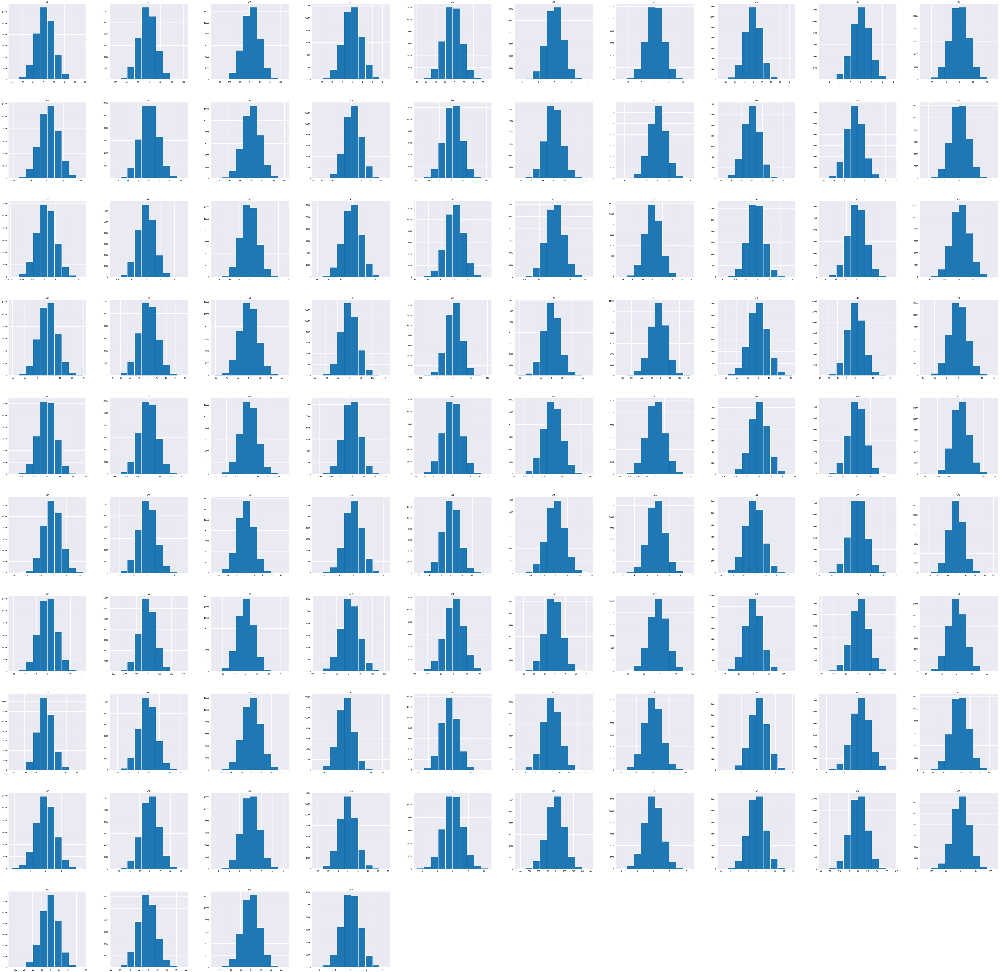
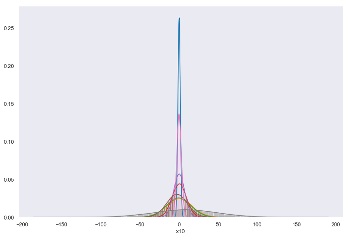
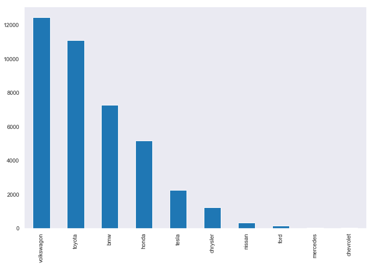
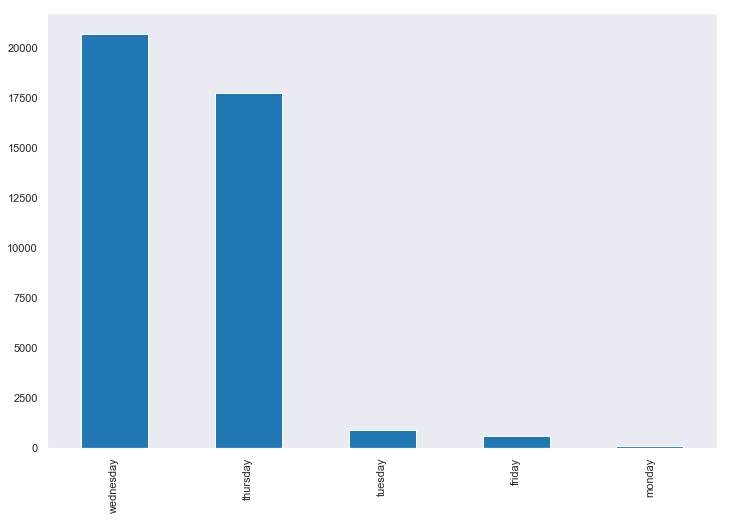
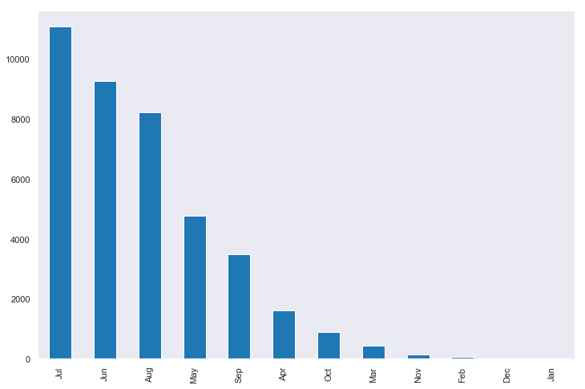
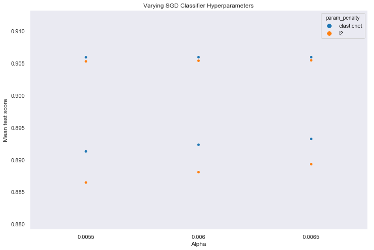
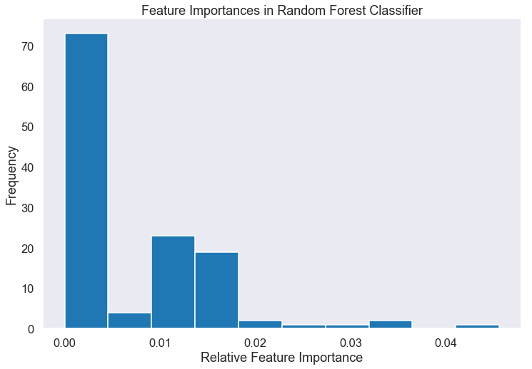

# Setting up the notebook
These are the main python packages that I will use throughout this exercise. I have also set a few options which are purely optional, but based on my preferences for jupyter notebooks. I like to generate inline matplotlib figures, I like the style of dark seaborn figures, and I want to be able to view 20 columns and rows of any pandas dataframes that I generate.


```python
import numpy as np
import pandas as pd
import seaborn as sns
import matplotlib.pyplot as plt
import sklearn as sk
%matplotlib inline
sns.set_style("dark")
sns.set_context("notebook")
pd.set_option("display.max_columns", 10)
pd.set_option("display.max_rows", 10)
```

Here we import the datasets as pandas dataframes and peek at the training data.


```python
train = pd.read_csv('./data/exercise_02_train.csv')
test = pd.read_csv('./data/exercise_02_test.csv')
```

# Exploring the dataset statistically

Let's first view a slice of the top of the dataframe.


```python
train.head()
```


<div>
<style scoped>
    .dataframe tbody tr th:only-of-type {
        vertical-align: middle;
    }

    .dataframe tbody tr th {
        vertical-align: top;
    }

    .dataframe thead th {
        text-align: right;
    }
</style>
<table border="1" class="dataframe">
  <thead>
    <tr style="text-align: right;">
      <th></th>
      <th>x0</th>
      <th>x1</th>
      <th>x2</th>
      <th>x3</th>
      <th>x4</th>
      <th>...</th>
      <th>x96</th>
      <th>x97</th>
      <th>x98</th>
      <th>x99</th>
      <th>y</th>
    </tr>
  </thead>
  <tbody>
    <tr>
      <th>0</th>
      <td>0.198560</td>
      <td>74.425320</td>
      <td>67.627745</td>
      <td>-3.095111</td>
      <td>-6.822327</td>
      <td>...</td>
      <td>26.238591</td>
      <td>-2.125570</td>
      <td>9.644466</td>
      <td>1.237667</td>
      <td>0</td>
    </tr>
    <tr>
      <th>1</th>
      <td>-29.662621</td>
      <td>24.320711</td>
      <td>-48.205182</td>
      <td>1.430339</td>
      <td>-6.552206</td>
      <td>...</td>
      <td>-15.141647</td>
      <td>-36.030599</td>
      <td>5.820376</td>
      <td>1.952183</td>
      <td>1</td>
    </tr>
    <tr>
      <th>2</th>
      <td>15.493759</td>
      <td>-66.160459</td>
      <td>50.512903</td>
      <td>-2.265792</td>
      <td>14.428578</td>
      <td>...</td>
      <td>-19.914894</td>
      <td>26.212736</td>
      <td>2.372690</td>
      <td>0.558988</td>
      <td>1</td>
    </tr>
    <tr>
      <th>3</th>
      <td>-19.837651</td>
      <td>33.210943</td>
      <td>53.405563</td>
      <td>1.079462</td>
      <td>11.364251</td>
      <td>...</td>
      <td>-27.197636</td>
      <td>19.221130</td>
      <td>13.382712</td>
      <td>0.214462</td>
      <td>0</td>
    </tr>
    <tr>
      <th>4</th>
      <td>11.896655</td>
      <td>-26.717872</td>
      <td>-17.758176</td>
      <td>1.692017</td>
      <td>21.553537</td>
      <td>...</td>
      <td>33.383803</td>
      <td>-5.703269</td>
      <td>-11.023730</td>
      <td>-1.191319</td>
      <td>0</td>
    </tr>
  </tbody>
</table>
<p>5 rows × 101 columns</p>
</div>


We can generate some statistical information of the dataframe as follows:


```python
train.shape
```


    (40000, 101)


It looks like each sample consists of 100 features and 1 target.


```python
train.describe()
```


<div>
<style scoped>
    .dataframe tbody tr th:only-of-type {
        vertical-align: middle;
    }

    .dataframe tbody tr th {
        vertical-align: top;
    }

    .dataframe thead th {
        text-align: right;
    }
</style>
<table border="1" class="dataframe">
  <thead>
    <tr style="text-align: right;">
      <th></th>
      <th>x0</th>
      <th>x1</th>
      <th>x2</th>
      <th>x3</th>
      <th>x4</th>
      <th>...</th>
      <th>x96</th>
      <th>x97</th>
      <th>x98</th>
      <th>x99</th>
      <th>y</th>
    </tr>
  </thead>
  <tbody>
    <tr>
      <th>count</th>
      <td>39989.000000</td>
      <td>39990.000000</td>
      <td>39992.000000</td>
      <td>39991.000000</td>
      <td>39992.000000</td>
      <td>...</td>
      <td>39985.000000</td>
      <td>39987.000000</td>
      <td>39994.000000</td>
      <td>39987.000000</td>
      <td>40000.00000</td>
    </tr>
    <tr>
      <th>mean</th>
      <td>3.446069</td>
      <td>-7.788884</td>
      <td>1.706058</td>
      <td>-0.072972</td>
      <td>0.123077</td>
      <td>...</td>
      <td>-0.807556</td>
      <td>-2.514305</td>
      <td>0.038370</td>
      <td>0.043218</td>
      <td>0.20360</td>
    </tr>
    <tr>
      <th>std</th>
      <td>16.247547</td>
      <td>37.014862</td>
      <td>38.385085</td>
      <td>1.503243</td>
      <td>16.289994</td>
      <td>...</td>
      <td>23.836194</td>
      <td>18.554646</td>
      <td>8.450995</td>
      <td>1.114444</td>
      <td>0.40268</td>
    </tr>
    <tr>
      <th>min</th>
      <td>-60.113902</td>
      <td>-157.341119</td>
      <td>-163.339956</td>
      <td>-6.276969</td>
      <td>-61.632319</td>
      <td>...</td>
      <td>-108.474714</td>
      <td>-73.908741</td>
      <td>-35.416133</td>
      <td>-4.376614</td>
      <td>0.00000</td>
    </tr>
    <tr>
      <th>25%</th>
      <td>-7.602474</td>
      <td>-32.740989</td>
      <td>-24.141605</td>
      <td>-1.088182</td>
      <td>-10.896241</td>
      <td>...</td>
      <td>-16.826144</td>
      <td>-15.026614</td>
      <td>-5.645656</td>
      <td>-0.710712</td>
      <td>0.00000</td>
    </tr>
    <tr>
      <th>50%</th>
      <td>3.448865</td>
      <td>-8.019993</td>
      <td>1.963977</td>
      <td>-0.062389</td>
      <td>0.104277</td>
      <td>...</td>
      <td>-0.651197</td>
      <td>-2.509525</td>
      <td>0.023663</td>
      <td>0.042663</td>
      <td>0.00000</td>
    </tr>
    <tr>
      <th>75%</th>
      <td>14.266716</td>
      <td>16.853383</td>
      <td>27.516500</td>
      <td>0.940612</td>
      <td>11.078565</td>
      <td>...</td>
      <td>15.275896</td>
      <td>9.889591</td>
      <td>5.728781</td>
      <td>0.797856</td>
      <td>0.00000</td>
    </tr>
    <tr>
      <th>max</th>
      <td>75.311659</td>
      <td>153.469221</td>
      <td>154.051060</td>
      <td>5.837559</td>
      <td>65.949709</td>
      <td>...</td>
      <td>92.926545</td>
      <td>76.120119</td>
      <td>34.170189</td>
      <td>4.490209</td>
      <td>1.00000</td>
    </tr>
  </tbody>
</table>
<p>8 rows × 95 columns</p>
</div>


.describe() shows us a few things:
1. Most, if not all features have some missing values. We will deal with this in the data cleaning step of preprocessing.
2. Most features have negative and postive values with means that are roughly centered around zero.


I say __most__ because I cannot be bothered to scroll through all 100 columns. Let's try to get even more compact information about this dataframe.

Let's look at _meta statistics_ of the statistics dataframe. This is a neat trick for more compactly dealing with describing a dataframe that is large in both dimensions.


```python
neat_trick = train.describe().T
```


```python
neat_trick.describe()
```


<div>
<style scoped>
    .dataframe tbody tr th:only-of-type {
        vertical-align: middle;
    }

    .dataframe tbody tr th {
        vertical-align: top;
    }

    .dataframe thead th {
        text-align: right;
    }
</style>
<table border="1" class="dataframe">
  <thead>
    <tr style="text-align: right;">
      <th></th>
      <th>count</th>
      <th>mean</th>
      <th>std</th>
      <th>min</th>
      <th>25%</th>
      <th>50%</th>
      <th>75%</th>
      <th>max</th>
    </tr>
  </thead>
  <tbody>
    <tr>
      <th>count</th>
      <td>95.000000</td>
      <td>95.000000</td>
      <td>95.000000</td>
      <td>95.000000</td>
      <td>95.000000</td>
      <td>95.000000</td>
      <td>95.000000</td>
      <td>95.000000</td>
    </tr>
    <tr>
      <th>mean</th>
      <td>39991.852632</td>
      <td>-0.229167</td>
      <td>16.097573</td>
      <td>-68.109206</td>
      <td>-11.004186</td>
      <td>-0.182751</td>
      <td>10.579730</td>
      <td>67.693470</td>
    </tr>
    <tr>
      <th>std</th>
      <td>3.281049</td>
      <td>3.542845</td>
      <td>17.551428</td>
      <td>77.723484</td>
      <td>13.184976</td>
      <td>3.333283</td>
      <td>11.050040</td>
      <td>72.288777</td>
    </tr>
    <tr>
      <th>min</th>
      <td>39985.000000</td>
      <td>-21.624920</td>
      <td>0.402680</td>
      <td>-423.119841</td>
      <td>-76.473541</td>
      <td>-19.040474</td>
      <td>0.000000</td>
      <td>1.000000</td>
    </tr>
    <tr>
      <th>25%</th>
      <td>39989.000000</td>
      <td>-0.062812</td>
      <td>3.989000</td>
      <td>-106.216749</td>
      <td>-16.481024</td>
      <td>-0.130946</td>
      <td>2.630581</td>
      <td>16.896682</td>
    </tr>
    <tr>
      <th>50%</th>
      <td>39992.000000</td>
      <td>-0.001596</td>
      <td>8.334879</td>
      <td>-35.060656</td>
      <td>-5.662323</td>
      <td>-0.005898</td>
      <td>5.631632</td>
      <td>34.170189</td>
    </tr>
    <tr>
      <th>75%</th>
      <td>39994.000000</td>
      <td>0.043043</td>
      <td>24.203969</td>
      <td>-16.216740</td>
      <td>-2.748804</td>
      <td>0.061379</td>
      <td>16.367891</td>
      <td>95.564434</td>
    </tr>
    <tr>
      <th>max</th>
      <td>40000.000000</td>
      <td>9.519717</td>
      <td>96.666843</td>
      <td>0.000000</td>
      <td>0.000000</td>
      <td>9.560092</td>
      <td>56.676810</td>
      <td>378.752405</td>
    </tr>
  </tbody>
</table>
</div>


We are now viewing summary statistics OF the summary statistics. This highlights other information that we would have probably missed just viewing the normal statistics dataframe:

1. The count of count is only 95. Not 100. But we know that the dimensions of train have 100 feature columns. This means that 5 features are categorical, non-numeric features.

2. The min of count is 39985. This means that no features are missing more than 15 values. This is good in the sense that our dataset is not missing a large percentage of entries.

3. The min of min and the max of max have similar magnitudes: ~-423 and ~+378 respectively. This confirms our earlier observation that the data is mostly mean-centered on zero.


```python
train.info(all)
```

    <class 'pandas.core.frame.DataFrame'>
    RangeIndex: 40000 entries, 0 to 39999
    Data columns (total 101 columns):
    x0     float64
    x1     float64
    x2     float64
    x3     float64
    x4     float64
    x5     float64
    x6     float64
    x7     float64
    x8     float64
    x9     float64
    x10    float64
    x11    float64
    x12    float64
    x13    float64
    x14    float64
    x15    float64
    x16    float64
    x17    float64
    x18    float64
    x19    float64
    x20    float64
    x21    float64
    x22    float64
    x23    float64
    x24    float64
    x25    float64
    x26    float64
    x27    float64
    x28    float64
    x29    float64
    x30    float64
    x31    float64
    x32    float64
    x33    float64
    x34    object
    x35    object
    x36    float64
    x37    float64
    x38    float64
    x39    float64
    x40    float64
    x41    object
    x42    float64
    x43    float64
    x44    float64
    x45    object
    x46    float64
    x47    float64
    x48    float64
    x49    float64
    x50    float64
    x51    float64
    x52    float64
    x53    float64
    x54    float64
    x55    float64
    x56    float64
    x57    float64
    x58    float64
    x59    float64
    x60    float64
    x61    float64
    x62    float64
    x63    float64
    x64    float64
    x65    float64
    x66    float64
    x67    float64
    x68    object
    x69    float64
    x70    float64
    x71    float64
    x72    float64
    x73    float64
    x74    float64
    x75    float64
    x76    float64
    x77    float64
    x78    float64
    x79    float64
    x80    float64
    x81    float64
    x82    float64
    x83    float64
    x84    float64
    x85    float64
    x86    float64
    x87    float64
    x88    float64
    x89    float64
    x90    float64
    x91    float64
    x92    float64
    x93    object
    x94    float64
    x95    float64
    x96    float64
    x97    float64
    x98    float64
    x99    float64
    y      int64
    dtypes: float64(94), int64(1), object(6)
    memory usage: 30.8+ MB


.info(all) shows us that the non-numerical features are: x34, x35, x41, x45, x68, and x93.

# Data cleaning
Let's split the data into numerical and categorical features.


```python
train_num = train.drop(['x34', 'x35', 'x41', 'x45', 'x68', 'x93', 'y'], axis=1)
train_cat = train[['x34', 'x35', 'x41', 'x45', 'x68', 'x93']]

test_num = test.drop(['x34', 'x35', 'x41', 'x45', 'x68', 'x93'], axis=1)
test_cat = test[['x34', 'x35', 'x41', 'x45', 'x68', 'x93']]
```


```python
train_cat
```


<div>
<style scoped>
    .dataframe tbody tr th:only-of-type {
        vertical-align: middle;
    }

    .dataframe tbody tr th {
        vertical-align: top;
    }

    .dataframe thead th {
        text-align: right;
    }
</style>
<table border="1" class="dataframe">
  <thead>
    <tr style="text-align: right;">
      <th></th>
      <th>x34</th>
      <th>x35</th>
      <th>x41</th>
      <th>x45</th>
      <th>x68</th>
      <th>x93</th>
    </tr>
  </thead>
  <tbody>
    <tr>
      <th>0</th>
      <td>Toyota</td>
      <td>wed</td>
      <td>$449.48</td>
      <td>0.0%</td>
      <td>Jun</td>
      <td>asia</td>
    </tr>
    <tr>
      <th>1</th>
      <td>Honda</td>
      <td>wed</td>
      <td>$-525.06</td>
      <td>0.0%</td>
      <td>sept.</td>
      <td>asia</td>
    </tr>
    <tr>
      <th>2</th>
      <td>bmw</td>
      <td>wed</td>
      <td>$-599.5</td>
      <td>0.01%</td>
      <td>Oct</td>
      <td>america</td>
    </tr>
    <tr>
      <th>3</th>
      <td>volkswagon</td>
      <td>wed</td>
      <td>$-220.71</td>
      <td>-0.0%</td>
      <td>Jun</td>
      <td>asia</td>
    </tr>
    <tr>
      <th>4</th>
      <td>volkswagon</td>
      <td>thurday</td>
      <td>$-1405.59</td>
      <td>-0.0%</td>
      <td>July</td>
      <td>asia</td>
    </tr>
    <tr>
      <th>...</th>
      <td>...</td>
      <td>...</td>
      <td>...</td>
      <td>...</td>
      <td>...</td>
      <td>...</td>
    </tr>
    <tr>
      <th>39995</th>
      <td>Toyota</td>
      <td>wednesday</td>
      <td>$-2113.2</td>
      <td>-0.01%</td>
      <td>July</td>
      <td>euorpe</td>
    </tr>
    <tr>
      <th>39996</th>
      <td>Honda</td>
      <td>thur</td>
      <td>$935.41</td>
      <td>-0.02%</td>
      <td>sept.</td>
      <td>asia</td>
    </tr>
    <tr>
      <th>39997</th>
      <td>volkswagon</td>
      <td>wed</td>
      <td>$338.2</td>
      <td>-0.01%</td>
      <td>July</td>
      <td>asia</td>
    </tr>
    <tr>
      <th>39998</th>
      <td>bmw</td>
      <td>thurday</td>
      <td>$-169.39</td>
      <td>0.02%</td>
      <td>Jun</td>
      <td>asia</td>
    </tr>
    <tr>
      <th>39999</th>
      <td>Toyota</td>
      <td>thurday</td>
      <td>$-768.26</td>
      <td>0.0%</td>
      <td>July</td>
      <td>asia</td>
    </tr>
  </tbody>
</table>
<p>40000 rows × 6 columns</p>
</div>


## Turning the $ and \% columns into numerical features

x41 and x45 are actually numerical. Let's fix them.


```python
dollars = train['x41'].str.strip("$")
percentages = train['x45'].str.strip("%")
dollars_df = pd.DataFrame(data=dollars, columns=['x41'])
percentages_df = pd.DataFrame(data=percentages, columns=['x45'])
d_and_p = dollars_df.join(percentages_df)
train_num = train_num.join(d_and_p)
```

Let's repeat this for the test set before we forget.


```python
dollars = test['x41'].str.strip("$")
percentages = test['x45'].str.strip("%")
dollars_df = pd.DataFrame(data=dollars, columns=['x41'])
percentages_df = pd.DataFrame(data=percentages, columns=['x45'])
d_and_p = dollars_df.join(percentages_df)
test_num = test_num.join(d_and_p)
```

Don't forget to drop the $ and \% columns from the categorical dataframesa;


```python
train_cat = train_cat.drop(['x41', 'x45'], axis=1)
test_cat = test_cat.drop(['x41', 'x45'], axis=1)
```

## Fixing typos in weekday column


```python
train_cat
```


<div>
<style scoped>
    .dataframe tbody tr th:only-of-type {
        vertical-align: middle;
    }

    .dataframe tbody tr th {
        vertical-align: top;
    }

    .dataframe thead th {
        text-align: right;
    }
</style>
<table border="1" class="dataframe">
  <thead>
    <tr style="text-align: right;">
      <th></th>
      <th>x34</th>
      <th>x35</th>
      <th>x68</th>
      <th>x93</th>
    </tr>
  </thead>
  <tbody>
    <tr>
      <th>0</th>
      <td>Toyota</td>
      <td>wed</td>
      <td>Jun</td>
      <td>asia</td>
    </tr>
    <tr>
      <th>1</th>
      <td>Honda</td>
      <td>wed</td>
      <td>sept.</td>
      <td>asia</td>
    </tr>
    <tr>
      <th>2</th>
      <td>bmw</td>
      <td>wed</td>
      <td>Oct</td>
      <td>america</td>
    </tr>
    <tr>
      <th>3</th>
      <td>volkswagon</td>
      <td>wed</td>
      <td>Jun</td>
      <td>asia</td>
    </tr>
    <tr>
      <th>4</th>
      <td>volkswagon</td>
      <td>thurday</td>
      <td>July</td>
      <td>asia</td>
    </tr>
    <tr>
      <th>...</th>
      <td>...</td>
      <td>...</td>
      <td>...</td>
      <td>...</td>
    </tr>
    <tr>
      <th>39995</th>
      <td>Toyota</td>
      <td>wednesday</td>
      <td>July</td>
      <td>euorpe</td>
    </tr>
    <tr>
      <th>39996</th>
      <td>Honda</td>
      <td>thur</td>
      <td>sept.</td>
      <td>asia</td>
    </tr>
    <tr>
      <th>39997</th>
      <td>volkswagon</td>
      <td>wed</td>
      <td>July</td>
      <td>asia</td>
    </tr>
    <tr>
      <th>39998</th>
      <td>bmw</td>
      <td>thurday</td>
      <td>Jun</td>
      <td>asia</td>
    </tr>
    <tr>
      <th>39999</th>
      <td>Toyota</td>
      <td>thurday</td>
      <td>July</td>
      <td>asia</td>
    </tr>
  </tbody>
</table>
<p>40000 rows × 4 columns</p>
</div>


```python
train_cat.x35.unique()
```


    array(['wed', 'thurday', 'wednesday', 'thur', 'tuesday', 'monday',
           'friday', 'fri', nan], dtype=object)


```python
train_cat.replace(to_replace='wed', value='wednesday', inplace=True)
train_cat.replace(to_replace='thurday', value='thursday', inplace=True)
train_cat.replace(to_replace='thur', value='thursday', inplace=True)
train_cat.replace(to_replace='fri', value='friday', inplace=True)

test_cat.replace(to_replace='wed', value='wednesday', inplace=True)
test_cat.replace(to_replace='thurday', value='thursday', inplace=True)
test_cat.replace(to_replace='thur', value='thursday', inplace=True)
test_cat.replace(to_replace='fri', value='friday', inplace=True)
```


```python
train_cat
```


<div>
<style scoped>
    .dataframe tbody tr th:only-of-type {
        vertical-align: middle;
    }

    .dataframe tbody tr th {
        vertical-align: top;
    }

    .dataframe thead th {
        text-align: right;
    }
</style>
<table border="1" class="dataframe">
  <thead>
    <tr style="text-align: right;">
      <th></th>
      <th>x34</th>
      <th>x35</th>
      <th>x68</th>
      <th>x93</th>
    </tr>
  </thead>
  <tbody>
    <tr>
      <th>0</th>
      <td>Toyota</td>
      <td>wednesday</td>
      <td>Jun</td>
      <td>asia</td>
    </tr>
    <tr>
      <th>1</th>
      <td>Honda</td>
      <td>wednesday</td>
      <td>sept.</td>
      <td>asia</td>
    </tr>
    <tr>
      <th>2</th>
      <td>bmw</td>
      <td>wednesday</td>
      <td>Oct</td>
      <td>america</td>
    </tr>
    <tr>
      <th>3</th>
      <td>volkswagon</td>
      <td>wednesday</td>
      <td>Jun</td>
      <td>asia</td>
    </tr>
    <tr>
      <th>4</th>
      <td>volkswagon</td>
      <td>thursday</td>
      <td>July</td>
      <td>asia</td>
    </tr>
    <tr>
      <th>...</th>
      <td>...</td>
      <td>...</td>
      <td>...</td>
      <td>...</td>
    </tr>
    <tr>
      <th>39995</th>
      <td>Toyota</td>
      <td>wednesday</td>
      <td>July</td>
      <td>euorpe</td>
    </tr>
    <tr>
      <th>39996</th>
      <td>Honda</td>
      <td>thursday</td>
      <td>sept.</td>
      <td>asia</td>
    </tr>
    <tr>
      <th>39997</th>
      <td>volkswagon</td>
      <td>wednesday</td>
      <td>July</td>
      <td>asia</td>
    </tr>
    <tr>
      <th>39998</th>
      <td>bmw</td>
      <td>thursday</td>
      <td>Jun</td>
      <td>asia</td>
    </tr>
    <tr>
      <th>39999</th>
      <td>Toyota</td>
      <td>thursday</td>
      <td>July</td>
      <td>asia</td>
    </tr>
  </tbody>
</table>
<p>40000 rows × 4 columns</p>
</div>


```python
train_cat.x34.unique()
```


    array(['Toyota', 'Honda', 'bmw', 'volkswagon', 'tesla', 'nissan',
           'chrystler', 'ford', 'mercades', 'chevrolet', nan], dtype=object)


## Fix car brand misspellings and standardize casing


```python
train_cat.replace(to_replace='chrystler', value='chrysler', inplace=True)
train_cat.replace(to_replace='mercades', value='mercedes', inplace=True)
train_cat.replace(to_replace='Toyota', value='toyota', inplace=True)
train_cat.replace(to_replace='Honda', value='honda', inplace=True)

test_cat.replace(to_replace='chrystler', value='chrysler', inplace=True)
test_cat.replace(to_replace='mercades', value='mercedes', inplace=True)
test_cat.replace(to_replace='Toyota', value='toyota', inplace=True)
test_cat.replace(to_replace='Honda', value='honda', inplace=True)
```


```python
train_cat.x68.unique()
```


    array(['Jun', 'sept.', 'Oct', 'July', 'Aug', 'Apr', 'May', 'Mar', 'Nov',
           'Feb', 'Dev', nan, 'January'], dtype=object)


## Standardize months


```python
train_cat.replace(to_replace='sept.', value='Sep', inplace=True)
train_cat.replace(to_replace='July', value='Jul', inplace=True)
train_cat.replace(to_replace='Dev', value='Dec', inplace=True)
train_cat.replace(to_replace='January', value='Jan', inplace=True)

test_cat.replace(to_replace='sept.', value='Sep', inplace=True)
test_cat.replace(to_replace='July', value='Jul', inplace=True)
test_cat.replace(to_replace='Dev', value='Dec', inplace=True)
test_cat.replace(to_replace='January', value='Jan', inplace=True)
```

## Everything is good with the continents data

# Imputing the data
We must impute the data for completing missing values. This will need to be done for both the categorical and numerical data.

## Imputing the categorical data
For dealing with nan's in the categorical data, I will replace those values with the most frequent occurrence. For example, most day entries are wednesdays, so it should not degrade the model too much to replace unknown weekdays with wednesdays.


```python
from sklearn.impute import SimpleImputer
imputer = SimpleImputer(strategy='most_frequent')
```


```python
train_cat_no_nan = imputer.fit_transform(train_cat)
```


```python
test_cat_no_nan = imputer.transform(test_cat)
```

## Imputing the numerical data

For dealing with na's/nan's in the numerical data, I will replace those values with 0. Most features seem to be centered at zero, so this should be roughly equivalent to replacing each missing value with the average, which is generally accepted as a good imputation strategy.


```python
train_num_no_na = train_num.fillna(value=0)
```


```python
test_num_no_na = test_num.fillna(value=0)
```

# Exploring the dataset visually

## Numerical data visualization

Let's generate a few figures to look at our dataset. In particular, we are interested in viewing the shapes of the distributions of feature values. Some features may be binary, some may have normal distributions, some may be low or high value heavy, etc.

First we will make a group of histograms of all of the features in our training set. The goal is to identify any strange quirks in the data. Sometimes data will have a hard cutoff at a high or low value, or be discretized strangely. We need to check our data visually to identify any of these possibilities before continuing.


```python
fig = train_num_no_na.hist(figsize=(100,100))
```





Based on the above figure, it is easy to see that all of our features have fairly Gaussian continuous distributions. This is very good. Nothing problematic here.

Let's superimpose a few randomly selected distributions on top of each other to compare their magnitudes, variances, etc.


```python
fig = plt.figure(figsize=(12,8))
sns.distplot(a=train_num_no_na['x3'])
sns.distplot(a=train_num_no_na['x4'])
sns.distplot(a=train_num_no_na['x5'])
sns.distplot(a=train_num_no_na['x6'])
sns.distplot(a=train_num_no_na['x7'])
sns.distplot(a=train_num_no_na['x8'])
sns.distplot(a=train_num_no_na['x9'])
sns.distplot(a=train_num_no_na['x10'])
```


    <matplotlib.axes._subplots.AxesSubplot at 0x1a2db07a20>





There are significant differences in the width of these Gaussian distributions. However, all data seems to already be roughly centered on zero. We will standardize the variances of each distribution later to avoid problems in model construction related to the magnitudes of certain features.

After randomly selecting a bunch of features to create distribution plots of, it is clear that the vast majority of them are Gaussian shaped and mean-zeroed. This makes these data good candidates for standardization via mean zero centering and unit variance. This standardization technique is important because, if the magnitudes of different features differ greatly, it can degrade the performance of certain learning algorithms.

## Categorical data visualization

Let's now view the categorical data. 


```python
fig = plt.figure(figsize=(12,8))
train_cat['x34'].value_counts().plot(kind='bar')
```


    <matplotlib.axes._subplots.AxesSubplot at 0x1a3347c4e0>





```python
fig = plt.figure(figsize=(12,8))
train_cat['x35'].value_counts().plot(kind='bar')
```


    <matplotlib.axes._subplots.AxesSubplot at 0x1a336486d8>





```python
fig = plt.figure(figsize=(12,8))
train_cat['x68'].value_counts().plot(kind='bar')
```


    <matplotlib.axes._subplots.AxesSubplot at 0x1a3355b9e8>





Some categories are represented much more strongly than others. This may cause some problems during cross-validation...

One possible solution to the uneven distribution of categorical data would be to use stratified sampling during model constructions. This means to preferentially select the under-represented categories, which results in a more even representation of each category in the training data used by the model. 

# Standardize the numerical data


```python
from sklearn.preprocessing import StandardScaler
scaler = StandardScaler()
```


```python
import warnings
warnings.filterwarnings("ignore")
```


```python
train_num_scl = scaler.fit_transform(train_num_no_na)
test_num_scl = scaler.transform(test_num_no_na)
```

## One-hot encode the categorical data

Many learning models are unable to deal with categorical, non numerical data. A good solution to this is to use one-hot encoding. We replace each categorical feature with n binary features, where n is the number of categories associated with that feature.


```python
from sklearn.preprocessing import OneHotEncoder
encoder = OneHotEncoder(sparse=False)
```


```python
train_cat_ohe = encoder.fit_transform(train_cat_no_nan)
test_cat_ohe = encoder.transform(test_cat_no_nan)
```

# Double check our work
Let's make sure that all of the dataframes are of the expected size.


```python
train_cat_ohe.shape
```


    (40000, 30)


```python
test_cat_ohe.shape
```


    (10000, 30)


```python
train_num_scl.shape
```


    (40000, 96)


```python
test_num_scl.shape
```


    (10000, 96)


All of the dimensions of our dataframes match expectations. Let's build our final training and testing sets and start generating models!

# Final dataframe construction


```python
X_train = np.concatenate((train_num_scl, train_cat_ohe), axis=1)
X_test = np.concatenate((test_num_scl, test_cat_ohe), axis=1)
y_train = np.array(train['y'])
```

The assignment asks for probabilities of belonging to class 1.

# Selecting estimators which provide a predict_proba method


```python
from sklearn.utils.testing import all_estimators

estimators = all_estimators()

for name, class_ in estimators:
    if hasattr(class_, 'predict_proba'):
        print(name)
```

    AdaBoostClassifier
    BaggingClassifier
    BayesianGaussianMixture
    BernoulliNB
    CalibratedClassifierCV
    ComplementNB
    DecisionTreeClassifier
    ExtraTreeClassifier
    ExtraTreesClassifier
    GaussianMixture
    GaussianNB
    GaussianProcessClassifier
    GradientBoostingClassifier
    KNeighborsClassifier
    LabelPropagation
    LabelSpreading
    LinearDiscriminantAnalysis
    LogisticRegression
    LogisticRegressionCV
    MLPClassifier
    MultinomialNB
    NuSVC
    QuadraticDiscriminantAnalysis
    RandomForestClassifier
    SGDClassifier
    SVC
    _BinaryGaussianProcessClassifierLaplace
    _ConstantPredictor


These are all of the estimators that we have to choose from for generating probability predictions.

# Model Generation

In this section of the notebook, I will generate multiple models with several different learning algorithms while trying out many different hyperparameters. The models will be cross-validated on subsets of the training data and scored according to their ROC AUC scores.


```python
from sklearn.ensemble import RandomForestClassifier
from sklearn.svm import SVC
from sklearn.neighbors import KNeighborsClassifier
from sklearn.linear_model import SGDClassifier

from sklearn.model_selection import KFold
from sklearn.model_selection import cross_val_score
from sklearn.model_selection import GridSearchCV

import warnings
warnings.simplefilter(action='ignore')

```


```python
from sklearn.metrics import roc_auc_score
```

The process of building multiple models with varying hyperparameters and scoring them via cross-validation is accomplished with the GridSearchCV feature in scikit-learn. The following function is a wrapper function which runs GridSearchCV for a given model and set of hyperparameters. The best model is then selected from the grid search and it itself is cross-validated and statistics of its performance are printed. I will repeat this process for several different algorithms, attempting to find the highest ROC AUC score possible.


```python
def clf_model_gsearch_cval(model, X, y, param_grid, cv):
    grid_search = GridSearchCV(model, param_grid, cv=cv, scoring="roc_auc", n_jobs=-1)
    grid_search.fit(X, y)
    gs_results = pd.DataFrame(grid_search.cv_results_).sort_values(by=['rank_test_score'])
    grid_search.best_estimator_
    scores = cross_val_score(grid_search.best_estimator_, X, y, cv=cv, scoring="roc_auc", n_jobs=-1)
    Message = print("Cross-validation statistics for best model:",'Scores:', scores, 'Mean:', scores.mean(), 'Standard Deviation:', scores.std())
    return gs_results, grid_search.best_estimator_, Message
```

Due to the long time required to evaluate this function for some classification models (can be on the order of hours), I have iterated it many times for each classification model, selecting only a few hyperparameter variations each time to keep the evaluation times reasonable. Therefore, this notebook only shows the final form of this function once I have honed in on the optimum hyperparameters. Just know that I iterated it many times before to get to this point.

## SGD Classifier


```python
sgd = SGDClassifier()

param_grid = [{
    'loss': ['log', 'modified_huber'],
    'penalty': ['l2', 'elasticnet'], 'alpha': [5.5e-3, 6e-3, 6.5e-3],
    'n_jobs': [-1], 'random_state': [42]
}]

results_sgd, best_sgd, Message = clf_model_gsearch_cval(
    model=sgd, X=X_train, y=y_train, param_grid=param_grid, cv=3)
```

    Cross-validation statistics for best model: Scores: [0.90044132 0.9093813  0.90796655] Mean: 0.9059297261116642 Standard Deviation: 0.0039236322328364895


Here we have generated an SGD classifier with an ROC_AUC score of 0.90. The following dataframe shows detailed information about this grid search and the performance of each model considered, across each cross-validation sweep.


```python
results_sgd
```


<div>
<style scoped>
    .dataframe tbody tr th:only-of-type {
        vertical-align: middle;
    }

    .dataframe tbody tr th {
        vertical-align: top;
    }

    .dataframe thead th {
        text-align: right;
    }
</style>
<table border="1" class="dataframe">
  <thead>
    <tr style="text-align: right;">
      <th></th>
      <th>mean_fit_time</th>
      <th>std_fit_time</th>
      <th>mean_score_time</th>
      <th>std_score_time</th>
      <th>param_alpha</th>
      <th>...</th>
      <th>split0_train_score</th>
      <th>split1_train_score</th>
      <th>split2_train_score</th>
      <th>mean_train_score</th>
      <th>std_train_score</th>
    </tr>
  </thead>
  <tbody>
    <tr>
      <th>9</th>
      <td>0.260306</td>
      <td>0.000181</td>
      <td>0.006663</td>
      <td>0.000618</td>
      <td>0.0065</td>
      <td>...</td>
      <td>0.910575</td>
      <td>0.907506</td>
      <td>0.906231</td>
      <td>0.908104</td>
      <td>0.001823</td>
    </tr>
    <tr>
      <th>5</th>
      <td>0.266205</td>
      <td>0.010837</td>
      <td>0.006740</td>
      <td>0.000211</td>
      <td>0.006</td>
      <td>...</td>
      <td>0.910664</td>
      <td>0.907572</td>
      <td>0.906160</td>
      <td>0.908132</td>
      <td>0.001881</td>
    </tr>
    <tr>
      <th>1</th>
      <td>0.288750</td>
      <td>0.044813</td>
      <td>0.007985</td>
      <td>0.001167</td>
      <td>0.0055</td>
      <td>...</td>
      <td>0.910706</td>
      <td>0.907622</td>
      <td>0.906123</td>
      <td>0.908150</td>
      <td>0.001908</td>
    </tr>
    <tr>
      <th>8</th>
      <td>0.148997</td>
      <td>0.004621</td>
      <td>0.007155</td>
      <td>0.000960</td>
      <td>0.0065</td>
      <td>...</td>
      <td>0.910850</td>
      <td>0.907627</td>
      <td>0.906136</td>
      <td>0.908204</td>
      <td>0.001967</td>
    </tr>
    <tr>
      <th>4</th>
      <td>0.165612</td>
      <td>0.015945</td>
      <td>0.006888</td>
      <td>0.000340</td>
      <td>0.006</td>
      <td>...</td>
      <td>0.910816</td>
      <td>0.907619</td>
      <td>0.906020</td>
      <td>0.908152</td>
      <td>0.001994</td>
    </tr>
    <tr>
      <th>...</th>
      <td>...</td>
      <td>...</td>
      <td>...</td>
      <td>...</td>
      <td>...</td>
      <td>...</td>
      <td>...</td>
      <td>...</td>
      <td>...</td>
      <td>...</td>
      <td>...</td>
    </tr>
    <tr>
      <th>7</th>
      <td>0.206556</td>
      <td>0.003093</td>
      <td>0.006904</td>
      <td>0.000168</td>
      <td>0.006</td>
      <td>...</td>
      <td>0.895244</td>
      <td>0.894725</td>
      <td>0.894252</td>
      <td>0.894740</td>
      <td>0.000405</td>
    </tr>
    <tr>
      <th>3</th>
      <td>0.220946</td>
      <td>0.018427</td>
      <td>0.008474</td>
      <td>0.002142</td>
      <td>0.0055</td>
      <td>...</td>
      <td>0.893709</td>
      <td>0.893945</td>
      <td>0.893343</td>
      <td>0.893666</td>
      <td>0.000248</td>
    </tr>
    <tr>
      <th>10</th>
      <td>0.121862</td>
      <td>0.008589</td>
      <td>0.006828</td>
      <td>0.000205</td>
      <td>0.0065</td>
      <td>...</td>
      <td>0.893453</td>
      <td>0.890512</td>
      <td>0.892781</td>
      <td>0.892248</td>
      <td>0.001258</td>
    </tr>
    <tr>
      <th>6</th>
      <td>0.121668</td>
      <td>0.007648</td>
      <td>0.006981</td>
      <td>0.000716</td>
      <td>0.006</td>
      <td>...</td>
      <td>0.891884</td>
      <td>0.889342</td>
      <td>0.891662</td>
      <td>0.890963</td>
      <td>0.001150</td>
    </tr>
    <tr>
      <th>2</th>
      <td>0.119528</td>
      <td>0.000689</td>
      <td>0.008095</td>
      <td>0.000652</td>
      <td>0.0055</td>
      <td>...</td>
      <td>0.889979</td>
      <td>0.887856</td>
      <td>0.890165</td>
      <td>0.889333</td>
      <td>0.001047</td>
    </tr>
  </tbody>
</table>
<p>12 rows × 21 columns</p>
</div>


Here are the parameters for the best SGD model.


```python
best_sgd
```


    SGDClassifier(alpha=0.0065, average=False, class_weight=None,
           early_stopping=False, epsilon=0.1, eta0=0.0, fit_intercept=True,
           l1_ratio=0.15, learning_rate='optimal', loss='log', max_iter=None,
           n_iter=None, n_iter_no_change=5, n_jobs=-1, penalty='elasticnet',
           power_t=0.5, random_state=42, shuffle=True, tol=None,
           validation_fraction=0.1, verbose=0, warm_start=False)


Here I have been generating figures at each pass to visually show which parameters yield the best results. These figures aided my selection of hyperparameter values at each pass.


```python
fig = plt.figure(figsize=(12,8))

sns.swarmplot(
    data=results_sgd, x="param_alpha", y="mean_test_score", hue="param_penalty")
plt.title("Varying SGD Classifier Hyperparameters")
plt.xlabel("Alpha")
plt.ylabel("Mean test score")
```


    Text(0, 0.5, 'Mean test score')





The SGD Classifier is topping out at ROC AUC = 0.90662. Let's see if using another classifier can improve on this score.

## Decision Tree Classifier


```python
from sklearn.tree import DecisionTreeClassifier
tre = DecisionTreeClassifier()
```


```python
param_grid = [{
    'criterion': ['gini'], 'splitter': ['best'],
    'max_depth': [7, 9, 11], 'min_samples_split': [2],
    'min_samples_leaf': [4, 8, 12], 'random_state': [42]
}]

results_tre, best_tre, Message = clf_model_gsearch_cval(
    model=tre, X=X_train, y=y_train, param_grid=param_grid, cv=3)
```

    Cross-validation statistics for best model: Scores: [0.80131586 0.80551512 0.80208226] Mean: 0.8029710769855596 Standard Deviation: 0.0018259133044459936


```python
results_tre
```


<div>
<style scoped>
    .dataframe tbody tr th:only-of-type {
        vertical-align: middle;
    }

    .dataframe tbody tr th {
        vertical-align: top;
    }

    .dataframe thead th {
        text-align: right;
    }
</style>
<table border="1" class="dataframe">
  <thead>
    <tr style="text-align: right;">
      <th></th>
      <th>mean_fit_time</th>
      <th>std_fit_time</th>
      <th>mean_score_time</th>
      <th>std_score_time</th>
      <th>param_criterion</th>
      <th>param_max_depth</th>
      <th>param_min_samples_leaf</th>
      <th>param_min_samples_split</th>
      <th>param_random_state</th>
      <th>param_splitter</th>
      <th>...</th>
      <th>split1_test_score</th>
      <th>split2_test_score</th>
      <th>mean_test_score</th>
      <th>std_test_score</th>
      <th>rank_test_score</th>
      <th>split0_train_score</th>
      <th>split1_train_score</th>
      <th>split2_train_score</th>
      <th>mean_train_score</th>
      <th>std_train_score</th>
    </tr>
  </thead>
  <tbody>
    <tr>
      <th>2</th>
      <td>3.033138</td>
      <td>0.190953</td>
      <td>0.011110</td>
      <td>0.003359</td>
      <td>gini</td>
      <td>7</td>
      <td>12</td>
      <td>2</td>
      <td>42</td>
      <td>best</td>
      <td>...</td>
      <td>0.805515</td>
      <td>0.802082</td>
      <td>0.802971</td>
      <td>0.001826</td>
      <td>1</td>
      <td>0.862802</td>
      <td>0.853349</td>
      <td>0.856750</td>
      <td>0.857634</td>
      <td>0.003909</td>
    </tr>
    <tr>
      <th>1</th>
      <td>2.808633</td>
      <td>0.174557</td>
      <td>0.011816</td>
      <td>0.001403</td>
      <td>gini</td>
      <td>7</td>
      <td>8</td>
      <td>2</td>
      <td>42</td>
      <td>best</td>
      <td>...</td>
      <td>0.803875</td>
      <td>0.801141</td>
      <td>0.802608</td>
      <td>0.001125</td>
      <td>2</td>
      <td>0.862635</td>
      <td>0.852074</td>
      <td>0.856048</td>
      <td>0.856919</td>
      <td>0.004355</td>
    </tr>
    <tr>
      <th>5</th>
      <td>3.963264</td>
      <td>0.232484</td>
      <td>0.009085</td>
      <td>0.000148</td>
      <td>gini</td>
      <td>9</td>
      <td>12</td>
      <td>2</td>
      <td>42</td>
      <td>best</td>
      <td>...</td>
      <td>0.800586</td>
      <td>0.801597</td>
      <td>0.802416</td>
      <td>0.001918</td>
      <td>3</td>
      <td>0.920775</td>
      <td>0.914225</td>
      <td>0.912703</td>
      <td>0.915901</td>
      <td>0.003502</td>
    </tr>
    <tr>
      <th>0</th>
      <td>2.585058</td>
      <td>0.014094</td>
      <td>0.014076</td>
      <td>0.000648</td>
      <td>gini</td>
      <td>7</td>
      <td>4</td>
      <td>2</td>
      <td>42</td>
      <td>best</td>
      <td>...</td>
      <td>0.804482</td>
      <td>0.801425</td>
      <td>0.802403</td>
      <td>0.001471</td>
      <td>4</td>
      <td>0.861965</td>
      <td>0.851255</td>
      <td>0.856703</td>
      <td>0.856641</td>
      <td>0.004372</td>
    </tr>
    <tr>
      <th>4</th>
      <td>3.600890</td>
      <td>0.120644</td>
      <td>0.015154</td>
      <td>0.004669</td>
      <td>gini</td>
      <td>9</td>
      <td>8</td>
      <td>2</td>
      <td>42</td>
      <td>best</td>
      <td>...</td>
      <td>0.796251</td>
      <td>0.799009</td>
      <td>0.796520</td>
      <td>0.001932</td>
      <td>5</td>
      <td>0.921781</td>
      <td>0.913717</td>
      <td>0.915590</td>
      <td>0.917029</td>
      <td>0.003446</td>
    </tr>
    <tr>
      <th>8</th>
      <td>4.522114</td>
      <td>0.180707</td>
      <td>0.007789</td>
      <td>0.001122</td>
      <td>gini</td>
      <td>11</td>
      <td>12</td>
      <td>2</td>
      <td>42</td>
      <td>best</td>
      <td>...</td>
      <td>0.790255</td>
      <td>0.797651</td>
      <td>0.793066</td>
      <td>0.003269</td>
      <td>6</td>
      <td>0.954965</td>
      <td>0.949579</td>
      <td>0.946924</td>
      <td>0.950489</td>
      <td>0.003345</td>
    </tr>
    <tr>
      <th>3</th>
      <td>3.914383</td>
      <td>0.027773</td>
      <td>0.009481</td>
      <td>0.000454</td>
      <td>gini</td>
      <td>9</td>
      <td>4</td>
      <td>2</td>
      <td>42</td>
      <td>best</td>
      <td>...</td>
      <td>0.792090</td>
      <td>0.795259</td>
      <td>0.792133</td>
      <td>0.002536</td>
      <td>7</td>
      <td>0.919812</td>
      <td>0.913630</td>
      <td>0.916174</td>
      <td>0.916538</td>
      <td>0.002537</td>
    </tr>
    <tr>
      <th>7</th>
      <td>3.732658</td>
      <td>0.112293</td>
      <td>0.012559</td>
      <td>0.003606</td>
      <td>gini</td>
      <td>11</td>
      <td>8</td>
      <td>2</td>
      <td>42</td>
      <td>best</td>
      <td>...</td>
      <td>0.776896</td>
      <td>0.785717</td>
      <td>0.777478</td>
      <td>0.006502</td>
      <td>8</td>
      <td>0.960998</td>
      <td>0.955133</td>
      <td>0.952172</td>
      <td>0.956101</td>
      <td>0.003668</td>
    </tr>
    <tr>
      <th>6</th>
      <td>4.247284</td>
      <td>0.435159</td>
      <td>0.008877</td>
      <td>0.000117</td>
      <td>gini</td>
      <td>11</td>
      <td>4</td>
      <td>2</td>
      <td>42</td>
      <td>best</td>
      <td>...</td>
      <td>0.753088</td>
      <td>0.765493</td>
      <td>0.756213</td>
      <td>0.006677</td>
      <td>9</td>
      <td>0.961853</td>
      <td>0.959126</td>
      <td>0.955624</td>
      <td>0.958867</td>
      <td>0.002550</td>
    </tr>
  </tbody>
</table>
<p>9 rows × 22 columns</p>
</div>


```python
best_tre
```


    DecisionTreeClassifier(class_weight=None, criterion='gini', max_depth=9,
                max_features=None, max_leaf_nodes=None,
                min_impurity_decrease=0.0, min_impurity_split=None,
                min_samples_leaf=8, min_samples_split=2,
                min_weight_fraction_leaf=0, presort=False, random_state=42,
                splitter='best')


The decision tree classifier took a very long time to run and performed relatively poorly. I will thus eliminate this model from consideration moving forward.

## Random Forest Classifier


```python
from sklearn.ensemble import RandomForestClassifier
rfc = RandomForestClassifier(n_jobs=-1)
```


```python
param_grid = [{
    'n_estimators': [600, 800, 1200, 1600], 'max_depth': [None],
    'min_samples_split': [3], 'min_samples_leaf': [4]
}]

results_rfc, best_rfc, Message = clf_model_gsearch_cval(
    model=rfc, X=X_train, y=y_train, param_grid=param_grid, cv=3)
```

    Cross-validation statistics for best model: Scores: [0.97363127 0.97940944 0.98027463] Mean: 0.9777717772245734 Standard Deviation: 0.0029490121001842133


```python
results_rfc
```


<div>
<style scoped>
    .dataframe tbody tr th:only-of-type {
        vertical-align: middle;
    }

    .dataframe tbody tr th {
        vertical-align: top;
    }

    .dataframe thead th {
        text-align: right;
    }
</style>
<table border="1" class="dataframe">
  <thead>
    <tr style="text-align: right;">
      <th></th>
      <th>mean_fit_time</th>
      <th>std_fit_time</th>
      <th>mean_score_time</th>
      <th>std_score_time</th>
      <th>param_max_depth</th>
      <th>param_min_samples_leaf</th>
      <th>param_min_samples_split</th>
      <th>param_n_estimators</th>
      <th>params</th>
      <th>split0_test_score</th>
      <th>split1_test_score</th>
      <th>split2_test_score</th>
      <th>mean_test_score</th>
      <th>std_test_score</th>
      <th>rank_test_score</th>
      <th>split0_train_score</th>
      <th>split1_train_score</th>
      <th>split2_train_score</th>
      <th>mean_train_score</th>
      <th>std_train_score</th>
    </tr>
  </thead>
  <tbody>
    <tr>
      <th>3</th>
      <td>437.475204</td>
      <td>43.815018</td>
      <td>2.563672</td>
      <td>0.787743</td>
      <td>None</td>
      <td>4</td>
      <td>3</td>
      <td>1600</td>
      <td>{'max_depth': None, 'min_samples_leaf': 4, 'mi...</td>
      <td>0.973681</td>
      <td>0.979444</td>
      <td>0.980661</td>
      <td>0.977928</td>
      <td>0.003044</td>
      <td>1</td>
      <td>0.999998</td>
      <td>0.999999</td>
      <td>0.999997</td>
      <td>0.999998</td>
      <td>5.706321e-07</td>
    </tr>
    <tr>
      <th>1</th>
      <td>252.978129</td>
      <td>1.527224</td>
      <td>2.191659</td>
      <td>0.074029</td>
      <td>None</td>
      <td>4</td>
      <td>3</td>
      <td>800</td>
      <td>{'max_depth': None, 'min_samples_leaf': 4, 'mi...</td>
      <td>0.973510</td>
      <td>0.979204</td>
      <td>0.980846</td>
      <td>0.977853</td>
      <td>0.003143</td>
      <td>2</td>
      <td>0.999998</td>
      <td>0.999998</td>
      <td>0.999997</td>
      <td>0.999997</td>
      <td>5.287540e-07</td>
    </tr>
    <tr>
      <th>2</th>
      <td>386.710256</td>
      <td>2.355328</td>
      <td>3.450413</td>
      <td>0.066629</td>
      <td>None</td>
      <td>4</td>
      <td>3</td>
      <td>1200</td>
      <td>{'max_depth': None, 'min_samples_leaf': 4, 'mi...</td>
      <td>0.973097</td>
      <td>0.979472</td>
      <td>0.980388</td>
      <td>0.977653</td>
      <td>0.003243</td>
      <td>3</td>
      <td>0.999998</td>
      <td>0.999998</td>
      <td>0.999997</td>
      <td>0.999998</td>
      <td>6.579442e-07</td>
    </tr>
    <tr>
      <th>0</th>
      <td>187.609992</td>
      <td>1.191991</td>
      <td>1.705567</td>
      <td>0.038222</td>
      <td>None</td>
      <td>4</td>
      <td>3</td>
      <td>600</td>
      <td>{'max_depth': None, 'min_samples_leaf': 4, 'mi...</td>
      <td>0.972803</td>
      <td>0.979129</td>
      <td>0.979734</td>
      <td>0.977222</td>
      <td>0.003134</td>
      <td>4</td>
      <td>0.999998</td>
      <td>0.999998</td>
      <td>0.999996</td>
      <td>0.999997</td>
      <td>6.194346e-07</td>
    </tr>
  </tbody>
</table>
</div>


```python
best_rfc
```


    RandomForestClassifier(bootstrap=True, class_weight=None, criterion='gini',
                max_depth=None, max_features='auto', max_leaf_nodes=None,
                min_impurity_decrease=0.0, min_impurity_split=None,
                min_samples_leaf=4, min_samples_split=3,
                min_weight_fraction_leaf=0.0, n_estimators=1600, n_jobs=-1,
                oob_score=False, random_state=None, verbose=0,
                warm_start=False)


The RFC performed very well, with an ROC_AUC score of 0.9777.

The best RFC at 0.9777717772245734:
RandomForestClassifier(bootstrap=True, class_weight=None, criterion='gini',
            max_depth=None, max_features='auto', max_leaf_nodes=None,
            min_impurity_decrease=0.0, min_impurity_split=None,
            min_samples_leaf=4, min_samples_split=3,
            min_weight_fraction_leaf=0.0, n_estimators=1600, n_jobs=-1,
            oob_score=False, random_state=None, verbose=0,
            warm_start=False)


## K Neighbors Classifier


```python
from sklearn.neighbors import KNeighborsClassifier
knc = KNeighborsClassifier()
```


```python
param_grid = [{
    'n_neighbors': [9, 10, 11, 12], 'n_jobs': [-1]
}]

results_knc, best_knc, Message = clf_model_gsearch_cval(
    model=knc, X=X_train, y=y_train, param_grid=param_grid, cv=3)
```

    Cross-validation statistics for best model: Scores: [0.98158527 0.98012657 0.98308775] Mean: 0.9815998647385893 Standard Deviation: 0.0012089401301407048


```python
results_knc
```


<div>
<style scoped>
    .dataframe tbody tr th:only-of-type {
        vertical-align: middle;
    }

    .dataframe tbody tr th {
        vertical-align: top;
    }

    .dataframe thead th {
        text-align: right;
    }
</style>
<table border="1" class="dataframe">
  <thead>
    <tr style="text-align: right;">
      <th></th>
      <th>mean_fit_time</th>
      <th>std_fit_time</th>
      <th>mean_score_time</th>
      <th>std_score_time</th>
      <th>param_n_jobs</th>
      <th>param_n_neighbors</th>
      <th>params</th>
      <th>split0_test_score</th>
      <th>split1_test_score</th>
      <th>split2_test_score</th>
      <th>mean_test_score</th>
      <th>std_test_score</th>
      <th>rank_test_score</th>
      <th>split0_train_score</th>
      <th>split1_train_score</th>
      <th>split2_train_score</th>
      <th>mean_train_score</th>
      <th>std_train_score</th>
    </tr>
  </thead>
  <tbody>
    <tr>
      <th>3</th>
      <td>0.888433</td>
      <td>0.086502</td>
      <td>140.703587</td>
      <td>0.174820</td>
      <td>-1</td>
      <td>12</td>
      <td>{'n_jobs': -1, 'n_neighbors': 12}</td>
      <td>0.981585</td>
      <td>0.980127</td>
      <td>0.983088</td>
      <td>0.981600</td>
      <td>0.001209</td>
      <td>1</td>
      <td>0.993128</td>
      <td>0.993209</td>
      <td>0.993214</td>
      <td>0.993183</td>
      <td>0.000039</td>
    </tr>
    <tr>
      <th>2</th>
      <td>0.830845</td>
      <td>0.163445</td>
      <td>137.592018</td>
      <td>1.860980</td>
      <td>-1</td>
      <td>11</td>
      <td>{'n_jobs': -1, 'n_neighbors': 11}</td>
      <td>0.980874</td>
      <td>0.979234</td>
      <td>0.981618</td>
      <td>0.980575</td>
      <td>0.000996</td>
      <td>2</td>
      <td>0.993259</td>
      <td>0.993260</td>
      <td>0.993239</td>
      <td>0.993253</td>
      <td>0.000010</td>
    </tr>
    <tr>
      <th>1</th>
      <td>0.756243</td>
      <td>0.325051</td>
      <td>134.354742</td>
      <td>2.156857</td>
      <td>-1</td>
      <td>10</td>
      <td>{'n_jobs': -1, 'n_neighbors': 10}</td>
      <td>0.979442</td>
      <td>0.977727</td>
      <td>0.980450</td>
      <td>0.979206</td>
      <td>0.001124</td>
      <td>3</td>
      <td>0.993623</td>
      <td>0.993165</td>
      <td>0.993359</td>
      <td>0.993382</td>
      <td>0.000187</td>
    </tr>
    <tr>
      <th>0</th>
      <td>0.434871</td>
      <td>0.105425</td>
      <td>130.623384</td>
      <td>0.119395</td>
      <td>-1</td>
      <td>9</td>
      <td>{'n_jobs': -1, 'n_neighbors': 9}</td>
      <td>0.977221</td>
      <td>0.977038</td>
      <td>0.978788</td>
      <td>0.977682</td>
      <td>0.000785</td>
      <td>4</td>
      <td>0.993522</td>
      <td>0.993122</td>
      <td>0.993296</td>
      <td>0.993313</td>
      <td>0.000164</td>
    </tr>
  </tbody>
</table>
</div>


```python
best_knc
```


    KNeighborsClassifier(algorithm='auto', leaf_size=30, metric='minkowski',
               metric_params=None, n_jobs=-1, n_neighbors=9, p=2,
               weights='uniform')


The KNC obtained the highest score of all.

K Neighbors classifier currently has the highest score at 0.9815998647385893. The model is:
KNeighborsClassifier(algorithm='auto', leaf_size=30, metric='minkowski',
           metric_params=None, n_jobs=-1, n_neighbors=9, p=2,
           weights='uniform')

# Final Model Deployments
We have chosen tuned Random Forest Classifier and K Neighbors Classifier as our two algorithms for this project. We now fit the best tuned versions of each of these algorithms to the entire training set, and use them to generate our positive class prediction probabilities.


```python
final_rfc = best_rfc.fit(X_train, y_train)
final_knc = best_knc.fit(X_train, y_train)
```


```python
pred_rfc = final_rfc.predict_proba(X_test)
pred_knc = final_knc.predict_proba(X_test)
```


```python
pred_rfc1 = pred_rfc[:,1]
pred_knc1 = pred_knc[:,1]
```


```python
np.savetxt("results1.csv", pred_rfc1)
np.savetxt("results2.csv", pred_knc1)
```

# Model Comparison

This section generates figures used in the "Comparison of Modeling Choices" report.


```python
fig = plt.figure(figsize=(12,8))
sns.set_context("talk")
plt.hist(final_rfc.feature_importances_)
plt.title("Feature Importances in Random Forest Classifier")
plt.xlabel("Relative Feature Importance")
plt.ylabel("Frequency")
```


    Text(0, 0.5, 'Frequency')





```python
feat = final_rfc.feature_importances_
```


```python
top = 0
ind = 0
for i in range(len(feat)):
    if feat[i] > top:
        ind = i
        top = feat[i]
top, ind
```


    (0.04558681949757327, 70)


